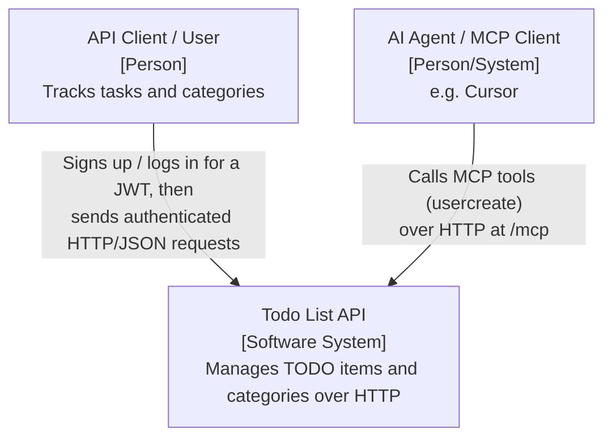
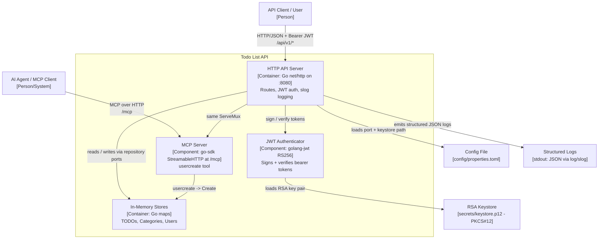
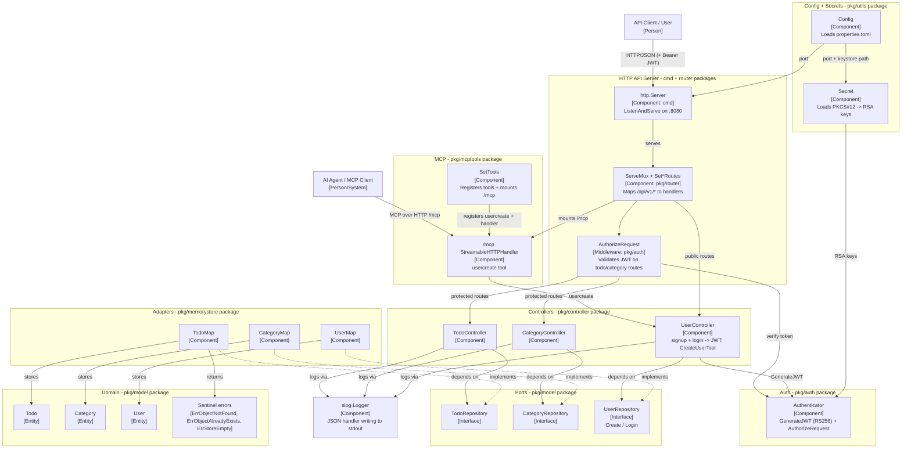

[](https://github.com/rahulkrishnanfs/todolist/actions/workflows/sonarcloud.yml) [](https://sonarcloud.io/summary/new_code?id=rahulkrishnanfs_todolist) [](https://sonarcloud.io/summary/new_code?id=rahulkrishnanfs_todolist) [](https://sonarcloud.io/summary/new_code?id=rahulkrishnanfs_todolist) [](https://sonarcloud.io/summary/new_code?id=rahulkrishnanfs_todolist) [](https://sonarcloud.io/summary/new_code?id=rahulkrishnanfs_todolist)

[](https://sonarcloud.io/summary/new_code?id=rahulkrishnanfs_todolist) [](https://sonarcloud.io/summary/new_code?id=rahulkrishnanfs_todolist)
 
# Todo List

A small TODO list application written in Go, structured around clean / hexagonal
architecture (ports and adapters). Domain models and persistence are decoupled
through repository interfaces, so the storage backend can be swapped without
touching business logic.

The project ships with an in-memory store and a REST API (`net/http`).
Write/read routes for todos and categories are protected by **RS256 JWT
authentication**; clients obtain a token via a user signup/login flow. The same
server also exposes a **Model Context Protocol (MCP)** endpoint at `/mcp`, so
MCP clients (e.g. Cursor) can drive the service through tools — currently a
`usercreate` tool. Runtime settings (port, keystore, TLS cert/key) are loaded
from `config/properties.toml`, and the JWT signing keys are loaded from a
PKCS#12 keystore. The listen port defaults to `:8080`.

> **Transport note:** the server currently listens over **plain HTTP**
> (`server.ListenAndServe`). HTTPS/TLS support is present but disabled — the
> `ListenAndServeTLS` call in `cmd/main.go` is commented out, and the PEM
> cert/key paths still live in `config/properties.toml`. Re-enable it by
> switching back to `ListenAndServeTLS` (see the Roadmap).

## Features

- Domain models for `Todo`, `Category`, and `User`.
- Repository interfaces (`TodoRepository`, `CategoryRepository`,
  `UserRepository`) acting as ports.
- In-memory adapters (`TodoMap`, `CategoryMap`, `UserMap`).
- Controllers (`TodoController`, `CategoryController`, `UserController`) that
  depend on the abstractions, not concrete storage.
- JWT auth (`auth.Authenticator`): RS256 token generation on login and
  `AuthorizeRequest` middleware on protected routes.
- MCP integration (`pkg/mcptools`): an MCP server (`modelcontextprotocol/go-sdk`)
  mounted on the same `ServeMux` at `/mcp` via `NewStreamableHTTPHandler`,
  exposing a `usercreate` tool backed by `UserController.CreateUserTool`.
- HTTP server via `http.Server.ListenAndServe` (TLS via `ListenAndServeTLS` is
  present but commented out; PEM cert/key paths remain in config).
- PKCS#12 keystore loading (`utils.Secret`) into an RSA key pair for JWT signing.
- TOML configuration (`utils.Config`) for port, keystore, and TLS cert/key
  settings.
- Structured JSON logging via `log/slog`, created in `main` and injected into
  the controllers.
- Sentinel domain errors (`ErrObjectNotFound`, `ErrObjectAlreadyExists`,
  `ErrStoreEmpty`) defined in the model; the stores return `ErrObjectNotFound` /
  `ErrObjectAlreadyExists`, and `GetAll` returns an empty list (not an error)
  when the store is empty.
- Meaningful HTTP status codes for writes (`201 Created` on create,
  `204 No Content` on update/delete).

## Project Structure

```text
todolist/
├── cmd/
│   └── main.go                     # Entrypoint: loads config + keystore, wires stores/controllers/auth/routes + MCP tools, starts HTTP server
├── pkg/
│   ├── controller/
│   │   ├── todo_controller.go      # TodoController (depends on TodoRepository)
│   │   ├── category_controller.go  # CategoryController (depends on CategoryRepository)
│   │   └── user_controller.go      # UserController: signup + login (issues JWT) + CreateUserTool (MCP)
│   ├── mcptools/
│   │   └── user_mcp.go             # SetTools: registers the usercreate MCP tool + mounts /mcp (StreamableHTTPHandler)
│   ├── router/
│   │   ├── todo_routes.go          # SetTodoRoutes: /api/v1/todos handlers (JWT-protected)
│   │   ├── category_routes.go      # SetCategoryRoutes: /api/v1/categories handlers (JWT-protected)
│   │   └── user_routes.go          # SetUserRoutes: /api/v1/users signup + login (public)
│   ├── memorystore/
│   │   ├── in_memory_todo.go       # In-memory adapter: TodoMap
│   │   ├── in_memory_category.go   # In-memory adapter: CategoryMap
│   │   └── in_memory_user.go       # In-memory adapter: UserMap
│   ├── auth/
│   │   └── auth.go                 # Authenticator: RS256 JWT + AuthorizeRequest middleware
│   ├── utils/
│   │   ├── config.go               # Config: loads config/properties.toml (port, keystore, TLS cert/key)
│   │   └── secrets.go              # Secret: loads PKCS#12 keystore -> RSA key pair (JWT signing)
│   └── model/
│       └── model.go                # Domain entities (Todo, Category, User) + repository ports
├── config/
│   ├── properties.toml             # Service config: port, keystore path + password, TLS cert/key paths
│   └── properties.toml.dev         # Local-dev config (absolute paths) — ignored by git/docker
├── charts/todolist/                # Helm chart: Deployment, Service, ConfigMap, Secret, Ingress
├── scripts/                        # docker-run.sh, k8s-secrets.sh helpers
├── secrets/                        # PKCS#12 keystore (JWT) + PEM TLS cert/key (keep real secrets out of git)
├── docs/                           # codereview.md, status-code/key-gen/k8s notes
├── magfile.go                      # Mage targets: build, docker login/build/push
├── Dockerfile                      # Multi-stage build -> distroless nonroot image
├── .github/workflows/              # CI: SonarCloud, golangci-lint, AI review, issue labeler, moderator
├── go.mod                          # Module: todolist (Go 1.25)
└── README.md
```

All application packages live under `pkg/` (imported as `todolist/pkg/...`); `cmd/main.go` is the only `package main` and just wires everything together.

## Getting Started

Requirements: **Go 1.25+**. A PKCS#12 keystore (for JWT signing) and a config
file are required at startup. A TLS certificate/key pair (PEM) is referenced by
the config but is **not used at runtime** while the server runs over plain HTTP;
you only need it if you re-enable `ListenAndServeTLS`. See
[`docs/2_key_generation.md`](docs/2_key_generation.md) for the OpenSSL commands
that generate the keystore and the self-signed PEM cert/key.

1. Ensure `config/properties.toml` points at a valid keystore and TLS cert/key:

```toml
[service]
port = ":8080"
keystore_file_path = "/absolute/path/to/secrets/keystore.p12"
keystore_password = "changeit"
server_cert = "/absolute/path/to/secrets/servercert.pem"
server_key = "/absolute/path/to/secrets/serverkey.pem"
```

2. Run from the repository root (config is read from `./config/properties.toml`):

```bash
go run ./cmd
```

This loads the config and keystore, wires up the in-memory stores, controllers,
auth, REST routes, and the MCP tools, then serves HTTP on the configured port
(default `:8080`). Todo/category endpoints require a JWT — sign up and log in
first to get one.

### API Endpoints

| Method | Path | Auth | Description |
| --- | --- | --- | --- |
| POST | `/api/v1/users/signup` | None | Register a user |
| POST | `/api/v1/users/login` | None | Authenticate; returns a JWT |
| POST | `/api/v1/todos` | Bearer | Create a TODO |
| GET | `/api/v1/todos` | Bearer | List all TODOs |
| GET | `/api/v1/todos/{id}` | Bearer | Get a TODO by id |
| PUT | `/api/v1/todos/{id}` | Bearer | Update a TODO |
| DELETE | `/api/v1/todos/{id}` | Bearer | Delete a TODO by id |
| POST | `/api/v1/categories` | Bearer | Create a category |
| GET | `/api/v1/categories` | Bearer | List all categories |
| GET | `/api/v1/categories/{id}` | Bearer | Get a category by id |
| PUT | `/api/v1/categories/{id}` | Bearer | Update a category |
| DELETE | `/api/v1/categories/{id}` | Bearer | Delete a category by id |
| POST | `/mcp` | None | MCP endpoint (streamable HTTP) exposing the `usercreate` tool |

Example flow (the server currently runs over plain HTTP):

```bash
# 1. Sign up
curl -X POST http://localhost:8080/api/v1/users/signup \
  -H 'Content-Type: application/json' \
  -d '{"uid":"u1","username":"alice","password":"s3cret","email_address":"alice@example.com"}'

# 2. Log in and capture the token
TOKEN=$(curl -s -X POST http://localhost:8080/api/v1/users/login \
  -H 'Content-Type: application/json' \
  -d '{"username":"alice","password":"s3cret"}' | jq -r .token)

# 3. Call a protected route with the bearer token
curl -X POST http://localhost:8080/api/v1/todos \
  -H "Authorization: Bearer $TOKEN" \
  -H 'Content-Type: application/json' \
  -d '{"tid":"1","activity":"Write docs","description":"Update README","is_done":false,"category_id":"c1","user_id":"alice"}'

curl http://localhost:8080/api/v1/todos -H "Authorization: Bearer $TOKEN"
```

### MCP (Model Context Protocol)

The server registers an MCP server (`name: "todolist"`, `version: 1.0.0`) and
mounts it at `/mcp` using the go-sdk's streamable-HTTP handler. It currently
exposes one tool:

| Tool | Description | Required arguments |
| --- | --- | --- |
| `usercreate` | Create a user who needs to sign up to the todolist service | `uid`, `username`, `password`, `email_address` |

To consume it from an MCP client such as Cursor, add the endpoint to your
`mcp.json` (project-level `.cursor/mcp.json` or global `~/.cursor/mcp.json`):

```json
{
  "mcpServers": {
    "todolist": {
      "type": "http",
      "url": "http://localhost:8080/mcp"
    }
  }
}
```

Start the server first, then enable `todolist` in Cursor's MCP settings; the
`usercreate` tool will become available to the agent.

## Architecture Overview

The application follows a ports-and-adapters layout:

- An HTTP layer: `http.Server.ListenAndServe` serves a `ServeMux` (wired by the
  `pkg/router` package) that maps RESTful `/api/v1/*` routes to controller
  methods. (A commented-out `ListenAndServeTLS` path can re-enable HTTPS.)
- An MCP layer: `pkg/mcptools.SetTools` registers the `usercreate` tool on an
  `mcp.Server` and mounts it on the same `ServeMux` at `/mcp` via
  `NewStreamableHTTPHandler`, so MCP clients hit the service alongside REST.
- Controllers (HTTP handlers) depend on repository **interfaces**, never on a
  concrete store.
- Repository interfaces (`TodoRepository`, `CategoryRepository`,
  `UserRepository`) are the **ports** defined alongside the domain model.
- The in-memory stores (`TodoMap`, `CategoryMap`, `UserMap`) are one set of
  **adapters** implementing those ports. Other adapters (e.g. SQL, file) could
  be added without changing controllers or domain logic.
- Domain models (`Todo`, `Category`, `User`) are persistence-independent.
- An **auth layer** (`auth.Authenticator`) wraps protected routes with
  `AuthorizeRequest`, which verifies the RS256 JWT using the public key;
  `UserController.Login` mints tokens with the private key.
- **Config** (`utils.Config`) loads `config/properties.toml`; **secrets**
  (`utils.Secret`) decode a PKCS#12 keystore into the RSA key pair injected into
  the `Authenticator`. The TLS server certificate and key (PEM) are still listed
  in the config but are only consumed when the commented-out `ListenAndServeTLS`
  path is re-enabled.
- A `*slog.Logger` (JSON handler writing to stdout) is constructed in
  `cmd/main.go` and injected into the controllers, which emit structured logs
  for each request.

```text
HTTP  ->  route  ->  JWT middleware  ->  Controller (handler)  ->  Repository interface (port)  ->  In-memory adapter  ->  Domain model
   |                                            |
   |                                            +--> structured logs (slog JSON -> stdout)
   +--> /mcp (StreamableHTTPHandler) -> usercreate tool -> UserController.CreateUserTool -> UserRepository
```

## C4 Architecture Diagrams

The diagrams below follow the [C4 model](https://c4model.com/) and are written
in Mermaid, which renders natively on GitHub.

### Level 1 - System Context



### Level 2 - Container



> TLS cert/key (`secrets/servercert.pem` + `serverkey.pem`) remain in config but
> are unused while the server runs over plain HTTP.

### Level 3 - Component



## Developer Tooling (Cursor Skills)

This repo includes [Cursor](https://cursor.com) Agent Skills under `.cursor/skills/`.
Each skill lives in `.cursor/skills/<name>/SKILL.md` and is invoked by name in the
Cursor agent.

| Skill | What it does | How to use |
| --- | --- | --- |
| `commit-with-issue` | Creates a Conventional Commit (issue number at the end of the subject) on a matching `feature/#[issue]-[branch]` branch. | `/commit-with-issue` |
| `code-review-update` | Re-scans the source and updates `docs/codereview.md` (finding statuses + new findings) from architect, senior-engineer, hacker, and security perspectives. Writes only that file. | `/code-review-update` |
| `codereview-to-issues` | Opens a GitHub issue for every **Open** finding in `docs/codereview.md`, mapping defects to the bug-report template and design gaps to the feature-request template (via the GitHub MCP). | `/codereview-to-issues` |
| `readme-update` | Re-scans the source and updates this `README.md` (structure, API, C4 diagrams, tooling) to stay accurate for newcomers. Writes only this file. | `/readme-update` |

### `commit-with-issue`

When invoked, the skill:

1. Inspects your staged/unstaged changes.
2. Asks for the GitHub issue number (required) and uses it with a `#` prefix.
3. Picks the right Conventional Commit type (`feat`, `fix`, `docs`, `refactor`, …).
4. Creates a branch named `feature/#[issue]-[branchname]`.
5. Commits with a `type(scope): subject (#[issue])` message — the issue number
   goes at the end of the subject line.

Commits are authored by **you** (the developer making the change). Configure your
git identity once so authorship is attributed correctly:

```bash
git config user.name "Your Name"
git config user.email "you@example.com"
```

The skill definitions live in `.cursor/skills/<skill-name>/SKILL.md` — read or edit
them there to adjust the workflow.

### `code-review-update`

Run `/code-review-update` to refresh [`docs/codereview.md`](docs/codereview.md). It
re-scans the source, re-verifies each existing finding (flipping its status to
Resolved / Partial / Open), and adds new findings reviewed from four perspectives:
software architect, senior expert programmer, hacker/attacker, and security expert.
It only ever writes `docs/codereview.md`.

### `codereview-to-issues`

Run `/codereview-to-issues` to turn the **Open** findings in
[`docs/codereview.md`](docs/codereview.md) into GitHub issues — one per finding.
Defects are filed with the bug-report template and missing-capability/design
items with the feature-request template, created one by one (with dedup) through
the GitHub MCP server (`user-github`).

### `readme-update`

Run `/readme-update` to refresh this README from the code. It reconciles the
overview, project structure, API endpoints, architecture, and C4 diagrams with the
source, and keeps this Developer Tooling table in sync. It only ever writes
`README.md`.

## Roadmap / Future Work

- Hash passwords (currently stored/compared in plaintext) with bcrypt.
- Per-user authorization / data ownership (scope todos and categories to the
  authenticated user).
- Move secrets out of the repo; load keystore path/password from environment or
  a secret manager.
- Re-enable HTTPS/TLS: the server currently runs over plain HTTP
  (`ListenAndServe`); switch back to `ListenAndServeTLS` using the PEM cert/key
  already referenced in `config/properties.toml`.
- Add authentication to the `/mcp` endpoint (the MCP `usercreate` tool is
  currently unauthenticated).
- Align the CI Go version (`.github/workflows/sonarcloud.yml` pins 1.22.0) with
  `go.mod` (1.25); the lint workflow and Dockerfile build stage already use 1.25.
- Persistent storage adapter (SQL or file-based) implementing the existing
  repository ports.
- Input validation and consistent JSON error responses (map errors to
  400/404/409).
- Tests for adapters, controllers, and the auth flow.
