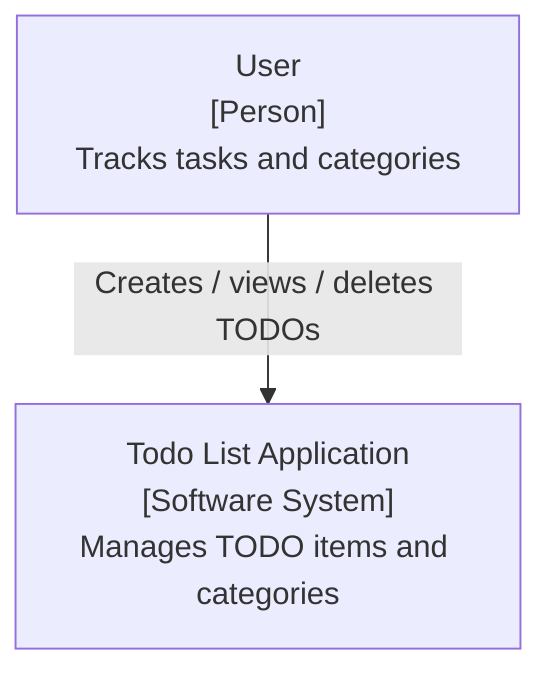
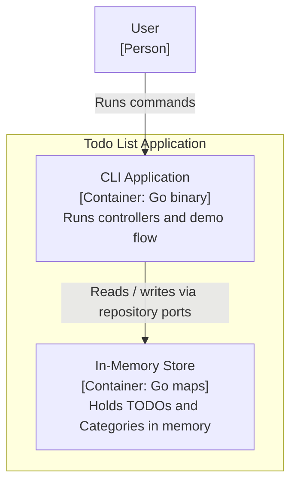
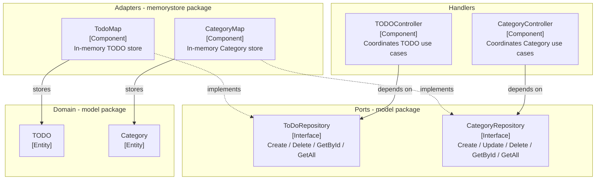

# Todo List

A small TODO list application written in Go, structured around clean / hexagonal
architecture (ports and adapters). Domain models and persistence are decoupled
through repository interfaces, so the storage backend can be swapped without
touching business logic.

Currently the project ships with an in-memory store and a small CLI demo in
`cmd/main.go`.

## Features

- Domain models for `TODO` items and `Category` groupings.
- Repository interfaces (`ToDoRepository`, `CategoryRepository`) acting as ports.
- In-memory adapter implementation (`TodoMap`, `CategoryMap`).
- Controllers (`TODOController`, `CategoryController`) that depend on the
  abstractions, not concrete storage.

## Project Structure

```text
todolist/
├── cmd/
│   ├── main.go               # Entrypoint / CLI demo
│   ├── todo_controller.go    # TODOController (depends on ToDoRepository)
│   └── category_controller.go# CategoryController (depends on CategoryRepository)
├── memorystore/
│   └── in_memory.go          # In-memory adapters: TodoMap, CategoryMap
├── model/
│   └── model.go              # Domain entities + repository interfaces (ports)
├── go.mod                    # Module: todolist (Go 1.22)
└── README.md
```

## Getting Started

Requirements: Go 1.22+.

```bash
# From the repository root
go run ./cmd
```

This runs the demo in `cmd/main.go`, which creates an in-memory TODO store,
adds a sample item, and prints all items.

## Architecture Overview

The application follows a ports-and-adapters layout:

- Controllers (handlers) depend on repository **interfaces**, never on a
  concrete store.
- Repository interfaces (`ToDoRepository`, `CategoryRepository`) are the
  **ports** defined alongside the domain model.
- The in-memory store (`TodoMap`, `CategoryMap`) is one **adapter**
  implementing those ports. Other adapters (e.g. SQL, file) could be added
  without changing controllers or domain logic.
- Domain models (`TODO`, `Category`) are persistence-independent.

```text
Controller (handler)  ->  Repository interface (port)  ->  In-memory adapter  ->  Domain model
```

## C4 Architecture Diagrams

The diagrams below follow the [C4 model](https://c4model.com/) and are written
in Mermaid, which renders natively on GitHub.

### Level 1 - System Context



### Level 2 - Container



### Level 3 - Component



## Roadmap / Future Work

- Persistent storage adapter (SQL or file-based) implementing the existing
  repository ports.
- HTTP API layer in front of the controllers.
- `Update` support for `ToDoRepository` (currently commented out).
- Tests for adapters and controllers.
