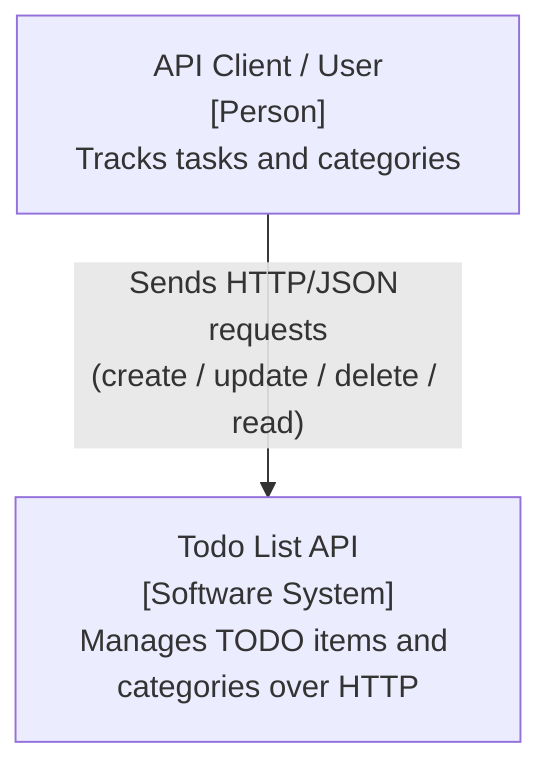
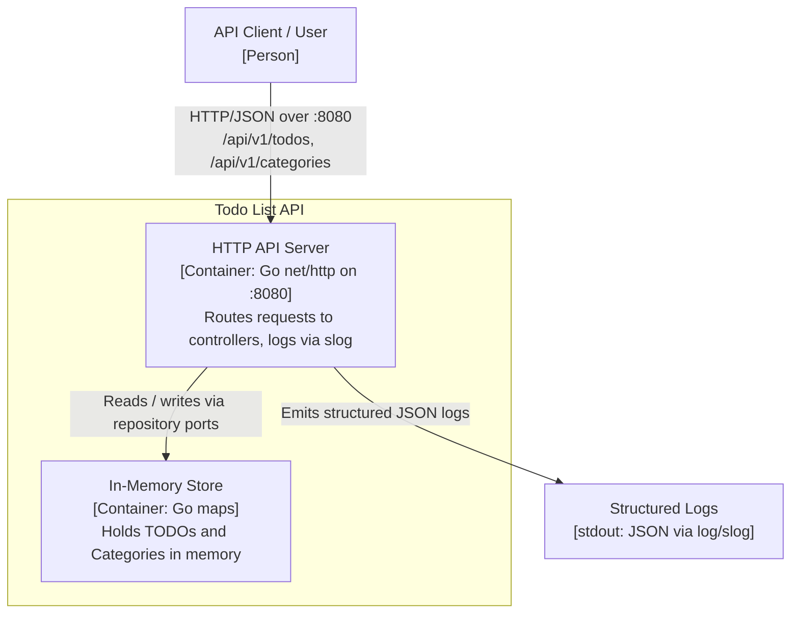
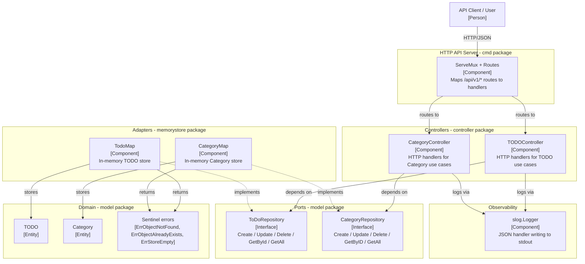

[](https://github.com/rahulkrishnanfs/todolist/actions/workflows/sonarcloud.yml) [](https://sonarcloud.io/summary/new_code?id=rahulkrishnanfs_todolist) [](https://sonarcloud.io/summary/new_code?id=rahulkrishnanfs_todolist) [](https://sonarcloud.io/summary/new_code?id=rahulkrishnanfs_todolist) [](https://sonarcloud.io/summary/new_code?id=rahulkrishnanfs_todolist) [](https://sonarcloud.io/summary/new_code?id=rahulkrishnanfs_todolist)

[](https://sonarcloud.io/summary/new_code?id=rahulkrishnanfs_todolist) [](https://sonarcloud.io/summary/new_code?id=rahulkrishnanfs_todolist)
 
# Todo List

A small TODO list application written in Go, structured around clean / hexagonal
architecture (ports and adapters). Domain models and persistence are decoupled
through repository interfaces, so the storage backend can be swapped without
touching business logic.

Currently the project ships with an in-memory store and an HTTP REST API
(`net/http`) served from `cmd/main.go` on port `:8080`.

## Features

- Domain models for `TODO` items and `Category` groupings.
- Repository interfaces (`ToDoRepository`, `CategoryRepository`) acting as ports.
- In-memory adapter implementation (`TodoMap`, `CategoryMap`).
- Controllers (`TODOController`, `CategoryController`) that depend on the
  abstractions, not concrete storage.
- Structured JSON logging via `log/slog`, created in `main` and injected into
  the controllers.
- Sentinel domain errors (`ErrObjectNotFound`, `ErrObjectAlreadyExists`,
  `ErrStoreEmpty`) returned by the stores.
- Meaningful HTTP status codes for writes (`201 Created` on create,
  `204 No Content` on update/delete).

## Project Structure

```text
todolist/
├── cmd/
│   ├── main.go                 # Entrypoint: wires stores, controllers, routes; starts HTTP server
│   ├── routes.go               # ToDoRoutes: registers /api/v1/todos handlers
│   └── category_routes.go      # CategoryRoutes: registers /api/v1/categories handlers
├── controller/
│   ├── todo_controller.go      # TODOController (depends on ToDoRepository)
│   └── category_controller.go  # CategoryController (depends on CategoryRepository)
├── memorystore/
│   ├── in_memory_todo.go       # In-memory adapter: TodoMap
│   └── in_memory_category.go   # In-memory adapter: CategoryMap
├── model/
│   └── model.go                # Domain entities + repository interfaces (ports)
├── go.mod                      # Module: todolist (Go 1.22)
└── README.md
```

## Getting Started

Requirements: Go 1.22+.

```bash
# From the repository root
go run ./cmd
```

This starts the HTTP server in `cmd/main.go`, which wires up the in-memory
stores, controllers, and routes, then listens on `:8080`.

### API Endpoints

| Method | Path | Description |
| --- | --- | --- |
| POST | `/api/v1/todos` | Create a TODO |
| GET | `/api/v1/todos` | List all TODOs |
| GET | `/api/v1/todos/{id}` | Get a TODO by id |
| PUT | `/api/v1/todos/{id}` | Update a TODO |
| DELETE | `/api/v1/todos/{id}` | Delete a TODO by id |
| POST | `/api/v1/categories` | Create a category |
| GET | `/api/v1/categories` | List all categories |
| GET | `/api/v1/categories/{id}` | Get a category by id |
| PUT | `/api/v1/categories/{id}` | Update a category |
| DELETE | `/api/v1/categories/{id}` | Delete a category by id |

Example:

```bash
curl -X POST localhost:8080/api/v1/todos \
  -H 'Content-Type: application/json' \
  -d '{"tid":"1","activity":"Write docs","description":"Update README","isdone":false}'

curl localhost:8080/api/v1/todos
```

## Architecture Overview

The application follows a ports-and-adapters layout:

- An HTTP layer (`ServeMux` + route files in `cmd/`) maps RESTful `/api/v1/*`
  routes to controller methods.
- Controllers (HTTP handlers) depend on repository **interfaces**, never on a
  concrete store.
- Repository interfaces (`ToDoRepository`, `CategoryRepository`) are the
  **ports** defined alongside the domain model.
- The in-memory store (`TodoMap`, `CategoryMap`) is one **adapter**
  implementing those ports. Other adapters (e.g. SQL, file) could be added
  without changing controllers or domain logic.
- Domain models (`TODO`, `Category`) are persistence-independent.
- A `*slog.Logger` (JSON handler writing to stdout) is constructed in
  `cmd/main.go` and injected into both controllers, which emit structured logs
  for each request.

```text
HTTP route  ->  Controller (handler)  ->  Repository interface (port)  ->  In-memory adapter  ->  Domain model
                      |
                      +--> structured logs (slog JSON -> stdout)
```

## C4 Architecture Diagrams

The diagrams below follow the [C4 model](https://c4model.com/) and are written
in Mermaid, which renders natively on GitHub.

### Level 1 - System Context



### Level 2 - Container



### Level 3 - Component



## Roadmap / Future Work

- Persistent storage adapter (SQL or file-based) implementing the existing
  repository ports.
- Input validation and consistent JSON error responses.
- Authentication / authorization for the API.
- Tests for adapters and controllers.
