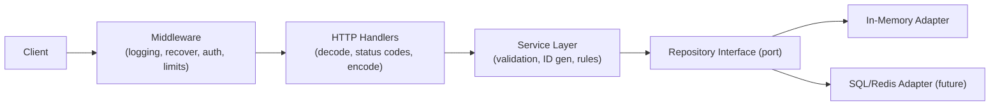

# Code Review: Todo List Service

A deep review of the Go TODO-list service. Findings are grouped by aspect and ordered roughly by severity within each section. Each item cites the relevant file and gives a concrete recommendation.

Severity legend: **[Critical]** can cause data loss/incorrect behavior/security exposure, **[High]** important correctness/design issue, **[Medium]** quality/maintainability, **[Low]** polish.

---

## 1. Correctness Bugs (fix these first)

### 1.1 [Critical] Handlers continue executing after `http.Error`
In every handler, `http.Error(...)` is called on error but there is no `return`. Execution falls through to the next statement, so the server may write a second response, dereference a zero value, or marshal/serve garbage after already sending an error.

```14:27:cmd/category_controller.go
func (c *CategoryController) Create(w http.ResponseWriter, r *http.Request) {
	fmt.Println("request came here")
	var category model.Category
	err := json.NewDecoder(r.Body).Decode(&category)
	if err != nil {
		http.Error(w, err.Error(), http.StatusInternalServerError)
	}
	err = c.store.Create(category)
	if err != nil {
		fmt.Println("somethings is having issue")
		http.Error(w, err.Error(), http.StatusInternalServerError)
	}
}
```

Fix: add `return` after every `http.Error(...)`. This applies to all handlers in both `todo_controller.go` and `category_controller.go` (Create, Update, Delete, GetAll, GetById).

### 1.2 [Critical] `GetAll` returns 5 phantom empty structs
`make([]model.Category, 5)` creates a slice of length 5 (five zero-valued structs), then `append` adds the real data after them. Callers get 5 empty objects + the actual records.

```62:73:memorystore/in_memory_category.go
func (c *CategoryMap) GetAll() ([]model.Category, error) {
	c.mu.Lock()
	defer c.mu.Unlock()
	category := make([]model.Category, 5)
	...
	for _, v := range c.store {
		category = append(category, v)
	}
	return category, nil
}
```

Fix: pre-allocate capacity, not length: `make([]model.Category, 0, len(c.store))`. Same bug in `in_memory_todo.go` `GetAll`.

### 1.3 [High] Returning an error for an empty store
`GetAll` returns `errors.New("Store is empty")` when there are no records. An empty collection is a valid result (HTTP 200 with `[]`), not an error. Returning an error here forces a 500 for the normal "no data yet" case.

Fix: return an empty slice and `nil` error when the store is empty.

### 1.4 [High] Reads take a write lock
The struct uses `sync.RWMutex`, but `GetByID` and `GetAll` call `Lock()` (exclusive) instead of `RLock()`. This serializes all reads unnecessarily and defeats the purpose of `RWMutex`.

```53:60:memorystore/in_memory_category.go
func (c *CategoryMap) GetByID(cid string) (model.Category, error) {
	c.mu.Lock()
	defer c.mu.Unlock()
	...
}
```

Fix: use `c.mu.RLock()` / `defer c.mu.RUnlock()` in read-only methods (`GetByID`, `GetAll`, both stores).

### 1.5 [High] Misleading error messages
`GetById` in the todo store returns `"Store is empty"` when a single ID is missing (should be "not found"). `Delete`/`Update` use `"ID not found in the map "` (trailing space, leaks internal data-structure detail). Messages are inconsistent across the two stores.

Fix: standardize on a sentinel error, e.g. `var ErrNotFound = errors.New("not found")`, and return it consistently. This also lets handlers map it to HTTP 404 (see 4.1).

---

## 2. System Design & Architecture

### 2.1 [High] Missing service/use-case layer
Controllers call the repository directly. The README advertises hexagonal architecture, but there is no application/service layer to hold business rules (ID generation, validation, setting `CreationDate`, enforcing that a TODO's `CategoryID` exists). Business logic currently has nowhere to live and would leak into HTTP handlers.

Recommendation: introduce a `service` package: `Controller -> Service -> Repository`. Controllers handle HTTP only (decode/encode, status codes); services own rules; repositories own persistence.

### 2.2 [High] Client supplies primary keys (`TID`/`CID`)
IDs come from the request body. Two problems: clients can overwrite each other's records by reusing an ID, and `Create` rejects rather than generating an ID. This is both a correctness and a security/ownership concern.

Recommendation: generate IDs server-side (e.g. `google/uuid`) inside the service layer, ignore any client-supplied ID, and set `CreationDate` server-side too.

### 2.3 [Medium] No referential integrity between TODO and Category
`TODO.CategoryID` is free text; nothing validates the category exists. The domain says "TODO belongs to Category" but it is unenforced.

Recommendation: validate `CategoryID` against the category repository on create/update.

### 2.4 [Medium] Controllers live in `package main`
`TODOController`/`CategoryController` are in `cmd` under `package main`, so they can't be imported or unit-tested from elsewhere. `cmd` should be a thin entrypoint.

Recommendation: move controllers to an internal package (e.g. `internal/http` or `handler`), and keep `cmd/main.go` as wiring only.

### 2.5 [Medium] No `context.Context` propagation
Repository interfaces don't take `context.Context`. A real datastore adapter (SQL, etc.) needs context for cancellation/timeouts/tracing. Adding it later is a breaking change to every method.

Recommendation: change signatures now to `Create(ctx context.Context, ...)`, etc., and pass `r.Context()` from handlers.

### 2.6 [Low] `Update` is a true upsert vs strict update — decide intent
`Update` returns "ID not found" if absent. That's reasonable, but combined with client-supplied IDs and no `PUT` semantics it's ambiguous. Clarify whether endpoints are create-only/update-only or upsert.

---

## 3. Concurrency & Scalability

### 3.1 [High] In-memory store cannot scale horizontally
All state lives in process-local maps. Running more than one replica (behind a load balancer) means each instance has different data; restarts lose everything. This caps you at a single instance and zero durability.

Recommendation: implement a persistent adapter (Postgres/SQLite/Redis) behind the existing repository interfaces. The ports are already there — this is the intended extension point.

### 3.2 [Medium] Lock contention with a single global mutex
Each store has one `RWMutex` guarding the whole map. Fixing 1.4 (read locks) is the first win. Under very high write load a single mutex becomes a bottleneck, but for this scale it's fine — the persistent backend (3.1) is the real concurrency story.

### 3.3 [Low] No request-level concurrency limits
There is no max in-flight request limit or backpressure. With a real datastore you'd want connection pooling and a bounded worker model. Note for later.

---

## 4. HTTP API Design

### 4.1 [High] Everything returns 500
All errors map to `http.StatusInternalServerError`, including client errors (bad JSON, missing ID) and "not found". This makes the API unusable for clients and hides real server faults.

Recommendation:
- Bad/invalid JSON or validation failure -> `400 Bad Request`.
- Not found -> `404 Not Found`.
- Duplicate on create -> `409 Conflict`.
- Genuine unexpected errors -> `500` (and log internally, don't echo `err.Error()` to the client; see 5.1).

### 4.2 [Medium] Non-RESTful routing and verbs
`POST /api/todo/delete/{id}`, `POST /api/todo/update`, `GET /api/todo/getbyid/{id}` use verbs in the path and the wrong methods.

Recommendation (Go 1.22 ServeMux supports this):
- `POST /api/todos` (create)
- `GET /api/todos` (list)
- `GET /api/todos/{id}`
- `PUT /api/todos/{id}` (update)
- `DELETE /api/todos/{id}`

### 4.3 [Medium] `Create` returns no body or `Location`
On success, handlers write nothing. A create should return `201 Created` with the created resource (especially once IDs are server-generated) and ideally a `Location` header.

### 4.4 [Low] No request body size limit / strict decoding
`json.NewDecoder(r.Body).Decode` accepts unknown fields and unbounded bodies.

Recommendation: wrap with `http.MaxBytesReader` and call `dec.DisallowUnknownFields()`.

---

## 5. Security

### 5.1 [High] Internal error details leaked to clients
`http.Error(w, err.Error(), 500)` sends raw internal error strings to the caller. This can leak storage internals and aids attackers.

Recommendation: log the detailed error server-side; return a generic message and an appropriate status code to the client.

### 5.2 [High] No authentication / authorization
All endpoints are open. Anyone can read, modify, or delete any TODO/category. There is no concept of a user owning their data.

Recommendation: add auth (API key/JWT/session) and scope data per user. Even for a demo, document that it is unauthenticated.

### 5.3 [Medium] No server timeouts (slowloris exposure)
```20:25:cmd/main.go
server := &http.Server{
	Addr:    ":8080",
	Handler: router,
}
```
No `ReadTimeout`, `ReadHeaderTimeout`, `WriteTimeout`, or `IdleTimeout`. A slow client can hold connections open indefinitely.

Recommendation: set sensible timeouts on `http.Server`.

### 5.4 [Medium] No input validation
No checks that `Activity`/`Name` are non-empty, length-bounded, etc. Combined with no body size limit (4.4), this is a DoS/garbage-data vector.

### 5.5 [Low] No rate limiting / CORS policy / security headers
No throttling and no explicit CORS handling. Add as needed when exposing publicly.

---

## 6. Deployment & Operations

### 6.1 [High] `ListenAndServe` error is ignored
```24:25:cmd/main.go
log.Println("Listening...")
server.ListenAndServe()
```
If the port is taken or the server fails, the process exits silently with no error.

Recommendation: `log.Fatal(server.ListenAndServe())` (ignoring `http.ErrServerClosed` if you add graceful shutdown).

### 6.2 [High] No graceful shutdown
There's no signal handling. On SIGTERM (common in Kubernetes/containers) in-flight requests are dropped.

Recommendation: listen for `os.Interrupt`/`SIGTERM` and call `server.Shutdown(ctx)` with a timeout.

### 6.3 [Medium] Dockerfile does not copy `go.sum` and reduces build caching
```4:5:Dockerfile
COPY go.mod ./
RUN go mod download
```
Only `go.mod` is copied. There are currently no dependencies, but the moment one is added, builds break or become non-reproducible without `go.sum`.

Recommendation: `COPY go.mod go.sum ./` once a `go.sum` exists; the distroless/nonroot base and `CGO_ENABLED=0` choices are good. Consider adding a build flag `-ldflags="-s -w"` for smaller binaries.

### 6.4 [Medium] Hardcoded port, no configuration
`:8080` is hardcoded. No env-based config.

Recommendation: read `PORT` (and other settings) from environment, with a sensible default.

### 6.5 [Medium] No health/readiness endpoint
There is no `/healthz` or `/readyz`. Orchestrators need these for liveness/readiness probes.

### 6.6 [Low] No `HEALTHCHECK` in Dockerfile and no structured logging
Add a container healthcheck and consider `log/slog` for structured logs (see 7).

---

## 7. Observability & Logging

### 7.1 [High] `fmt.Println` debugging statements
```15:23:cmd/category_controller.go
	fmt.Println("request came here")
	...
		fmt.Println("somethings is having issue")
```
These appear throughout both controllers (and a commented `fmt.Println` in `in_memory_todo.go`). They are noise, unstructured, and not useful in production.

Recommendation: remove them; use `log/slog` with levels and request context for any real logging.

### 7.2 [Medium] No request logging / middleware
No access logs, request IDs, or panic-recovery middleware. An unhandled panic in a handler takes down the request with a stack trace and no recovery.

Recommendation: add middleware for logging, request IDs, and `recover()`.

### 7.3 [Low] No metrics/tracing
No Prometheus metrics or tracing hooks. Optional, but worth a stub for a service intended to grow.

---

## 8. Naming, Conventions & Code Quality

### 8.1 [High] JSON tag typo `cayegoryid`
```9:16:model/model.go
type TODO struct {
	...
	CategoryID   string    `json:"cayegoryid"`
}
```
The JSON field is misspelled; API clients must send `cayegoryid`. Fix to `json:"category_id"` (and pick a consistent casing convention for all tags).

### 8.2 [Medium] Inconsistent method naming: `GetById` vs `GetByID`
The TODO repository uses `GetById`; the Category repository uses `GetByID`. Go convention is `ID` (initialism uppercased): `GetByID`. Standardize across interfaces and implementations.

### 8.3 [Medium] Inconsistent JSON tag style
Tags are lowercase, no separators: `creationdate`, `isdone`. Prefer snake_case (`creation_date`, `is_done`) or camelCase consistently.

### 8.4 [Medium] Inconsistent receiver/parameter naming
`CategoryMap.Create(Category model.Category)` uses an exported-looking, type-shadowing parameter name `Category`; elsewhere it's lowercase `category`. Use short, consistent, lowercase receiver and parameter names.

### 8.5 [Low] Type/file naming
- `TODOController` vs `CategoryController` — acronym casing differs from the type style elsewhere; consider `TodoController` for consistency with `TodoMap`.
- README references `memorystore/in_memory.go`, but the actual files are `in_memory_todo.go` and `in_memory_category.go`. Update the README.

### 8.6 [Low] Stray files and comments
`Note.txt` (scratch notes) and misspelled comments ("indepdendent", "persistance", "Reposyiry") should be cleaned up or removed from the repo.

---

## 9. Testing

### 9.1 [High] No tests at all
There are no `_test.go` files. The store has subtle bugs (1.2, 1.3) that unit tests would have caught immediately.

Recommendation:
- Table-driven unit tests for both stores (create/duplicate, update/missing, delete/missing, get-all empty vs populated).
- Handler tests using `net/http/httptest` to assert status codes and bodies.
- A `go vet` + `staticcheck` + `golangci-lint` step in CI.

---

## 10. Suggested Target Architecture



---

## 11. Priority Checklist

1. Add `return` after every `http.Error` (1.1).
2. Fix `GetAll` slice allocation (1.2) and empty-store handling (1.3).
3. Use `RLock` for reads (1.4); standardize not-found errors (1.5).
4. Map errors to correct HTTP status codes; stop leaking `err.Error()` (4.1, 5.1).
5. Generate IDs and `CreationDate` server-side; add input validation (2.2, 5.4).
6. Add server timeouts, graceful shutdown, and check `ListenAndServe` error (5.3, 6.1, 6.2).
7. Remove `fmt.Println`; add structured logging + recovery middleware (7.1, 7.2).
8. Fix JSON tag typo and naming inconsistencies (8.1, 8.2).
9. Add unit and handler tests (9.1).
10. Plan a persistent storage adapter for durability/horizontal scaling (3.1).
```
