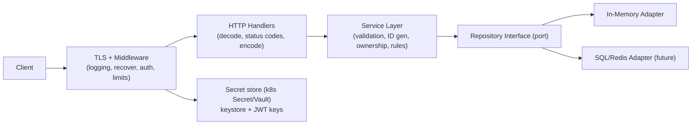

# Code Review: Todo List Service

A deep review of the Go TODO-list service. Findings are grouped by aspect and ordered roughly by severity within each section. Each item cites the relevant file and gives a concrete recommendation.

Each finding is presented as a ticket-ready table (severity, status, location, how to reproduce, suggested fix) so it can be dropped straight into JIRA or a GitHub issue. The **Findings index** below is a triage table over every item.

Severity legend: **Critical** can cause data loss/incorrect behavior/security exposure, **High** important correctness/design issue, **Medium** quality/maintainability, **Low** polish.

Status legend: **Resolved** fixed in current code, **Partial** partly addressed, **Open** still outstanding.

> **Re-review note (2026-06-22):** An MCP (Model Context Protocol) server was added and wired into the existing HTTP server. Notable changes and their review impact:
> - New `pkg/mcptools` package (`SetTools`) mounts an MCP server on the shared `ServeMux` at `/mcp` via the go-sdk `StreamableHTTPHandler` (`cmd/main.go:48-50`).
> - A `usercreate` MCP tool was added (`UserController.CreateUserTool`, `pkg/controller/user_controller.go:91-107`); `User` gained `jsonschema` tags for tool input.
> - TLS was re-enabled (`ListenAndServeTLS`) using a custom CA + SAN cert (`secrets/ca.*`, `secrets/server.*`, `secrets/fullchain.crt`); `config/properties.toml` now points at those files using **machine-specific absolute paths**.
> - New CI workflows: `lint.yml` (golangci-lint on Go 1.25), `issue-labeler.yaml`, `moderator.yml`. `sonarcloud.yml` still pins Go 1.22.0 (9.2 unchanged).
> - New docs: `docs/design/mcp-per-user-static-token-auth.md`, `docs/2_cert_key_generation.md`, `docs/2.1_trusting_custom_ca.md`.
>
> **New findings this pass:**
> - **5.11 (Critical):** the `/mcp` endpoint is completely unauthenticated, exposing the `usercreate` tool to any caller.
> - **5.12 (Medium):** `DisableLocalhostProtection: true` disables the SDK's DNS-rebinding protection unconditionally.
> - **1.10 (Critical):** the MCP `usercreate` path reaches the unguarded `UserMap` (1.7) and applies no validation, and leaks raw errors to the client.
> - **6.10 (High):** `config/properties.toml` uses developer-machine absolute paths that are baked into the image and will not exist in the container/k8s.
> - **5.7 updated:** more private-key material now sits under `secrets/` (CA key, server key) and `secrets/` is still not in `.gitignore`.

> **Re-review note (2026-06-20):** The codebase was substantially restructured and grown since the last pass. Notable changes:
> - All application code moved under a `pkg/` layout: `pkg/controller`, `pkg/memorystore`, `pkg/model`, `pkg/router`, `pkg/auth`, `pkg/utils`. `cmd/main.go` is now wiring only and imports `todolist/pkg/*`. The old top-level `controller/`, `memorystore/`, etc. are deleted from the working tree.
> - Routes moved out of `cmd` into a dedicated `pkg/router` package.
> - **TLS** is now terminated in-process via `ListenAndServeTLS` (cert/key from config).
> - **JWT authentication** was added (`pkg/auth`): RS256 tokens signed with an RSA key loaded from a PKCS#12 keystore; an `AuthorizeRequest` middleware now guards all `todos`/`categories` routes. This moves 5.2 from Open to **Partial**.
> - A **User** resource was added (`signup`/`login`) with a `UserRepository`, plus `UserID`/`UID` fields on `Todo`/`Category`.
> - **Configuration** is now read from `config/properties.toml` via `pkg/utils.InitConfig`; the port is no longer hard-coded (6.4 → Partial).
> - The Dockerfile now copies `go.sum` and real dependencies exist, closing 6.3. Empty-store `GetAll` now returns `[]` (closes 1.3).
> - New deployment surface: a Helm chart under `charts/todolist`, `scripts/`, and a SonarCloud GitHub workflow.
>
> Re-verification pass (2026-06-20): re-read every `.go` file under `pkg/` and `cmd/`, plus `Dockerfile`, `.dockerignore`, `.gitignore`, `config/*.toml`, the Helm chart, `scripts/`, `magfile.go`, and `.github/workflows/sonarcloud.yml`. `go vet ./...` is clean. Closed since last pass: 1.3 (empty store), 6.3 (go.sum in Dockerfile). Moved to Partial: 1.4 (category now uses `RLock`, todo store still doesn't), 5.2 (JWT added), 6.4 (config-file port).
>
> **New findings this pass** — several serious ones tied to the new auth/TLS/k8s surface:
> - **5.7 (Critical):** TLS private keys and the PKCS#12 keystore are committed to git (`secrets/*.pem`, `secrets/keystore.p12`).
> - **5.8 (Critical):** The same key material is also base64-embedded in the Helm `Secret` template, and the keystore password (`changeit`) is in `config/properties.toml`, the ConfigMap, and baked into the Docker image.
> - **1.7 (Critical):** `UserMap` has no mutex — concurrent signup/login is a data race / map-corruption panic.
> - **1.8 (Critical):** `utils.NewSecret` never sets its `logger`, and `Secret.Extract` ignores decode errors then type-asserts — guaranteed nil-pointer panic on any keystore problem.
> - **5.9 (High):** Passwords are stored and compared in plaintext.
> - Plus 5.10 (JWT context key / no RBAC), 6.7 (config error handling), 6.8 (Helm probes/limits), 9.2 (CI Go-version mismatch), and 1.9 (auth middleware fall-through).
>
> Presentation unchanged: findings render as a master **Findings index** plus a per-finding `Field | Detail` table so each row maps onto a JIRA/GitHub issue. Citations were updated to the new `pkg/` paths.

---

## Findings index

| ID | Severity | Status | Lens | Issue | Location |
| --- | --- | --- | --- | --- | --- |
| [1.1](#11--handlers-continue-executing-after-httperror) | Critical | Resolved | Programmer | Handlers continue executing after `http.Error` | `pkg/controller/*.go` |
| [1.2](#12--getall-returns-5-phantom-empty-structs) | Critical | Resolved | Programmer | `GetAll` returns 5 phantom empty structs | `pkg/memorystore/*.go` |
| [1.3](#13--returning-an-error-for-an-empty-store) | High | Resolved | Programmer | Empty store returned an error (500) | `pkg/memorystore/in_memory_{todo,category}.go` |
| [1.4](#14--reads-take-a-write-lock) | High | Partial | Programmer | Todo store reads still take a write `Lock()` | `pkg/memorystore/in_memory_todo.go:57-77` |
| [1.5](#15--misleading-error-messages) | High | Resolved | Programmer | Misleading/inconsistent error messages | `pkg/model/model.go` |
| [1.6](#16--update-does-not-reconcile-the-path-id-with-the-body-id) | Critical | Open | Hacker | `Update` ignores path/body id mismatch | `pkg/memorystore/in_memory_todo.go:45-55` |
| [1.7](#17--usermap-has-no-mutex-concurrent-map-access) | Critical | Open | Programmer | `UserMap` has no mutex (data race) | `pkg/memorystore/in_memory_user.go:8-33` |
| [1.8](#18--newsecret-nil-logger--extract-ignores-errors) | Critical | Open | Programmer | `NewSecret` nil logger + `Extract` panics on bad keystore | `pkg/utils/secrets.go:22-47` |
| [1.9](#19--authorizerequest-falls-through-on-invalid-token) | Medium | Open | Programmer | Auth middleware does nothing when token is non-valid | `pkg/auth/auth.go:70-75` |
| [1.10](#110--mcp-usercreate-tool-shares-the-unguarded-usermap-and-skips-validation) | Critical | Open | Programmer/Hacker | MCP `usercreate` hits unguarded `UserMap`, no validation, leaks errors | `pkg/controller/user_controller.go:91-107` |
| [2.1](#21--missing-serviceuse-case-layer) | High | Open | Architect | Missing service/use-case layer | `pkg/controller/` |
| [2.2](#22--client-supplies-primary-keys) | High | Open | Architect | Client supplies primary keys | `pkg/controller/`, `pkg/memorystore/` |
| [2.3](#23--no-referential-integrity-between-todo-category-and-user) | Medium | Open | Architect | No Todo↔Category↔User referential integrity | `pkg/model/model.go` |
| [2.4](#24--controllers-live-in-package-main) | Medium | Resolved | Architect | Controllers were in `package main` | `pkg/controller/` |
| [2.5](#25--no-contextcontext-propagation) | Medium | Open | Architect | No `context.Context` propagation | `pkg/model/model.go` |
| [2.6](#26--update-upsert-vs-strict-update) | Low | Open | Architect | `PUT` upsert vs strict update undecided | `pkg/router/*.go` |
| [3.1](#31--in-memory-store-cannot-scale-horizontally) | High | Open | Architect | In-memory store can't scale horizontally | `pkg/memorystore/` |
| [3.2](#32--lock-contention-with-a-single-global-mutex) | Medium | Open | Architect | Single global mutex contention | `pkg/memorystore/` |
| [3.3](#33--no-request-level-concurrency-limits) | Low | Open | Architect | No request concurrency limits | `cmd/main.go` |
| [4.1](#41--everything-returns-500) | High | Partial | API | Most errors return 500 | `pkg/controller/*.go` |
| [4.2](#42--non-restful-routing-and-verbs) | Medium | Resolved | API | Non-RESTful routing/verbs | `pkg/router/*.go` |
| [4.3](#43--create-returns-no-body-or-location) | Medium | Partial | API | `Create` returns no body/`Location` | `pkg/controller/*.go` |
| [4.4](#44--no-request-body-size-limit--strict-decoding) | Medium | Open | Security | No body size limit / strict decoding | `pkg/controller/*.go` |
| [5.1](#51--internal-error-details-leaked-to-clients) | High | Open | Security | Internal error details leaked to clients | `pkg/controller/*.go` |
| [5.2](#52--no-authentication--authorization) | High | Partial | Security | JWT added; no per-user ownership/RBAC | `pkg/auth/`, `pkg/router/` |
| [5.3](#53--no-server-timeouts-slowloris-exposure) | Medium | Open | Security | No server timeouts (slowloris) | `cmd/main.go:45-48` |
| [5.4](#54--no-input-validation) | Medium | Open | Security | No input validation | `pkg/controller/*.go` |
| [5.5](#55--no-rate-limiting--cors-policy--security-headers) | Low | Open | Security | No rate limiting/CORS/headers | `cmd/main.go` |
| [5.6](#56--mass-assignment--client-controls-server-owned-fields) | High | Open | Hacker | Mass assignment of server-owned fields | `pkg/controller/*.go` |
| [5.7](#57--tls-private-keys-and-keystore-committed-to-git) | Critical | Open | Security | TLS keys + keystore committed to git | `secrets/*` |
| [5.8](#58--secrets-and-keystore-password-embedded-in-repo-and-image) | Critical | Open | Security | Keystore password + key material in repo/image | `config/properties.toml:4`, `charts/todolist/templates/{secrets,config}.yaml` |
| [5.9](#59--plaintext-password-storage-and-comparison) | High | Open | Security | Passwords stored/compared in plaintext | `pkg/memorystore/in_memory_user.go`, `pkg/model/model.go` |
| [5.10](#510--jwt-context-key-collision-and-no-rbacownership) | Medium | Open | Security | String context key; hardcoded role; no RBAC | `pkg/auth/auth.go:71`, `pkg/controller/user_controller.go:71` |
| [5.11](#511--mcp-endpoint-is-unauthenticated) | Critical | Open | Security | `/mcp` has no auth; `usercreate` tool is public | `pkg/mcptools/user_mcp.go:19-22`, `cmd/main.go:48-50` |
| [5.12](#512--dns-rebinding-protection-disabled-on-the-mcp-handler) | Medium | Open | Security | `DisableLocalhostProtection: true` on the MCP handler | `pkg/mcptools/user_mcp.go:19-22` |
| [6.1](#61--listenandserve-error-is-ignored) | High | Resolved | Ops | `ListenAndServe(TLS)` error ignored | `cmd/main.go:50-54` |
| [6.2](#62--no-graceful-shutdown) | High | Open | Ops | No graceful shutdown | `cmd/main.go` |
| [6.3](#63--dockerfile-does-not-copy-gosum) | Medium | Resolved | Ops | Dockerfile now copies `go.sum` | `Dockerfile:4` |
| [6.4](#64--hardcoded-port-no-configuration) | Medium | Partial | Ops | Port from file, but no env override | `cmd/main.go`, `pkg/utils/config.go` |
| [6.5](#65--no-healthreadiness-endpoint) | Medium | Open | Ops | No health/readiness endpoint | `pkg/router/` |
| [6.6](#66--no-healthcheck-in-dockerfile) | Low | Partial | Ops | No `HEALTHCHECK` in Dockerfile | `Dockerfile` |
| [6.7](#67--initconfig-panics-and-main-ignores-config-errors) | Medium | Open | Ops | `InitConfig` panics; `main` ignores config error | `pkg/utils/config.go:24-34`, `cmd/main.go:18-23` |
| [6.8](#68--helm-deployment-lacks-probes-limits-and-securitycontext) | Medium | Open | Ops | Helm Deployment lacks probes/limits/securityContext | `charts/todolist/templates/deployment.yaml` |
| [6.9](#69--committed-build-artifact-not-gitignored) | Low | Open | Ops | `bin/app` artifact not ignored | `bin/app`, `.gitignore` |
| [6.10](#610--machine-specific-absolute-paths-in-config) | High | Open | Ops | `properties.toml` uses dev-machine absolute paths baked into the image | `config/properties.toml:3-6`, `Dockerfile:14` |
| [7.1](#71--fmtprintln-debugging-statements) | High | Resolved | Observability | `fmt.Println` debugging | `pkg/controller/*.go` |
| [7.2](#72--no-request-logging--middleware) | Medium | Partial | Observability | No access-log/recover/request-id middleware | `cmd/`, `pkg/router/` |
| [7.3](#73--no-metricstracing) | Low | Open | Observability | No metrics/tracing | `cmd/` |
| [7.4](#74--incorrectmisleading-log-attributes-and-detached-context) | Low | Open | Observability | Incorrect log attributes/detached ctx | `pkg/controller/todo_controller.go:128` |
| [8.1](#81--json-tag-typo-cayegoryid) | High | Resolved | Quality | JSON tag typo `cayegoryid` | `pkg/model/model.go:17-25` |
| [8.2](#82--inconsistent-method-naming-getbyid-vs-getbyid) | Medium | Resolved | Quality | `GetById` vs `GetByID` inconsistency | `pkg/model/model.go` |
| [8.3](#83--inconsistent-json-tag-style) | Medium | Resolved | Quality | Inconsistent JSON tag style | `pkg/model/model.go` |
| [8.4](#84--inconsistent-receiverparameter-naming) | Medium | Open | Quality | Inconsistent receiver/param naming | `pkg/memorystore/in_memory_todo.go:23,45` |
| [8.5](#85--typefile-naming) | Low | Resolved | Quality | Type/file naming | `pkg/controller/` |
| [8.6](#86--stray-files-and-misspellings) | Low | Open | Quality | Stray files & misspellings | `pkg/model/model.go`, `docs/note.txt`, `pkg/utils/config.go` |
| [9.1](#91--no-tests-at-all) | High | Open | QA | No tests at all | repo-wide |
| [9.2](#92--ci-go-version-mismatch-and-brittle-lint-gate) | Medium | Open | QA | CI Go version (1.22) ≠ `go.mod` (1.25) | `.github/workflows/sonarcloud.yml:26` |

---

## 1. Correctness Bugs (fix these first)

### 1.1 — Handlers continue executing after `http.Error`

| Field | Detail |
| --- | --- |
| **Severity** | Critical |
| **Status** | Resolved |
| **Lens** | Programmer |
| **Location** | `pkg/controller/todo_controller.go`, `pkg/controller/category_controller.go`, `pkg/controller/user_controller.go` |
| **Issue** | `http.Error(...)` was historically called on error with no `return`, so execution fell through. |
| **Impact** | Server could write a second response or dereference a zero value after already sending an error. |
| **How to reproduce** | n/a (resolved) |
| **Suggested fix** | Every handler now `return`s after `http.Error(...)` (verified across all three controllers). |

### 1.2 — `GetAll` returns 5 phantom empty structs

| Field | Detail |
| --- | --- |
| **Severity** | Critical |
| **Status** | Resolved |
| **Lens** | Programmer |
| **Location** | `pkg/memorystore/in_memory_todo.go:66-77`, `pkg/memorystore/in_memory_category.go:61-72` |
| **Issue** | `make([]T, 5)` created five zero-valued structs before `append`. |
| **Impact** | Callers got 5 empty objects prepended to the real records. |
| **How to reproduce** | n/a (resolved) |
| **Suggested fix** | Both `GetAll` methods now use `make([]T, 0)`; could still pre-size with `len(store)`. |

### 1.3 — Returning an error for an empty store

| Field | Detail |
| --- | --- |
| **Severity** | High |
| **Status** | Resolved |
| **Lens** | Programmer |
| **Location** | `pkg/memorystore/in_memory_todo.go:66-77`, `pkg/memorystore/in_memory_category.go:61-72` |
| **Issue** | `GetAll` used to return `ErrStoreEmpty` for an empty store, which controllers mapped to 500. |
| **Impact** | The normal "no data yet" case yielded HTTP 500 instead of an empty list. |
| **How to reproduce** | n/a (resolved) |
| **Suggested fix** | Both stores now early-return an empty slice with `nil` when the map is empty. `ErrStoreEmpty` is now unused in `model/model.go` and can be deleted. Current code below. |

```66:77:pkg/memorystore/in_memory_todo.go
func (t *TodoMap) GetAll() ([]model.Todo, error) {
	t.mu.Lock()
	defer t.mu.Unlock()
	todo := make([]model.Todo, 0)
	if len(t.store) == 0 {
		return todo, nil
	}
	for _, v := range t.store {
		todo = append(todo, v)
	}
	return todo, nil
}
```

The empty-slice check is redundant (the loop already yields `[]`) but harmless; the `ErrStoreEmpty` sentinel in `model/model.go:11` is now dead code.

### 1.4 — Reads take a write lock

| Field | Detail |
| --- | --- |
| **Severity** | High |
| **Status** | Partial |
| **Lens** | Programmer |
| **Location** | `pkg/memorystore/in_memory_todo.go:57-77` |
| **Issue** | `CategoryMap.GetById`/`GetAll` were fixed to `RLock()`, but `TodoMap.GetById` and `TodoMap.GetAll` still call `Lock()` (exclusive). |
| **Impact** | All todo reads are serialized unnecessarily, defeating the `RWMutex` under read-heavy load. |
| **How to reproduce** | Run concurrent `GET /api/v1/todos` under load and observe reads block each other. |
| **Suggested fix** | Use `RLock()`/`RUnlock()` in the todo store's read methods, matching the category store. Current code and fix below. |

```57:64:pkg/memorystore/in_memory_todo.go
func (t *TodoMap) GetById(id string) (model.Todo, error) {
	t.mu.Lock()
	defer t.mu.Unlock()
	if _, ok := t.store[id]; ok {
		return t.store[id], nil
	}
	return model.Todo{}, model.ErrObjectNotFound
}
```

```go
func (t *TodoMap) GetById(id string) (model.Todo, error) {
	t.mu.RLock()
	defer t.mu.RUnlock()
	if v, ok := t.store[id]; ok {
		return v, nil
	}
	return model.Todo{}, model.ErrObjectNotFound
}
```

### 1.5 — Misleading error messages

| Field | Detail |
| --- | --- |
| **Severity** | High |
| **Status** | Resolved |
| **Lens** | Programmer |
| **Location** | `pkg/model/model.go:8-12`, `pkg/memorystore/*.go` |
| **Issue** | Stores used to return ad-hoc strings (`"Store is empty"`, `"ID not found in the map "`). |
| **Impact** | Inconsistent, leaky error strings handlers couldn't map to status codes. |
| **How to reproduce** | n/a (resolved) |
| **Suggested fix** | `model/model.go` defines sentinel errors (`ErrObjectAlreadyExists`, `ErrObjectNotFound`, `ErrStoreEmpty`) returned consistently. (Note: `UserMap.Login` still returns an ad-hoc `errors.New(...)`; see 5.9.) |

### 1.6 — `Update` does not reconcile the path id with the body id

| Field | Detail |
| --- | --- |
| **Severity** | Critical |
| **Status** | Open |
| **Lens** | Hacker / Correctness |
| **Location** | `pkg/memorystore/in_memory_todo.go:45-55`, `pkg/memorystore/in_memory_category.go:32-41` |
| **Issue** | `Update` takes the id from the path but writes the *body* object verbatim under that key without checking that `body.TID`/`body.CID` matches the path id. |
| **Impact** | Map key and entity id disagree (corrupts `GetById`/serialization); classic mass-assignment foothold combined with no ownership check (5.2/5.6). |
| **How to reproduce** | `curl -k -X PUT https://localhost:8080/api/v1/todos/A -H "Authorization: Bearer $T" -d '{"tid":"B","activity":"x"}'` → a record is stored under key `A` whose internal `TID` is `B`; `GET /api/v1/todos/A` returns an object whose id is `B`. |
| **Suggested fix** | Treat the path id as authoritative: set `in.TID = id` before storing (or reject when `body.TID != "" && body.TID != id`). Current code and fix below. |

```45:55:pkg/memorystore/in_memory_todo.go
func (t *TodoMap) Update(tid string, Todo model.Todo) error {
	t.mu.Lock()
	defer t.mu.Unlock()
	if _, ok := t.store[tid]; ok {
		t.store[tid] = Todo
		return nil
	} else {
		return model.ErrObjectNotFound
	}

}
```

The success log compounds the confusion: `TodoController.Update` logs `Todolist.TID` (the body value), not the path id (see 7.4). Suggested fix — set the path id as the source of truth in the controller before persisting:

```go
func (t *TodoController) Update(w http.ResponseWriter, r *http.Request) {
	id := r.PathValue("id")
	var in model.Todo
	if err := json.NewDecoder(r.Body).Decode(&in); err != nil {
		writeError(w, http.StatusBadRequest, "invalid request body")
		return
	}
	in.TID = id // path is the source of truth; never trust the body id
	if err := t.store.Update(id, in); err != nil {
		writeError(w, statusFor(err), "could not update todo")
		return
	}
	w.WriteHeader(http.StatusNoContent)
	t.logger.LogAttrs(r.Context(), slog.LevelInfo, "todo updated", slog.String("id", id))
}
```

The same applies to `CategoryMap.Update` / `CategoryController.Update`.

### 1.7 — `UserMap` has no mutex (concurrent map access)

| Field | Detail |
| --- | --- |
| **Severity** | Critical |
| **Status** | Open |
| **Lens** | Programmer / Hacker (DoS) |
| **Location** | `pkg/memorystore/in_memory_user.go:8-33` |
| **Issue** | Unlike `TodoMap`/`CategoryMap`, `UserMap` guards its `map[string]model.User` with no lock at all. `Create` writes and `Login` iterates the map concurrently across requests. |
| **Impact** | Concurrent signup/login triggers Go's built-in concurrent-map-access detector → `fatal error: concurrent map read and map write`, crashing the whole process. A trivial unauthenticated DoS (both `signup` and `login` are public). |
| **How to reproduce** | Fire concurrent `POST /api/v1/users/signup` and `POST /api/v1/users/login` (e.g. `hey`/`wrk`), or run with `-race`; the server panics. |
| **Suggested fix** | Add a `sync.RWMutex` (write-lock `Create`, read-lock `Login`), mirroring the other stores. Current code and fix below. |

```8:33:pkg/memorystore/in_memory_user.go
type UserMap struct {
	user map[string]model.User
}

func NewUserMap() *UserMap {
	return &UserMap{
		user: make(map[string]model.User),
	}
}

func (u *UserMap) Create(user model.User) error {
	if _, ok := u.user[user.UID]; ok {
		return model.ErrObjectAlreadyExists
	}
	u.user[user.UID] = user
	return nil
}
```

```go
type UserMap struct {
	mu   sync.RWMutex
	user map[string]model.User
}

func (u *UserMap) Create(user model.User) error {
	u.mu.Lock()
	defer u.mu.Unlock()
	if _, ok := u.user[user.UID]; ok {
		return model.ErrObjectAlreadyExists
	}
	u.user[user.UID] = user
	return nil
}

func (u *UserMap) Login(username, password string) (bool, error) {
	u.mu.RLock()
	defer u.mu.RUnlock()
	// ... iterate u.user ...
}
```

### 1.8 — `NewSecret` nil logger & `Extract` ignores errors

| Field | Detail |
| --- | --- |
| **Severity** | Critical |
| **Status** | Open |
| **Lens** | Programmer |
| **Location** | `pkg/utils/secrets.go:22-47` |
| **Issue** | `NewSecret` builds the struct but **never assigns `logger`**, so `s.logger` is nil. `Extract` then logs (on a nil logger) and, worse, ignores the `err` from `os.ReadFile`/`pkcs12.Decode` and unconditionally type-asserts `privateKey.(*rsa.PrivateKey)` / `certificate.PublicKey.(*rsa.PublicKey)`. |
| **Impact** | Any keystore problem (missing file, wrong password, non-RSA key) does not fail gracefully: it panics — either a nil-pointer deref on `s.logger.LogAttrs` or a failed type assertion on a nil interface. Startup crashes with an opaque stack trace. |
| **How to reproduce** | Start with a wrong `keystore_password` or missing `keystore.p12` → process panics instead of logging a clear fatal error. |
| **Suggested fix** | Assign `logger` in `NewSecret`; return errors from `Extract` instead of swallowing them; use the comma-ok form on type assertions. Current code and fix below. |

```22:47:pkg/utils/secrets.go
func NewSecret(path, password string, logger *slog.Logger) *Secret {
	return &Secret{
		FilePath: path,
		Password: password,
	}
}

func (s *Secret) Extract() (*rsa.PrivateKey, *rsa.PublicKey) {
	fileContent, err := os.ReadFile(s.FilePath)
	if err != nil {
		s.logger.LogAttrs(context.Background(), slog.LevelError,
			"exception in loading the secret",
			slog.String("error", err.Error()))
	}

	privateKey, certificate, err := pkcs12.Decode(fileContent, s.Password)
	if err != nil {
		s.logger.LogAttrs(context.Background(), slog.LevelError,
			"exception in decoding the privatekey and certificate",
			slog.String("error", err.Error()))
	}

	s.PrivateKey = privateKey.(*rsa.PrivateKey)
	s.PublicKey = certificate.PublicKey.(*rsa.PublicKey)
	return s.PrivateKey, s.PublicKey
}
```

```go
func NewSecret(path, password string, logger *slog.Logger) *Secret {
	return &Secret{FilePath: path, Password: password, logger: logger}
}

func (s *Secret) Extract() (*rsa.PrivateKey, *rsa.PublicKey, error) {
	content, err := os.ReadFile(s.FilePath)
	if err != nil {
		return nil, nil, fmt.Errorf("read keystore: %w", err)
	}
	pk, cert, err := pkcs12.Decode(content, s.Password)
	if err != nil {
		return nil, nil, fmt.Errorf("decode keystore: %w", err)
	}
	rsaPriv, ok := pk.(*rsa.PrivateKey)
	if !ok {
		return nil, nil, errors.New("keystore private key is not RSA")
	}
	rsaPub, ok := cert.PublicKey.(*rsa.PublicKey)
	if !ok {
		return nil, nil, errors.New("certificate public key is not RSA")
	}
	return rsaPriv, rsaPub, nil
}
```

### 1.9 — `AuthorizeRequest` falls through on invalid token

| Field | Detail |
| --- | --- |
| **Severity** | Medium |
| **Status** | Open |
| **Lens** | Programmer / Security |
| **Location** | `pkg/auth/auth.go:56-78` |
| **Issue** | The middleware returns `401` when parsing errors, and calls `next` when `token.Valid`, but has **no `else`**: if a token parses without error yet `token.Valid` is false, the handler neither writes a response nor calls `next`. |
| **Impact** | The client receives an empty `200 OK` with no body and the request silently dead-ends. Defense-in-depth gap and confusing behavior. |
| **How to reproduce** | n/a (hard to hit in practice since jwt/v5 usually returns an error for invalid tokens, but the code path is unguarded). |
| **Suggested fix** | Add an explicit `else { http.Error(w, "invalid token", http.StatusUnauthorized); return }` after the `token.Valid` check. |

```70:75:pkg/auth/auth.go
		if token.Valid {
			ctx := context.WithValue(r.Context(), "user", token.Claims.(*ApplicationClaims).Username)
			a.logger.LogAttrs(context.Background(), slog.LevelInfo,
				"token received is valid")
			next.ServeHTTP(w, r.WithContext(ctx))
		}
```

### 1.10 — MCP `usercreate` tool shares the unguarded `UserMap` and skips validation

| Field | Detail |
| --- | --- |
| **Severity** | Critical |
| **Status** | Open |
| **Lens** | Programmer / Hacker |
| **Location** | `pkg/controller/user_controller.go:91-107`, `pkg/mcptools/user_mcp.go:11-14` |
| **Issue** | `CreateUserTool` calls `u.user.Create(user)` on the same `UserMap` that has no mutex (1.7), with no validation of `uid`/`username`/`password`/`email_address`, stores the password in plaintext (5.9), and returns the raw `err` to the MCP client. The tool input is bound straight to `model.User` (mass assignment, 5.6). |
| **Impact** | The MCP surface multiplies the existing `UserMap` data race (concurrent tool calls + HTTP signups can crash the process), persists unvalidated/plaintext users, and leaks internal error strings to MCP clients. |
| **How to reproduce** | Call the `usercreate` tool concurrently with `POST /api/v1/users/signup` (run with `-race`) → concurrent map read/write panic; call with an empty body → an empty user is stored. |
| **Suggested fix** | Fix 1.7 (mutex), validate inputs and hash the password in a shared service layer (2.1/5.4/5.9), accept a narrow input DTO rather than `model.User` (5.6), and return a generic tool error while logging details server-side. |

```91:107:pkg/controller/user_controller.go
func (u *UserController) CreateUserTool(ctx context.Context, req *mcp.CallToolRequest, user model.User) (
	*mcp.CallToolResult,
	Output,
	error,
) {
	err := u.user.Create(user)
	if err != nil {
		u.logger.LogAttrs(context.Background(), slog.LevelError,
			"failed to create the user object",
			slog.String("error", err.Error()))
		return nil, Output{}, err

	}
	u.logger.LogAttrs(context.Background(), slog.LevelInfo,
		"user has been created")
	return nil, Output{Status: "User has been created"}, nil
}
```

---

## 2. System Design & Architecture

### 2.1 — Missing service/use-case layer

| Field | Detail |
| --- | --- |
| **Severity** | High |
| **Status** | Open |
| **Lens** | Architect |
| **Location** | `pkg/controller/todo_controller.go`, `pkg/controller/category_controller.go`, `pkg/controller/user_controller.go` |
| **Issue** | Controllers call repositories directly. There is no application/service layer for business rules (ID generation, validation, setting `CreationDate`, password hashing, enforcing `CategoryID`/`UserID` exist). |
| **Impact** | Business logic has nowhere to live and leaks into HTTP handlers. |
| **How to reproduce** | n/a (design) |
| **Suggested fix** | Introduce a `service` package: `Controller -> Service -> Repository`. Controllers handle HTTP only; services own rules; repositories own persistence. |

### 2.2 — Client supplies primary keys (`TID`/`CID`/`UID`)

| Field | Detail |
| --- | --- |
| **Severity** | High |
| **Status** | Open |
| **Lens** | Architect / Hacker |
| **Location** | `pkg/controller/*.go`, `pkg/memorystore/*.go` |
| **Issue** | `Create` takes the id (and every other field) from the request body for todos, categories, and users; `Create` rejects with `ErrObjectAlreadyExists` rather than minting an ID. `CreationDate`/`IsDone`/`UserID` are client-controlled. |
| **Impact** | ID squatting, mass assignment, and unusable create semantics. |
| **How to reproduce** | `curl -k -X POST https://localhost:8080/api/v1/todos -H "Authorization: Bearer $T" -d '{"tid":"chosen-id","is_done":true}'` → record persisted with a client-chosen id and pre-set state. |
| **Suggested fix** | Generate IDs server-side in the service layer, ignore client-supplied IDs, set `CreationDate` server-side, and derive `UserID` from the authenticated token (see 5.2/5.10). See sample below. |

```go
func (s *TodoService) Create(ctx context.Context, in model.Todo, userID string) (model.Todo, error) {
	in.TID = uuid.NewString()
	in.UserID = userID                 // from the JWT, never the body
	in.CreationDate = time.Now().UTC()
	in.IsDone = false
	if err := validate(in); err != nil { // see 5.4
		return model.Todo{}, err
	}
	return in, s.repo.Create(ctx, in)
}
```

### 2.3 — No referential integrity between TODO, Category and User

| Field | Detail |
| --- | --- |
| **Severity** | Medium |
| **Status** | Open |
| **Lens** | Architect |
| **Location** | `pkg/model/model.go`, `pkg/memorystore/*.go` |
| **Issue** | `Todo.CategoryID`/`Todo.UserID` and `Category.UID` are free text; nothing validates the referenced category/user exists, and the controllers never populate `UserID`/`UID` from the authenticated principal. |
| **Impact** | Orphan data: todos can reference non-existent categories/users; ownership fields stay empty. |
| **How to reproduce** | `curl -k -X POST https://localhost:8080/api/v1/todos -H "Authorization: Bearer $T" -d '{"category_id":"nope","activity":"x"}'` → accepted, and `user_id` is blank. |
| **Suggested fix** | Validate `CategoryID` against the category repository and set `UserID`/`UID` from the token in the service layer. |

### 2.4 — Controllers live in `package main`

| Field | Detail |
| --- | --- |
| **Severity** | Medium |
| **Status** | Resolved |
| **Lens** | Architect |
| **Location** | `pkg/controller/` |
| **Issue** | Controllers used to live in `cmd` under `package main`. |
| **Impact** | Untestable, non-reusable controllers. |
| **How to reproduce** | n/a (resolved) |
| **Suggested fix** | Controllers now live in `pkg/controller`, and routing in `pkg/router`; `cmd/main.go` is wiring only. (A `service` layer is still missing — see 2.1.) |

### 2.5 — No `context.Context` propagation

| Field | Detail |
| --- | --- |
| **Severity** | Medium |
| **Status** | Open |
| **Lens** | Architect |
| **Location** | `pkg/model/model.go` (repository interfaces) |
| **Issue** | Repository interfaces don't take `context.Context`. Controllers and `pkg/auth`/`pkg/utils` use `context.Background()` for logging; the request context is never threaded to the store. |
| **Impact** | A real datastore adapter can't do cancellation/timeouts/tracing; adding context later breaks every method signature. |
| **How to reproduce** | n/a (design) |
| **Suggested fix** | Change signatures now to `Create(ctx context.Context, ...)`, etc., and pass `r.Context()` from handlers. |

### 2.6 — `Update` upsert vs strict update

| Field | Detail |
| --- | --- |
| **Severity** | Low |
| **Status** | Open |
| **Lens** | Architect |
| **Location** | `pkg/router/*.go`, `pkg/memorystore/*.go` |
| **Issue** | `Update` is `PUT /api/v1/{resource}/{id}` and returns `ErrObjectNotFound` when absent (strict update), undocumented and unusual for `PUT`. |
| **Impact** | Ambiguous/undocumented API semantics. |
| **How to reproduce** | n/a (design) |
| **Suggested fix** | Decide and document: keep strict update (return `404`, see 4.1) or make `PUT` a true upsert. Fix 1.6 first. |

---

## 3. Concurrency & Scalability

### 3.1 — In-memory store cannot scale horizontally

| Field | Detail |
| --- | --- |
| **Severity** | High |
| **Status** | Open |
| **Lens** | Architect |
| **Location** | `pkg/memorystore/*.go` |
| **Issue** | All state lives in process-local maps. The Helm chart can set `replicaCount > 1`, but each replica would hold different data; restarts lose everything. |
| **Impact** | Effectively caps you at a single instance with zero durability — at odds with the k8s deployment. |
| **How to reproduce** | Set `replicaCount: 2`, create a todo, repeat `GET` → inconsistent results across replicas. |
| **Suggested fix** | Implement a persistent adapter (Postgres/SQLite/Redis) behind the existing repository interfaces. |

### 3.2 — Lock contention with a single global mutex

| Field | Detail |
| --- | --- |
| **Severity** | Medium |
| **Status** | Open |
| **Lens** | Architect |
| **Location** | `pkg/memorystore/*.go` |
| **Issue** | Each store has one `RWMutex` guarding the whole map (and `UserMap` has none — see 1.7). |
| **Impact** | Under very high write load a single mutex becomes a bottleneck (fine at this scale). |
| **How to reproduce** | n/a (design) |
| **Suggested fix** | Fix 1.4/1.7 first; a persistent backend (3.1) is the real concurrency story. |

### 3.3 — No request-level concurrency limits

| Field | Detail |
| --- | --- |
| **Severity** | Low |
| **Status** | Open |
| **Lens** | Architect |
| **Location** | `cmd/main.go` |
| **Issue** | No max in-flight request limit or backpressure. |
| **Impact** | With a real datastore, unbounded concurrency can exhaust connections. |
| **How to reproduce** | n/a (design) |
| **Suggested fix** | Add connection pooling and a bounded worker model once a real datastore exists. |

---

## 4. HTTP API Design

### 4.1 — Everything returns 500

| Field | Detail |
| --- | --- |
| **Severity** | High |
| **Status** | Partial |
| **Lens** | API design |
| **Location** | `pkg/controller/todo_controller.go`, `pkg/controller/category_controller.go`, `pkg/controller/user_controller.go` |
| **Issue** | Most errors map to `500`, including not-found and (in the Todo/User controllers) bad JSON. `CategoryController` returns `400` on decode errors, but `TodoController`/`UserController` decode errors are still `500`, and store not-found maps to `500` everywhere. |
| **Impact** | API unusable for clients; real server faults are hidden. |
| **How to reproduce** | `curl -k -i -X PUT https://localhost:8080/api/v1/todos/missing -H "Authorization: Bearer $T" -d '{}'` → `500` instead of `404`. |
| **Suggested fix** | Map sentinel errors with `errors.Is`: bad JSON/validation → `400`, not found → `404`, duplicate → `409`, else `500` (log internally, don't echo `err.Error()`; see 5.1). See sample below. |

```go
func writeError(w http.ResponseWriter, status int, msg string) {
	w.Header().Set("Content-Type", "application/json")
	w.WriteHeader(status)
	_ = json.NewEncoder(w).Encode(map[string]string{"error": msg})
}

func statusFor(err error) int {
	switch {
	case errors.Is(err, model.ErrObjectNotFound):
		return http.StatusNotFound
	case errors.Is(err, model.ErrObjectAlreadyExists):
		return http.StatusConflict
	default:
		return http.StatusInternalServerError
	}
}
```

### 4.2 — Non-RESTful routing and verbs

| Field | Detail |
| --- | --- |
| **Severity** | Medium |
| **Status** | Resolved |
| **Lens** | API design |
| **Location** | `pkg/router/todo_routes.go`, `pkg/router/category_routes.go`, `pkg/router/user_routes.go` |
| **Issue** | Original routes used verbs in the path and the wrong methods. |
| **Impact** | Non-idiomatic, confusing API surface. |
| **How to reproduce** | n/a (resolved) |
| **Suggested fix** | Now RESTful under `/api/v1`: `POST/GET /api/v1/todos`, `GET/PUT/DELETE /api/v1/todos/{id}`, the equivalent for `categories`, and `POST /api/v1/users/{signup,login}`. |

### 4.3 — `Create` returns no body or `Location`

| Field | Detail |
| --- | --- |
| **Severity** | Medium |
| **Status** | Partial |
| **Lens** | API design |
| **Location** | `pkg/controller/todo_controller.go`, `pkg/controller/category_controller.go`, `pkg/controller/user_controller.go` |
| **Issue** | Handlers write `201 Created` but send no response body or `Location` header. |
| **Impact** | Clients can't learn the created resource (especially once IDs are server-generated). |
| **How to reproduce** | `curl -k -i -X POST https://localhost:8080/api/v1/todos -H "Authorization: Bearer $T" -d '{...}'` → `201` with empty body, no `Location`. |
| **Suggested fix** | Return the created resource as JSON and set `Location: /api/v1/todos/{id}`. |

### 4.4 — No request body size limit / strict decoding

| Field | Detail |
| --- | --- |
| **Severity** | Medium |
| **Status** | Open |
| **Lens** | Security |
| **Location** | `pkg/controller/*.go` |
| **Issue** | `json.NewDecoder(r.Body).Decode` accepts unknown fields and unbounded bodies in every handler. |
| **Impact** | Unbounded bodies are a memory-exhaustion DoS vector (5.4); unknown fields enable mass assignment (5.6). |
| **How to reproduce** | `curl -k -X POST https://localhost:8080/api/v1/todos -H "Authorization: Bearer $T" --data-binary @hugefile.json` → server reads the whole body into memory. |
| **Suggested fix** | Cap the body with `http.MaxBytesReader` and call `dec.DisallowUnknownFields()`. See sample below. |

```go
func decodeJSON[T any](w http.ResponseWriter, r *http.Request, dst *T) error {
	r.Body = http.MaxBytesReader(w, r.Body, 1<<20) // 1 MiB cap
	dec := json.NewDecoder(r.Body)
	dec.DisallowUnknownFields()
	return dec.Decode(dst)
}
```

---

## 5. Security

### 5.1 — Internal error details leaked to clients

| Field | Detail |
| --- | --- |
| **Severity** | High |
| **Status** | Open |
| **Lens** | Security |
| **Location** | `pkg/controller/*.go` |
| **Issue** | Almost every handler does `http.Error(w, err.Error(), ...)`, echoing raw internal error strings (errors are also logged via `slog`, which is good). |
| **Impact** | Leaks storage/parse internals; a malformed JSON body returns the exact `encoding/json` parser message. |
| **How to reproduce** | `curl -k -i -X POST https://localhost:8080/api/v1/todos -H "Authorization: Bearer $T" -d '{bad json'` → response body contains the raw parser error. |
| **Suggested fix** | Log the detailed error server-side; return a generic message via `writeError`/`statusFor` (4.1). |

### 5.2 — No authentication / authorization

| Field | Detail |
| --- | --- |
| **Severity** | High |
| **Status** | Partial |
| **Lens** | Security |
| **Location** | `pkg/auth/auth.go`, `pkg/router/*.go`, `pkg/controller/user_controller.go` |
| **Issue** | JWT authentication now guards all `todos`/`categories` routes via `AuthorizeRequest`, which is a real improvement. However: (a) there is **no authorization** — any authenticated user can read/modify/delete *any* record (IDOR), since data is not scoped by `UserID`/`UID`; (b) the role is hardcoded to `"testrole"` at login (`user_controller.go:71`) and never checked; (c) `users/signup` and `users/login` are (correctly) public, but signup is unbounded (anyone can create accounts); (d) the new `/mcp` endpoint has **no auth at all** (see 5.11), adding an entirely unauthenticated surface alongside the protected REST routes. |
| **Impact** | Authentication without ownership/RBAC still allows cross-tenant data access once any account exists. |
| **How to reproduce** | Sign up user A and user B; with B's token, `GET`/`DELETE` a todo created by A → succeeds. |
| **Suggested fix** | Stamp `UserID`/`UID` from the token claims on create; filter reads/writes by the authenticated user; enforce roles where needed (see 5.10). |

### 5.3 — No server timeouts (slowloris exposure)

| Field | Detail |
| --- | --- |
| **Severity** | Medium |
| **Status** | Open |
| **Lens** | Security |
| **Location** | `cmd/main.go:52-55` |
| **Issue** | `http.Server` is created with no `ReadTimeout`, `ReadHeaderTimeout`, `WriteTimeout`, or `IdleTimeout` (even though it now serves TLS). |
| **Impact** | A slow client can hold connections open indefinitely (slowloris DoS). |
| **How to reproduce** | Open a TLS connection and dribble headers slowly; the server keeps it open with no timeout. |
| **Suggested fix** | Set sensible timeouts on `http.Server`. Current code and fix below. |

```52:55:cmd/main.go
	server := &http.Server{
		Addr:    config.Service.Port,
		Handler: mux,
	}
```

```go
server := &http.Server{
	Addr:              config.Service.Port,
	Handler:           mux,
	ReadHeaderTimeout: 5 * time.Second,
	ReadTimeout:       10 * time.Second,
	WriteTimeout:      15 * time.Second,
	IdleTimeout:       60 * time.Second,
}
```

### 5.4 — No input validation

| Field | Detail |
| --- | --- |
| **Severity** | Medium |
| **Status** | Open |
| **Lens** | Security |
| **Location** | `pkg/controller/*.go` |
| **Issue** | No checks that `Activity`/`Name`/`Username`/`Password` are non-empty, length-bounded, well-formed (e.g. email). |
| **Impact** | Combined with no body size limit (4.4), a DoS/garbage-data vector; empty-credential users can be created. |
| **How to reproduce** | `curl -k -X POST https://localhost:8080/api/v1/users/signup -d '{}'` → empty user persisted. |
| **Suggested fix** | Validate required fields and bound lengths in the service layer before persisting. |

### 5.5 — No rate limiting / CORS policy / security headers

| Field | Detail |
| --- | --- |
| **Severity** | Low |
| **Status** | Open |
| **Lens** | Security |
| **Location** | `cmd/main.go` |
| **Issue** | No throttling, no explicit CORS handling, no security headers. `users/login`/`signup` are unauthenticated and unthrottled (brute-force surface). |
| **Impact** | Open to credential brute force/abuse; no browser-origin controls. |
| **How to reproduce** | n/a (design) |
| **Suggested fix** | Add rate-limiting middleware (especially on auth endpoints) and an explicit CORS/headers policy. |

### 5.6 — Mass assignment — client controls server-owned fields

| Field | Detail |
| --- | --- |
| **Severity** | High |
| **Status** | Open |
| **Lens** | Hacker / Security |
| **Location** | `pkg/controller/*.go` |
| **Issue** | Handlers decode the full struct straight from the body and persist it, so the client controls *every* field: `CreationDate`, `IsDone`, `TID`/`CID`/`UID` (id squatting + overwrite via 1.6), `CategoryID`, and crucially `UserID`/`UID` (ownership). |
| **Impact** | Textbook mass assignment; because ownership is client-set and unchecked (5.2), a caller can forge `user_id` to attribute or access another user's data. |
| **How to reproduce** | `curl -k -X POST https://localhost:8080/api/v1/todos -H "Authorization: Bearer $T" -d '{"tid":"x","user_id":"victim","creation_date":"1999-01-01T00:00:00Z","is_done":true}'` → all fields persisted as sent. |
| **Suggested fix** | Don't bind the transport DTO to the domain object; accept a narrow input DTO with only client-settable fields and set ids/timestamps/state/owner server-side (2.2). Add `dec.DisallowUnknownFields()` (4.4). |

### 5.7 — TLS private keys and keystore committed to git

| Field | Detail |
| --- | --- |
| **Severity** | Critical |
| **Status** | Open |
| **Lens** | Security |
| **Location** | tracked: `secrets/key.pem`, `secrets/serverkey.pem`, `secrets/keystore.p12`, `secrets/cert.pem`, `secrets/servercert.pem`; new untracked: `secrets/ca.key`, `secrets/server.key`, `secrets/server.csr`, `secrets/ca.crt`, `secrets/server.crt`, `secrets/fullchain.crt` |
| **Issue** | The private keys and PKCS#12 keystore used for TLS and JWT signing are tracked in the repository (`git ls-files secrets/` lists five). The TLS rework added a fresh CA key and server key under `secrets/` (currently untracked), and `.gitignore` still does **not** ignore `secrets/`, so the new keys are one `git add` away from being committed too. `.dockerignore` excludes `secrets/`, but the existing key material is already in version-control history. |
| **Impact** | Anyone with repo access (or a leak/fork) holds the server's private TLS key, the new CA private key, and the JWT signing key — they can decrypt/MITM traffic, mint trusted certificates, and forge valid JWTs for any user/role. This is a full authentication bypass. |
| **How to reproduce** | `git log --stat -- secrets/` shows the committed key material; `git status` shows the new untracked `secrets/*.key` files with no `.gitignore` entry; `openssl rsa -in secrets/server.key -check` validates a private key. |
| **Suggested fix** | Remove `secrets/` from the index (`git rm --cached -r secrets/`), add `secrets/` to `.gitignore`, **rotate all keys and the keystore** (the committed ones are compromised), and inject key material at deploy time (k8s Secret/Vault), never via git. |

### 5.8 — Secrets and keystore password embedded in repo and image

| Field | Detail |
| --- | --- |
| **Severity** | Critical |
| **Status** | Open |
| **Lens** | Security |
| **Location** | `config/properties.toml:4`, `config/properties.toml.dev:5`, `charts/todolist/templates/secrets.yaml:2-5`, `charts/todolist/templates/config.yaml:7`, `Dockerfile:14` |
| **Issue** | The keystore password (`changeit`) is hardcoded in `config/properties.toml` (which `Dockerfile:14` copies into the image), in `properties.toml.dev`, and in the Helm ConfigMap. The Helm `Secret` template hardcodes the base64-encoded `keystore.p12`/`servercert.pem`/`serverkey.pem` directly in the chart (base64 is encoding, not encryption). |
| **Impact** | The signing/TLS key material and its (weak, default) password ship inside the container image and the chart, so possessing either fully compromises auth and TLS — compounding 5.7. |
| **How to reproduce** | `docker run ... cat /config/properties.toml` shows the password; `echo <data> | base64 -d` on `secrets.yaml` reconstructs the private key. |
| **Suggested fix** | Move the password and key material to a real secret store (k8s `Secret` populated out-of-band, External Secrets/Vault); reference it via `valueFrom`/`secretKeyRef`; remove key material from the chart and the image; use a strong, rotated password. |

### 5.9 — Plaintext password storage and comparison

| Field | Detail |
| --- | --- |
| **Severity** | High |
| **Status** | Open |
| **Lens** | Security |
| **Location** | `pkg/memorystore/in_memory_user.go:18-33`, `pkg/model/model.go:36-41`, `pkg/controller/user_controller.go:51-69` |
| **Issue** | `User.Password` is stored verbatim in the map and `Login` does a plaintext `==` comparison. No hashing, no constant-time compare. The password field is also a serializable JSON tag with no `-`. |
| **Impact** | Any memory dump, log, or future persistence leak exposes raw passwords; the `==` compare is timing-attackable; signup could echo the password back if the user object is ever returned. |
| **How to reproduce** | Sign up a user, inspect the in-memory map / any debug dump → plaintext password. |
| **Suggested fix** | Hash with `bcrypt`/`argon2` on signup and `CompareHashAndPassword` on login; never serialize the hash (`json:"-"`). See sample below. |

```go
hash, _ := bcrypt.GenerateFromPassword([]byte(in.Password), bcrypt.DefaultCost)
in.Password = string(hash) // store the hash, never the plaintext

// login:
if bcrypt.CompareHashAndPassword([]byte(stored.Password), []byte(attempt)) != nil {
	return false, model.ErrObjectNotFound
}
```

### 5.10 — JWT context key collision and no RBAC/ownership

| Field | Detail |
| --- | --- |
| **Severity** | Medium |
| **Status** | Open |
| **Lens** | Security |
| **Location** | `pkg/auth/auth.go:71`, `pkg/controller/user_controller.go:71` |
| **Issue** | `context.WithValue(r.Context(), "user", ...)` uses a bare `string` key (vet/staticcheck SA1029) which can collide across packages, and nothing downstream actually reads it. The role is hardcoded `"testrole"` at token issue and never enforced. |
| **Impact** | Fragile context plumbing and a non-functional authorization model — the token carries identity that the handlers ignore (ties to 5.2/5.6). |
| **How to reproduce** | n/a (design); `staticcheck ./...` flags the string context key. |
| **Suggested fix** | Use an unexported key type (`type ctxKey struct{}`), read the username/role from context in handlers to scope data and enforce roles, and derive the role from the user record rather than a constant. |

### 5.11 — MCP endpoint is unauthenticated

| Field | Detail |
| --- | --- |
| **Severity** | Critical |
| **Status** | Open |
| **Lens** | Security |
| **Location** | `pkg/mcptools/user_mcp.go:19-22`, `cmd/main.go:48-50` |
| **Issue** | `SetTools` mounts the MCP `StreamableHTTPHandler` directly on the shared mux at `/mcp` with no auth middleware, while every `todos`/`categories` route is wrapped in `AuthorizeRequest`. Anyone who can reach the port can list and invoke tools — currently `usercreate` — with no token. The per-user static-token design exists only as a doc (`docs/design/mcp-per-user-static-token-auth.md`), not in code. |
| **Impact** | Unauthenticated account creation (and any future tool) over MCP; combined with 1.10 it is also an unauthenticated crash/DoS vector. |
| **How to reproduce** | `curl -k https://localhost:8080/mcp` with a JSON-RPC `tools/call` for `usercreate` (no `Authorization` header) → a user is created. |
| **Suggested fix** | Wrap the `/mcp` handler with the same JWT middleware (or the designed static-token verifier via `go-sdk/mcp/auth.RequireBearerToken`) before mounting it; reject unauthenticated requests. See sample below. |

```19:22:pkg/mcptools/user_mcp.go
	mux.Handle("/mcp", mcp.NewStreamableHTTPHandler(
		func(*http.Request) *mcp.Server { return mcpserver },
		&mcp.StreamableHTTPOptions{DisableLocalhostProtection: true},
	))
```

```go
mcpHandler := mcp.NewStreamableHTTPHandler(
	func(*http.Request) *mcp.Server { return mcpserver },
	&mcp.StreamableHTTPOptions{},
)
mux.Handle("/mcp", authn.AuthorizeRequest(mcpHandler)) // require a valid token
```

### 5.12 — DNS-rebinding protection disabled on the MCP handler

| Field | Detail |
| --- | --- |
| **Severity** | Medium |
| **Status** | Open |
| **Lens** | Security |
| **Location** | `pkg/mcptools/user_mcp.go:19-22` |
| **Issue** | `DisableLocalhostProtection: true` is set unconditionally, turning off the SDK's `Host`/`Origin` validation that defends against DNS-rebinding. It was added to make a `todolist.ai:8080` host header work during local development, but it ships in the same code path used everywhere. |
| **Impact** | A malicious web page in the user's browser could rebind DNS and reach the local MCP server, invoking tools (compounded by the missing auth in 5.11). |
| **How to reproduce** | n/a (design); the flag is hardcoded on, so `Host`/`Origin` are no longer checked. |
| **Suggested fix** | Leave protection enabled and instead configure the allowed hosts, or gate `DisableLocalhostProtection` behind an explicit dev-only config flag (default off). Re-enable once 5.11 adds real auth. |

---

## 6. Deployment & Operations

### 6.1 — `ListenAndServe` error is ignored

| Field | Detail |
| --- | --- |
| **Severity** | High |
| **Status** | Resolved |
| **Lens** | Ops |
| **Location** | `cmd/main.go:59-63` |
| **Issue** | The server-start error used to be ignored. |
| **Impact** | Silent crash with no signal to operators. |
| **How to reproduce** | n/a (resolved) |
| **Suggested fix** | `main` now checks the `ListenAndServeTLS` error, logs it via `slog`, and exits non-zero (below). Once 6.2 lands, treat `http.ErrServerClosed` as a clean exit. |

```59:63:cmd/main.go
	if err := server.ListenAndServeTLS(config.Service.ServerCert, config.Service.ServerKey); err != nil {
		logger.LogAttrs(context.Background(), slog.LevelError, "http server stopped",
			slog.String("error", err.Error()))
		os.Exit(1)
	}
```

### 6.2 — No graceful shutdown

| Field | Detail |
| --- | --- |
| **Severity** | High |
| **Status** | Open |
| **Lens** | Ops |
| **Location** | `cmd/main.go` |
| **Issue** | No signal handling. Once shutdown is added, the current `os.Exit(1)` path will also treat a clean shutdown as failure (`ListenAndServeTLS` returns `http.ErrServerClosed`). |
| **Impact** | On SIGTERM (common in Kubernetes) in-flight requests are dropped. |
| **How to reproduce** | Send `SIGTERM` while a request is in flight → connection is cut instead of draining. |
| **Suggested fix** | Use `signal.NotifyContext` + `server.Shutdown(ctx)`; treat `http.ErrServerClosed` as clean. See sample below. |

```go
ctx, stop := signal.NotifyContext(context.Background(), os.Interrupt, syscall.SIGTERM)
defer stop()

go func() {
	if err := server.ListenAndServeTLS(cert, key); err != nil && !errors.Is(err, http.ErrServerClosed) {
		logger.LogAttrs(ctx, slog.LevelError, "server error", slog.Any("error", err))
		os.Exit(1)
	}
}()

<-ctx.Done()
shutdownCtx, cancel := context.WithTimeout(context.Background(), 10*time.Second)
defer cancel()
_ = server.Shutdown(shutdownCtx)
```

### 6.3 — Dockerfile does not copy `go.sum`

| Field | Detail |
| --- | --- |
| **Severity** | Medium |
| **Status** | Resolved |
| **Lens** | Ops |
| **Location** | `Dockerfile:4` |
| **Issue** | The build stage previously copied only `go.mod`. |
| **Impact** | Non-reproducible builds once dependencies exist. |
| **How to reproduce** | n/a (resolved) |
| **Suggested fix** | The Dockerfile now does `COPY go.mod go.sum ./` and the repo has a real `go.sum` with verified modules. The distroless/nonroot base and `CGO_ENABLED=0` remain good; consider `-ldflags="-s -w"`. Current code below. |

```4:5:Dockerfile
COPY go.mod go.sum ./
RUN go mod download -x
```

### 6.4 — Hardcoded port, no configuration

| Field | Detail |
| --- | --- |
| **Severity** | Medium |
| **Status** | Partial |
| **Lens** | Ops |
| **Location** | `cmd/main.go`, `pkg/utils/config.go` |
| **Issue** | The port (and cert/key/keystore paths) now come from `config/properties.toml` via `InitConfig`, so it is no longer hard-coded. There is still no environment-variable override, and the config file path itself is hard-coded in `main` (`"./config/properties.toml"`). |
| **Impact** | Config is file-only; running with a different config requires rebuilding the file path or image. |
| **How to reproduce** | Set `PORT=9090` → ignored; only the TOML value is honored. |
| **Suggested fix** | Allow env overrides (e.g. `PORT`, `CONFIG_FILE`) layered over the TOML defaults. |

### 6.5 — No health/readiness endpoint

| Field | Detail |
| --- | --- |
| **Severity** | Medium |
| **Status** | Open |
| **Lens** | Ops |
| **Location** | `pkg/router/` |
| **Issue** | There is no `/healthz` or `/readyz`, and the Helm Deployment defines no probes (6.8). |
| **Impact** | Orchestrators have no liveness/readiness probe target. |
| **How to reproduce** | `curl -k -i https://localhost:8080/healthz` → `404`. |
| **Suggested fix** | Add unauthenticated `/healthz` (liveness) and `/readyz` (readiness) handlers returning `200`. |

### 6.6 — No `HEALTHCHECK` in Dockerfile

| Field | Detail |
| --- | --- |
| **Severity** | Low |
| **Status** | Partial |
| **Lens** | Ops |
| **Location** | `Dockerfile` |
| **Issue** | Structured logging is in place, but the container has no `HEALTHCHECK`. (A distroless image has no shell/curl, so a healthcheck binary or k8s probe is needed.) |
| **Impact** | Container runtimes can't detect an unhealthy process. |
| **How to reproduce** | `docker inspect` shows no healthcheck. |
| **Suggested fix** | Prefer k8s probes against `/healthz` (6.5/6.8); for plain Docker, add a tiny healthcheck binary. |

### 6.7 — `InitConfig` panics and `main` ignores config errors

| Field | Detail |
| --- | --- |
| **Severity** | Medium |
| **Status** | Open |
| **Lens** | Ops |
| **Location** | `pkg/utils/config.go:24-34`, `cmd/main.go:18-23` |
| **Issue** | `InitConfig` `panic(err)`s on a decode error but otherwise always returns a `nil` error, so `main`'s `if err != nil` branch is dead. Worse, if it ever did return an error, `main` only logs and **continues** with a possibly-empty config, then dereferences `config.Service.*`. |
| **Impact** | Inconsistent failure handling: a bad config panics with a stack trace; a hypothetical soft error would proceed into nil/empty config use. |
| **How to reproduce** | Point `InitConfig` at a malformed TOML → process panics instead of a clean fatal log + exit. |
| **Suggested fix** | Return the error from `InitConfig` (don't panic); in `main`, log and `os.Exit(1)` on config error instead of continuing. |

```24:34:pkg/utils/config.go
func InitConfig(configFile string, cfg *Config, logger *slog.Logger) (*Config, error) {

	_, err := toml.DecodeFile(configFile, &cfg)

	if err != nil {
		logger.LogAttrs(context.Background(), slog.LevelError, "could not decode the config",
			slog.String("error", err.Error()))
		panic(err)
	}
	return cfg, nil
}
```

### 6.8 — Helm Deployment lacks probes, limits, and securityContext

| Field | Detail |
| --- | --- |
| **Severity** | Medium |
| **Status** | Open |
| **Lens** | Ops |
| **Location** | `charts/todolist/templates/deployment.yaml:21-34`, `charts/todolist/values.yaml` |
| **Issue** | The Deployment defines no `livenessProbe`/`readinessProbe`, no `resources` (requests/limits are an empty `{}` in values), and no `securityContext` (runAsNonRoot/readOnlyRootFilesystem/drop capabilities). The ConfigMap is mounted at `/config` but the app reads `./config/properties.toml` (relative to WORKDIR `/`), i.e. `/config/properties.toml` — workable, but undocumented and fragile. |
| **Impact** | No self-healing or readiness gating, unbounded resource use, and a weaker pod security posture than the distroless image allows. |
| **How to reproduce** | `helm template charts/todolist` shows no probes/resources/securityContext. |
| **Suggested fix** | Add probes against `/healthz`/`/readyz` (6.5), set `resources`, and add a `securityContext` (`runAsNonRoot: true`, `readOnlyRootFilesystem: true`, `allowPrivilegeEscalation: false`, drop all capabilities). |

### 6.9 — Committed build artifact not gitignored

| Field | Detail |
| --- | --- |
| **Severity** | Low |
| **Status** | Open |
| **Lens** | Ops |
| **Location** | `bin/app`, `.gitignore` |
| **Issue** | `magfile.go` builds to `./bin/app`; the produced binary is present in the working tree and `.gitignore` ignores `/todolist` but not `bin/`. |
| **Impact** | Risk of committing a large binary; repo clutter. |
| **How to reproduce** | `mage build` then `git status` → `bin/app` shows as untracked. |
| **Suggested fix** | Add `/bin/` to `.gitignore`. |

### 6.10 — Machine-specific absolute paths in config

| Field | Detail |
| --- | --- |
| **Severity** | High |
| **Status** | Open |
| **Lens** | Ops |
| **Location** | `config/properties.toml:3-6`, `Dockerfile:14` |
| **Issue** | `keystore_file_path`, `server_cert`, and `server_key` were changed from container paths (`/etc/todolist/secrets/...`) to a developer's home directory (`/Users/rahulra/claude/todolist/secrets/...`). The `Dockerfile` copies `config/` into the image, so this file ships baked in, and `main` loads it via the hard-coded `./config/properties.toml`. |
| **Impact** | The container/k8s pod will fail to start (`open /Users/rahulra/...: no such file or directory`) because those paths don't exist outside the developer's machine; also a minor information disclosure of the local layout. There is also a trailing space after the `server_cert` value. |
| **How to reproduce** | `docker build` then `docker run` the image → TLS startup fails because the keystore/cert paths don't resolve. |
| **Suggested fix** | Use container-relative paths (e.g. `/etc/todolist/secrets/...` or `./secrets/...`) and allow an env override (6.4); keep developer-local paths out of the committed config. Current values below. |

```3:6:config/properties.toml
keystore_file_path = "/Users/rahulra/claude/todolist/secrets/keystore.p12"
keystore_password  = "changeit"
server_cert        = "/Users/rahulra/claude/todolist/secrets/fullchain.crt" 
server_key         = "/Users/rahulra/claude/todolist/secrets/server.key"
```

---

## 7. Observability & Logging

### 7.1 — `fmt.Println` debugging statements

| Field | Detail |
| --- | --- |
| **Severity** | High |
| **Status** | Resolved |
| **Lens** | Observability |
| **Location** | `pkg/controller/*.go`, `pkg/memorystore/in_memory_todo.go:31` |
| **Issue** | The original controllers had `fmt.Println` debug lines. |
| **Impact** | Noisy, unstructured debug output. |
| **How to reproduce** | n/a (resolved) |
| **Suggested fix** | All controllers use `*slog.Logger` with `LogAttrs`. One leftover commented `// fmt.Println(m.store, "......")` at `in_memory_todo.go:31` can be deleted. |

### 7.2 — No request logging / middleware

| Field | Detail |
| --- | --- |
| **Severity** | Medium |
| **Status** | Partial |
| **Lens** | Observability |
| **Location** | `cmd/main.go`, `pkg/router/*.go` |
| **Issue** | There is now an auth middleware, but still no access logging, request IDs, or panic-recovery wrapper. A panic in any handler (e.g. the `UserMap` race in 1.7) takes the request/process down. |
| **Impact** | No recovery, no correlation across logs, hard to debug. |
| **How to reproduce** | Trigger a panic in a handler → connection drops with no recovery. |
| **Suggested fix** | Add middleware for access logging, request IDs, and `recover()`, composed with the existing auth middleware. |

### 7.3 — No metrics/tracing

| Field | Detail |
| --- | --- |
| **Severity** | Low |
| **Status** | Open |
| **Lens** | Observability |
| **Location** | `cmd/` |
| **Issue** | No Prometheus metrics or tracing hooks. |
| **Impact** | No visibility into latency, error rates, or traces. |
| **How to reproduce** | n/a (design) |
| **Suggested fix** | Expose `/metrics` and add OpenTelemetry tracing when the service grows. |

### 7.4 — Incorrect/misleading log attributes and detached context

| Field | Detail |
| --- | --- |
| **Severity** | Low |
| **Status** | Open |
| **Lens** | Observability |
| **Location** | `pkg/controller/todo_controller.go:128`, both controllers, `pkg/auth/auth.go` |
| **Issue** | `TodoController.GetById` logs the id under the wrong key (`slog.String("category_id", id)`; should be `"id"`); `TodoController.Update` success logs `Todolist.TID` (body value) not the path id (ties into 1.6); every handler and the auth middleware pass `context.Background()` to `LogAttrs` instead of `r.Context()`. |
| **Impact** | Misleading attributes and logs that can't be correlated once trace/request IDs exist (7.2). |
| **How to reproduce** | `GET /api/v1/todos/{id}` → log line tags the id as `category_id`. |
| **Suggested fix** | Use the correct key (`"id"`), log the path id in `Update`, and pass `r.Context()` to `LogAttrs`. |

---

## 8. Naming, Conventions & Code Quality

### 8.1 — JSON tag typo `cayegoryid`

| Field | Detail |
| --- | --- |
| **Severity** | High |
| **Status** | Resolved |
| **Lens** | Quality |
| **Location** | `pkg/model/model.go:17-25` |
| **Issue** | The `CategoryID` JSON tag was misspelled. |
| **Impact** | Wrong serialized field name. |
| **How to reproduce** | n/a (resolved) |
| **Suggested fix** | The tag is now `json:"category_id"`. Current struct below. |

```17:25:pkg/model/model.go
	Todo struct {
		TID          string    `json:"tid"`
		Activity     string    `json:"activity"`
		Description  string    `json:"description"`
		CreationDate time.Time `json:"creation_date"`
		IsDone       bool      `json:"is_done"`
		CategoryID   string    `json:"category_id"`
		UserID       string    `json:"user_id"`
	}
```

### 8.2 — Inconsistent method naming: `GetById` vs `GetByID`

| Field | Detail |
| --- | --- |
| **Severity** | Medium |
| **Status** | Resolved |
| **Lens** | Quality |
| **Location** | `pkg/model/model.go`, `pkg/memorystore/*.go` |
| **Issue** | The two repositories used different spellings. |
| **Impact** | Inconsistent API surface. |
| **How to reproduce** | n/a (resolved) |
| **Suggested fix** | Both repositories now use `GetById` consistently. (A future polish pass could adopt the Go-idiomatic `GetByID`.) |

### 8.3 — Inconsistent JSON tag style

| Field | Detail |
| --- | --- |
| **Severity** | Medium |
| **Status** | Resolved |
| **Lens** | Quality |
| **Location** | `pkg/model/model.go:17-41` |
| **Issue** | Multi-word JSON tags mixed styles. |
| **Impact** | Inconsistent wire format. |
| **How to reproduce** | n/a (resolved) |
| **Suggested fix** | Multi-word tags are now consistent snake_case (`creation_date`, `is_done`, `category_id`, `user_id`, `email_address`). |

### 8.4 — Inconsistent receiver/parameter naming

| Field | Detail |
| --- | --- |
| **Severity** | Medium |
| **Status** | Open |
| **Lens** | Quality |
| **Location** | `pkg/memorystore/in_memory_todo.go:23,45`, both controllers |
| **Issue** | `TodoMap.Create(Todo model.Todo)` and `TodoMap.Update(tid string, Todo model.Todo)` use an exported-looking, type-shadowing parameter `Todo`; controllers use a capitalized local `var Todolist`. |
| **Impact** | Type shadowing and non-idiomatic names hurt readability. |
| **How to reproduce** | n/a (style) |
| **Suggested fix** | Use short, lowercase parameter/variable names (e.g. `todo`). |

### 8.5 — Type/file naming

| Field | Detail |
| --- | --- |
| **Severity** | Low |
| **Status** | Resolved |
| **Lens** | Quality |
| **Location** | `pkg/controller/`, `pkg/memorystore/` |
| **Issue** | `TODOController` was inconsistent with `TodoMap`/`TodoRepository`. |
| **Impact** | Confusing naming. |
| **How to reproduce** | n/a (resolved) |
| **Suggested fix** | Types are now `TodoController`/`TodoMap`/`TodoRepository`, etc. |

### 8.6 — Stray files and misspellings

| Field | Detail |
| --- | --- |
| **Severity** | Low |
| **Status** | Open |
| **Lens** | Quality |
| **Location** | `pkg/model/model.go:14,45`, `docs/note.txt`, `pkg/utils/config.go:16` |
| **Issue** | A scratch-notes file lives at `docs/note.txt`; misspellings remain: "indepdendent"/"persistance" in `model/model.go`, "Reposyiry"/"idividual" in `docs/note.txt`, the struct field `KeystorePasswword` (triple-w) in `config.go`, and "Catgeory"/"catagory" in router/controller log messages. |
| **Impact** | Repo clutter and unprofessional identifiers (the misspelled field name is part of the public API of `utils.Config`). |
| **How to reproduce** | n/a (cleanup) |
| **Suggested fix** | Remove the scratch file and fix the misspellings (rename `KeystorePasswword` → `KeystorePassword`, updating its one use in `cmd/main.go:27`). |

---

## 9. Testing

### 9.1 — No tests at all

| Field | Detail |
| --- | --- |
| **Severity** | High |
| **Status** | Open |
| **Lens** | QA / Programmer |
| **Location** | repo-wide |
| **Issue** | There are no `_test.go` files anywhere. |
| **Impact** | Subtle store bugs (1.6, 1.7) that unit tests would catch ship undetected. |
| **How to reproduce** | `go test ./...` → `no test files`. |
| **Suggested fix** | Table-driven unit tests for all three stores (with `-race`), handler tests via `net/http/httptest`, and auth/token tests. |

### 9.2 — CI Go version mismatch and brittle lint gate

| Field | Detail |
| --- | --- |
| **Severity** | Medium |
| **Status** | Open |
| **Lens** | QA / Ops |
| **Location** | `.github/workflows/sonarcloud.yml:23-38` |
| **Issue** | `sonarcloud.yml` pins `go-version: '1.22.0'` (`:26`), but `go.mod` requires `go 1.25.0`; the build/tests will fail to compile in CI. It installs `golangci-lint@latest` as a hard gate, while `setup-go@v4`/`checkout@v3` are outdated and there is no `.golangci.yml`. A newer `.github/workflows/lint.yml` correctly uses Go `1.25` (`:21`), so the two workflows now disagree on the toolchain. |
| **Impact** | The SonarCloud workflow cannot pass as written (toolchain too old for the module), so analysis never runs reliably; the inconsistent Go versions across workflows are a maintenance trap. |
| **How to reproduce** | Push to `main` → the SonarCloud "Set up Go 1.22" job fails building a `go 1.25` module. |
| **Suggested fix** | Align all workflows on `go-version-file: go.mod` (or `1.25.x`), update the actions, and add a checked-in `.golangci.yml`. |

---

## 10. Suggested Target Architecture



---

## 11. Priority Checklist

Closed since the original review:

- [x] Add `return` after every `http.Error` (1.1).
- [x] Fix `GetAll` slice allocation (1.2).
- [x] Return `[]` (not an error) for an empty store (1.3).
- [x] Standardize not-found errors via sentinels (1.5).
- [x] Move controllers out of `package main` into `pkg/controller` (2.4).
- [x] RESTful routing under `/api/v1/*` with correct verbs (4.2).
- [x] Check the server-start error (6.1).
- [x] Copy `go.sum` in the Dockerfile (6.3).
- [x] Replace `fmt.Println` with structured `slog` logging (7.1).
- [x] Consistent `GetById` naming + snake_case JSON tags + `category_id` typo + `TodoController` naming (8.1, 8.2, 8.3, 8.5).
- [x] Add JWT authentication middleware (partial close of 5.2).

Still outstanding (highest priority first):

1. **Authenticate the `/mcp` endpoint** — it currently exposes the `usercreate` tool to anyone; re-enable DNS-rebinding protection (5.11, 5.12, 1.10).
2. **Remove and rotate committed key material** — TLS/JWT keys are in git and the image/chart, and new CA/server keys sit untracked under an un-gitignored `secrets/` (5.7, 5.8).
3. **Add a mutex to `UserMap`** — current code is an unauthenticated crash/data-race, now reachable over both HTTP and MCP (1.7, 1.10).
4. **Fix `NewSecret`/`Extract`** — nil logger + swallowed errors panic on any keystore issue (1.8).
5. **Hash passwords** — stop storing/comparing plaintext (5.9).
6. **Fix machine-specific config paths** — `properties.toml` absolute paths break the container/k8s image (6.10).
7. **Reconcile path id with body id in `Update`**; stop trusting client-supplied state/ownership (1.6, 2.2, 5.6).
8. **Authorization/ownership** — scope data per authenticated user; fix JWT context key/role (5.2, 5.10).
9. Map errors to correct HTTP status codes; stop leaking `err.Error()` (4.1, 5.1).
10. Add input validation + body size limit / strict decoding (5.4, 4.4).
11. Add server timeouts and graceful shutdown (5.3, 6.2).
12. Use `RLock` for todo reads (1.4); fix config error handling (6.7).
13. Add probes/resources/securityContext + health endpoints (6.5, 6.8); recovery + logging middleware (7.2).
14. Fix CI Go version (9.2); add unit/handler tests with `-race` (9.1); introduce a service layer (2.1); plan a persistent adapter (3.1).
