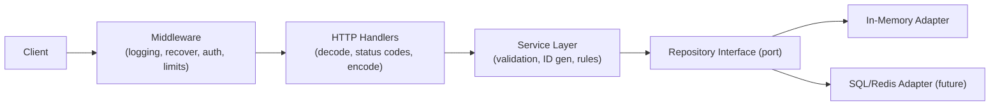

# Code Review: Todo List Service

A deep review of the Go TODO-list service. Findings are grouped by aspect and ordered roughly by severity within each section. Each item cites the relevant file and gives a concrete recommendation.

Each finding is presented as a ticket-ready table (severity, status, location, how to reproduce, suggested fix) so it can be dropped straight into JIRA or a GitHub issue. The **Findings index** below is a triage table over every item.

Severity legend: **Critical** can cause data loss/incorrect behavior/security exposure, **High** important correctness/design issue, **Medium** quality/maintainability, **Low** polish.

Status legend: **Resolved** fixed in current code, **Partial** partly addressed, **Open** still outstanding.

> **Re-review note (2026-06-15):** The codebase changed since the original review. Notable changes:
> - Controllers moved out of `package main` into a dedicated `controller/` package.
> - Structured logging (`log/slog`) added and injected into controllers.
> - Routes refactored to RESTful resource paths under `/api/v1/*` (closes 4.2).
> - `Update` now takes the id from the path: `Update(id string, obj)` — but the body id is not reconciled with the path id, which introduces a **new** integrity bug (see 1.6).
> - A naming refactor renamed `TODO` → `Todo`, `TODOController` → `TodoController`, `ToDoRepository` → `TodoRepository`, and standardized `GetByID` → `GetById` across both repositories. JSON tags moved to snake_case (`creation_date`, `is_done`).
>
> Re-verification pass (2026-06-15): re-read all `.go` files plus `Dockerfile`, `.dockerignore`, `.github/workflows/`, and `go.mod`. No status changes — every finding was confirmed against current code. This pass modernized the doc's own stale symbol references (`model.TODO` → `model.Todo`, `*TODOController` → `*TodoController`, `GetByID` → `GetById`) in citations and example fixes so they match the renamed code, and cleaned up a few stray sentence fragments left over from earlier edits (5.6, 6.2, 7.4). Still confirmed: no tests (`9.1`), no `go.sum`/dependencies (`6.3`), no service layer (`2.1`), `Update` body-id reconciliation bug (`1.6`), read methods still take a write `Lock()` (`1.4`), and the empty-store `ErrStoreEmpty` 500 (`1.3`).
>
> Each item below is annotated with its current status (`Resolved` = closed). Some original code citations referenced `cmd/category_controller.go`, which is now `controller/category_controller.go`. A deeper, attacker-focused pass was added in section 5 and a new correctness item (1.6).
>
> Presentation pass (2026-06-15): findings are now rendered as tables — a master **Findings index** plus a per-finding `Field | Detail` table — so each row maps onto a JIRA/GitHub issue (severity, status, location, how to reproduce, suggested fix).

---

## Findings index

| ID | Severity | Status | Lens | Issue | Location |
| --- | --- | --- | --- | --- | --- |
| [1.1](#11--handlers-continue-executing-after-httperror) | Critical | Resolved | Programmer | Handlers continue executing after `http.Error` | `controller/*.go` |
| [1.2](#12--getall-returns-5-phantom-empty-structs) | Critical | Resolved | Programmer | `GetAll` returns 5 phantom empty structs | `memorystore/*.go` |
| [1.3](#13--returning-an-error-for-an-empty-store) | High | Open | Programmer | Empty store returns an error (500) | `memorystore/in_memory_{todo,category}.go` |
| [1.4](#14--reads-take-a-write-lock) | High | Open | Programmer | Reads take a write `Lock()` | `memorystore/in_memory_category.go:52-59` |
| [1.5](#15--misleading-error-messages) | High | Resolved | Programmer | Misleading/inconsistent error messages | `model/model.go` |
| [1.6](#16--update-does-not-reconcile-the-path-id-with-the-body-id) | Critical | Open | Hacker | `Update` ignores path/body id mismatch | `memorystore/in_memory_todo.go:45-55` |
| [2.1](#21--missing-serviceuse-case-layer) | High | Open | Architect | Missing service/use-case layer | `controller/` |
| [2.2](#22--client-supplies-primary-keys) | High | Open | Architect | Client supplies primary keys | `controller/`, `memorystore/` |
| [2.3](#23--no-referential-integrity-between-todo-and-category) | Medium | Open | Architect | No Todo↔Category referential integrity | `model/model.go` |
| [2.4](#24--controllers-live-in-package-main) | Medium | Resolved | Architect | Controllers were in `package main` | `controller/` |
| [2.5](#25--no-contextcontext-propagation) | Medium | Open | Architect | No `context.Context` propagation | `model/model.go` |
| [2.6](#26--update-upsert-vs-strict-update) | Low | Open | Architect | `PUT` upsert vs strict update undecided | `cmd/routes.go` |
| [3.1](#31--in-memory-store-cannot-scale-horizontally) | High | Open | Architect | In-memory store can't scale horizontally | `memorystore/` |
| [3.2](#32--lock-contention-with-a-single-global-mutex) | Medium | Open | Architect | Single global mutex contention | `memorystore/` |
| [3.3](#33--no-request-level-concurrency-limits) | Low | Open | Architect | No request concurrency limits | `cmd/main.go` |
| [4.1](#41--everything-returns-500) | High | Partial | API | Most errors return 500 | `controller/*.go` |
| [4.2](#42--non-restful-routing-and-verbs) | Medium | Resolved | API | Non-RESTful routing/verbs | `cmd/routes.go` |
| [4.3](#43--create-returns-no-body-or-location) | Medium | Partial | API | `Create` returns no body/`Location` | `controller/*.go` |
| [4.4](#44--no-request-body-size-limit--strict-decoding) | Medium | Open | Security | No body size limit / strict decoding | `controller/*.go` |
| [5.1](#51--internal-error-details-leaked-to-clients) | High | Open | Security | Internal error details leaked to clients | `controller/*.go` |
| [5.2](#52--no-authentication--authorization) | High | Open | Security | No authentication/authorization | `cmd/`, `controller/` |
| [5.3](#53--no-server-timeouts-slowloris-exposure) | Medium | Open | Security | No server timeouts (slowloris) | `cmd/main.go:22-25` |
| [5.4](#54--no-input-validation) | Medium | Open | Security | No input validation | `controller/*.go` |
| [5.5](#55--no-rate-limiting--cors-policy--security-headers) | Low | Open | Security | No rate limiting/CORS/headers | `cmd/main.go` |
| [5.6](#56--mass-assignment--client-controls-server-owned-fields) | High | Open | Hacker | Mass assignment of server-owned fields | `controller/*.go` |
| [6.1](#61--listenandserve-error-is-ignored) | High | Resolved | Ops | `ListenAndServe` error ignored | `cmd/main.go:27-31` |
| [6.2](#62--no-graceful-shutdown) | High | Open | Ops | No graceful shutdown | `cmd/main.go` |
| [6.3](#63--dockerfile-does-not-copy-gosum) | Medium | Open | Ops | Dockerfile doesn't copy `go.sum` | `Dockerfile:4-5` |
| [6.4](#64--hardcoded-port-no-configuration) | Medium | Open | Ops | Hardcoded port, no config | `cmd/main.go` |
| [6.5](#65--no-healthreadiness-endpoint) | Medium | Open | Ops | No health/readiness endpoint | `cmd/` |
| [6.6](#66--no-healthcheck-in-dockerfile) | Low | Partial | Ops | No `HEALTHCHECK` in Dockerfile | `Dockerfile` |
| [7.1](#71--fmtprintln-debugging-statements) | High | Resolved | Observability | `fmt.Println` debugging | `controller/*.go` |
| [7.2](#72--no-request-logging--middleware) | Medium | Partial | Observability | No logging/recover middleware | `cmd/` |
| [7.3](#73--no-metricstracing) | Low | Open | Observability | No metrics/tracing | `cmd/` |
| [7.4](#74--incorrectmisleading-log-attributes-and-detached-context) | Low | Open | Observability | Incorrect log attributes/detached ctx | `controller/todo_controller.go:128` |
| [8.1](#81--json-tag-typo-cayegoryid) | High | Resolved | Quality | JSON tag typo `cayegoryid` | `model/model.go:16-23` |
| [8.2](#82--inconsistent-method-naming-getbyid-vs-getbyid) | Medium | Resolved | Quality | `GetById` vs `GetByID` inconsistency | `model/model.go` |
| [8.3](#83--inconsistent-json-tag-style) | Medium | Resolved | Quality | Inconsistent JSON tag style | `model/model.go` |
| [8.4](#84--inconsistent-receiverparameter-naming) | Medium | Open | Quality | Inconsistent receiver/param naming | `memorystore/in_memory_todo.go:23,45` |
| [8.5](#85--typefile-naming) | Low | Resolved | Quality | Type/file naming | `controller/` |
| [8.6](#86--stray-files-and-comments) | Low | Open | Quality | Stray files & misspellings | `model/model.go`, `docs/note.txt` |
| [9.1](#91--no-tests-at-all) | High | Open | QA | No tests at all | repo-wide |

---

## 1. Correctness Bugs (fix these first)

### 1.1 — Handlers continue executing after `http.Error`

| Field | Detail |
| --- | --- |
| **Severity** | Critical |
| **Status** | Resolved |
| **Lens** | Programmer |
| **Location** | `controller/todo_controller.go`, `controller/category_controller.go` |
| **Issue** | `http.Error(...)` was called on error with no `return`, so execution fell through to the next statement. |
| **Impact** | Server could write a second response, dereference a zero value, or marshal/serve garbage after already sending an error. |
| **How to reproduce** | n/a (resolved) |
| **Suggested fix** | Every handler now `return`s after `http.Error(...)`. Original buggy shape shown below. |

```go
func (c *CategoryController) Create(w http.ResponseWriter, r *http.Request) {
	fmt.Println("request came here")
	var category model.Category
	err := json.NewDecoder(r.Body).Decode(&category)
	if err != nil {
		http.Error(w, err.Error(), http.StatusInternalServerError)
	}
	err = c.store.Create(category)
	if err != nil {
		fmt.Println("somethings is having issue")
		http.Error(w, err.Error(), http.StatusInternalServerError)
	}
}
```

### 1.2 — `GetAll` returns 5 phantom empty structs

| Field | Detail |
| --- | --- |
| **Severity** | Critical |
| **Status** | Resolved |
| **Lens** | Programmer |
| **Location** | `memorystore/in_memory_todo.go`, `memorystore/in_memory_category.go` |
| **Issue** | `make([]model.Category, 5)` created a slice of length 5 (five zero-valued structs), then `append` added the real data after them. |
| **Impact** | Callers got 5 empty objects prepended to the actual records. |
| **How to reproduce** | n/a (resolved) |
| **Suggested fix** | Both `GetAll` methods now use `make([]model.Category, 0)` / `make([]model.Todo, 0)`; could still pre-size with `len(c.store)`. |

### 1.3 — Returning an error for an empty store

| Field | Detail |
| --- | --- |
| **Severity** | High |
| **Status** | Open |
| **Lens** | Programmer |
| **Location** | `memorystore/in_memory_todo.go`, `memorystore/in_memory_category.go` (`GetAll`) |
| **Issue** | `GetAll` returns `model.ErrStoreEmpty` when there are no records; an empty collection is a valid result (200 with `[]`), not an error. Controllers map any `GetAll` error to `500`. |
| **Impact** | The normal "no data yet" case yields HTTP 500 instead of an empty list. |
| **How to reproduce** | On a freshly started server: `curl -i localhost:8080/api/v1/todos` → expect `200 []`, actual `500`. |
| **Suggested fix** | Return an empty slice and `nil` error when the store is empty; then drop `ErrStoreEmpty`. See sample below. |

```go
func (t *TodoMap) GetAll() ([]model.Todo, error) {
	t.mu.RLock()
	defer t.mu.RUnlock()
	todos := make([]model.Todo, 0, len(t.store)) // also pre-sizes (1.2)
	for _, v := range t.store {
		todos = append(todos, v)
	}
	return todos, nil // empty slice marshals as [], never an error
}
```

You can then drop `ErrStoreEmpty` entirely.

### 1.4 — Reads take a write lock

| Field | Detail |
| --- | --- |
| **Severity** | High |
| **Status** | Open |
| **Lens** | Programmer |
| **Location** | `memorystore/in_memory_category.go:52-59`, plus `GetById`/`GetAll` in both stores |
| **Issue** | The struct uses `sync.RWMutex`, but `GetById` and `GetAll` call `Lock()` (exclusive) instead of `RLock()`. |
| **Impact** | All reads are serialized unnecessarily, defeating the purpose of `RWMutex` under read-heavy load. |
| **How to reproduce** | Run concurrent `GET` requests under load and observe reads block each other; visible as throughput that doesn't scale with readers. |
| **Suggested fix** | Use `RLock()`/`RUnlock()` in read-only methods. Current code and fix below. |

```52:59:memorystore/in_memory_category.go
func (c *CategoryMap) GetById(cid string) (model.Category, error) {
	c.mu.Lock()
	defer c.mu.Unlock()
	if _, ok := c.store[cid]; ok {
		return c.store[cid], nil
	}
	return model.Category{}, model.ErrObjectNotFound
}
```

Fix: use `c.mu.RLock()` / `defer c.mu.RUnlock()` in read-only methods (`GetById`, `GetAll`, both stores):

```go
func (c *CategoryMap) GetById(cid string) (model.Category, error) {
	c.mu.RLock()
	defer c.mu.RUnlock()
	if v, ok := c.store[cid]; ok {
		return v, nil
	}
	return model.Category{}, model.ErrObjectNotFound
}
```

### 1.5 — Misleading error messages

| Field | Detail |
| --- | --- |
| **Severity** | High |
| **Status** | Resolved |
| **Lens** | Programmer |
| **Location** | `model/model.go`, `memorystore/*.go` |
| **Issue** | `GetById` in the todo store used to return `"Store is empty"` for a missing ID, and `Delete`/`Update` used `"ID not found in the map "` (trailing space, leaking internal detail); messages differed across stores. |
| **Impact** | Inconsistent, leaky error strings that handlers couldn't reliably map to status codes. |
| **How to reproduce** | n/a (resolved) |
| **Suggested fix** | `model/model.go` now defines sentinel errors (`ErrObjectAlreadyExists`, `ErrObjectNotFound`, `ErrStoreEmpty`) returned consistently; handlers can `errors.Is` them (see 4.1). |

### 1.6 — `Update` does not reconcile the path id with the body id

| Field | Detail |
| --- | --- |
| **Severity** | Critical |
| **Status** | Open |
| **Lens** | Hacker / Correctness |
| **Location** | `memorystore/in_memory_todo.go:45-55`, `memorystore/in_memory_category.go` |
| **Issue** | When `Update` was changed to take the id from the path, the store began writing the *body* object verbatim under that key without checking that `body.TID`/`body.CID` matches the path id. |
| **Impact** | Map key and entity id disagree (corrupts `GetById`/serialization); classic mass-assignment foothold — the client controls every persisted field; with no auth (5.2), any caller can rewrite arbitrary records. |
| **How to reproduce** | `curl -X PUT localhost:8080/api/v1/todos/A -d '{"tid":"B","activity":"x"}'` → a record is stored under key `A` whose internal `TID` is `B`; `GET /api/v1/todos/A` then returns an object whose id is `B`. |
| **Suggested fix** | Treat the path id as authoritative: set `in.TID = id` before storing (or reject when `body.TID != "" && body.TID != id`). Current code and fix below. |

The store writes the body object verbatim under the path key:

```45:55:memorystore/in_memory_todo.go
func (t *TodoMap) Update(tid string, Todo model.Todo) error {
	t.mu.Lock()
	defer t.mu.Unlock()
	if _, ok := t.store[tid]; ok {
		t.store[tid] = Todo // Todo.TID comes from the body and may differ from tid
		return nil
	} else {
		return model.ErrObjectNotFound
	}
}
```

The success log compounds the confusion: it logs `Todolist.TID` (the body value), not the path id used as the key. Suggested fix — treat the path id as authoritative and ignore/validate the body id:

```go
func (t *TodoController) Update(w http.ResponseWriter, r *http.Request) {
	id := r.PathValue("id")
	var in model.Todo
	if err := json.NewDecoder(r.Body).Decode(&in); err != nil {
		writeError(w, http.StatusBadRequest, "invalid request body")
		return
	}
	in.TID = id // path is the source of truth; never trust the body id
	if err := t.store.Update(id, in); err != nil {
		// map err -> 404/500 (see 4.1)
		return
	}
	w.WriteHeader(http.StatusNoContent)
	t.logger.LogAttrs(r.Context(), slog.LevelInfo, "todo updated", slog.String("id", id))
}
```

(Alternatively, reject with `400` when `body.TID != "" && body.TID != id`.) The same applies to `CategoryMap.Update` / `CategoryController.Update`.

---

## 2. System Design & Architecture

### 2.1 — Missing service/use-case layer

| Field | Detail |
| --- | --- |
| **Severity** | High |
| **Status** | Open |
| **Lens** | Architect |
| **Location** | `controller/todo_controller.go`, `controller/category_controller.go` |
| **Issue** | Controllers call the repository directly. The README advertises hexagonal architecture, but there is no application/service layer for business rules (ID generation, validation, setting `CreationDate`, enforcing `CategoryID` exists). |
| **Impact** | Business logic has nowhere to live and leaks into HTTP handlers. |
| **How to reproduce** | n/a (design) |
| **Suggested fix** | Introduce a `service` package: `Controller -> Service -> Repository`. Controllers handle HTTP only; services own rules; repositories own persistence. |

### 2.2 — Client supplies primary keys (`TID`/`CID`)

| Field | Detail |
| --- | --- |
| **Severity** | High |
| **Status** | Open |
| **Lens** | Architect / Hacker |
| **Location** | `controller/*.go`, `memorystore/*.go` |
| **Issue** | `Create` takes the id (and every other field) from the request body; clients can squat on/overwrite records by choosing an ID, and `Create` rejects with `ErrObjectAlreadyExists` rather than minting an ID. `CreationDate`/`IsDone` are client-controlled. |
| **Impact** | ID squatting, mass assignment, and unusable create semantics. |
| **How to reproduce** | `curl -X POST localhost:8080/api/v1/todos -d '{"tid":"chosen-id","is_done":true}'` → record persisted with a client-chosen id and pre-set state. |
| **Suggested fix** | Generate IDs server-side in the service layer, ignore client-supplied IDs, set `CreationDate` server-side; accept only `activity`, `description`, `category_id`. See sample below. |

```go
func (s *TodoService) Create(ctx context.Context, in model.Todo) (model.Todo, error) {
	in.TID = uuid.NewString()       // server-authoritative id
	in.CreationDate = time.Now().UTC()
	in.IsDone = false               // don't let the client preset state
	if err := validate(in); err != nil { // see 5.4
		return model.Todo{}, err
	}
	return in, s.repo.Create(ctx, in)
}
```

Accept only `activity`, `description`, and `category_id` from the client; derive everything else.

### 2.3 — No referential integrity between TODO and Category

| Field | Detail |
| --- | --- |
| **Severity** | Medium |
| **Status** | Open |
| **Lens** | Architect |
| **Location** | `model/model.go`, `memorystore/*.go` |
| **Issue** | `Todo.CategoryID` is free text; nothing validates the category exists. The domain says "Todo belongs to Category" but it is unenforced. |
| **Impact** | Todos can reference non-existent categories (orphan data). |
| **How to reproduce** | `curl -X POST localhost:8080/api/v1/todos -d '{"category_id":"does-not-exist","activity":"x"}'` → accepted. |
| **Suggested fix** | Validate `CategoryID` against the category repository on create/update. |

### 2.4 — Controllers live in `package main`

| Field | Detail |
| --- | --- |
| **Severity** | Medium |
| **Status** | Resolved |
| **Lens** | Architect |
| **Location** | `controller/todo_controller.go`, `controller/category_controller.go` |
| **Issue** | Controllers used to live in `cmd` under `package main`, so they couldn't be imported or unit-tested from elsewhere. |
| **Impact** | Untestable, non-reusable controllers. |
| **How to reproduce** | n/a (resolved) |
| **Suggested fix** | Controllers now live in their own `controller` package and `cmd/main.go` is wiring only. (A `service` layer is still missing — see 2.1.) |

### 2.5 — No `context.Context` propagation

| Field | Detail |
| --- | --- |
| **Severity** | Medium |
| **Status** | Open |
| **Lens** | Architect |
| **Location** | `model/model.go` (repository interfaces) |
| **Issue** | Repository interfaces don't take `context.Context`. Controllers use `context.Background()` for logging; the request context is never threaded to the store. |
| **Impact** | A real datastore adapter (SQL, etc.) can't do cancellation/timeouts/tracing; adding context later is a breaking change to every method. |
| **How to reproduce** | n/a (design) |
| **Suggested fix** | Change signatures now to `Create(ctx context.Context, ...)`, etc., and pass `r.Context()` from handlers. |

### 2.6 — `Update` upsert vs strict update

| Field | Detail |
| --- | --- |
| **Severity** | Low |
| **Status** | Open |
| **Lens** | Architect |
| **Location** | `cmd/routes.go`, `memorystore/*.go` |
| **Issue** | `Update` is `PUT /api/v1/{resource}/{id}` and returns `ErrObjectNotFound` when absent (strict update), but this isn't documented and strict `PUT` is unusual (idempotent `PUT` often implies upsert). |
| **Impact** | Ambiguous/undocumented API semantics. |
| **How to reproduce** | n/a (design) |
| **Suggested fix** | Decide and document: keep strict update (return `404`, see 4.1) or make `PUT` a true upsert. Fix the body-id reconciliation in 1.6 first. |

---

## 3. Concurrency & Scalability

### 3.1 — In-memory store cannot scale horizontally

| Field | Detail |
| --- | --- |
| **Severity** | High |
| **Status** | Open |
| **Lens** | Architect |
| **Location** | `memorystore/in_memory_todo.go`, `memorystore/in_memory_category.go` |
| **Issue** | All state lives in process-local maps. Running more than one replica behind a load balancer means each instance has different data; restarts lose everything. |
| **Impact** | Caps you at a single instance with zero durability. |
| **How to reproduce** | Run two replicas; create a todo on one, `GET` it from the other → not found. |
| **Suggested fix** | Implement a persistent adapter (Postgres/SQLite/Redis) behind the existing repository interfaces — the intended extension point. |

### 3.2 — Lock contention with a single global mutex

| Field | Detail |
| --- | --- |
| **Severity** | Medium |
| **Status** | Open |
| **Lens** | Architect |
| **Location** | `memorystore/*.go` |
| **Issue** | Each store has one `RWMutex` guarding the whole map. |
| **Impact** | Under very high write load a single mutex becomes a bottleneck (fine at this scale). |
| **How to reproduce** | n/a (design) |
| **Suggested fix** | Fixing 1.4 (read locks) is the first win; the persistent backend (3.1) is the real concurrency story. |

### 3.3 — No request-level concurrency limits

| Field | Detail |
| --- | --- |
| **Severity** | Low |
| **Status** | Open |
| **Lens** | Architect |
| **Location** | `cmd/main.go` |
| **Issue** | There is no max in-flight request limit or backpressure. |
| **Impact** | With a real datastore, unbounded concurrency can exhaust connections. |
| **How to reproduce** | n/a (design) |
| **Suggested fix** | Add connection pooling and a bounded worker model once a real datastore exists. |

---

## 4. HTTP API Design

### 4.1 — Everything returns 500

| Field | Detail |
| --- | --- |
| **Severity** | High |
| **Status** | Partial |
| **Lens** | API design |
| **Location** | `controller/todo_controller.go`, `controller/category_controller.go` |
| **Issue** | Most errors map to `500`, including "not found" and (in the Todo controller) bad JSON. `CategoryController` now returns `400` on decode errors, but `TodoController` decode errors are still `500`, and not-found from the store still maps to `500` in both. |
| **Impact** | API unusable for clients; real server faults are hidden. |
| **How to reproduce** | `curl -i -X PUT localhost:8080/api/v1/todos/missing -d '{}'` → `500` instead of `404`. |
| **Suggested fix** | Map sentinel errors with `errors.Is`: bad JSON/validation → `400`, not found → `404`, duplicate → `409`, else `500` (log internally, don't echo `err.Error()`; see 5.1). See sample below. |

```go
func writeError(w http.ResponseWriter, status int, msg string) {
	w.Header().Set("Content-Type", "application/json")
	w.WriteHeader(status)
	_ = json.NewEncoder(w).Encode(map[string]string{"error": msg})
}

func statusFor(err error) int {
	switch {
	case errors.Is(err, model.ErrObjectNotFound):
		return http.StatusNotFound
	case errors.Is(err, model.ErrObjectAlreadyExists):
		return http.StatusConflict
	default:
		return http.StatusInternalServerError
	}
}
```

Then in a handler: `if err := t.store.Create(todo); err != nil { writeError(w, statusFor(err), "could not create todo"); return }`. Note the client message is generic; the detailed `err` only goes to the logs (5.1).

### 4.2 — Non-RESTful routing and verbs

| Field | Detail |
| --- | --- |
| **Severity** | Medium |
| **Status** | Resolved |
| **Lens** | API design |
| **Location** | `cmd/routes.go`, `cmd/category_routes.go` |
| **Issue** | Original routes used verbs in the path (`POST /api/todo/delete/{id}`, `GET /api/todo/getbyid/{id}`) and the wrong methods. |
| **Impact** | Non-idiomatic, confusing API surface. |
| **How to reproduce** | n/a (resolved) |
| **Suggested fix** | Now RESTful under `/api/v1`: `POST /api/v1/todos`, `GET /api/v1/todos`, `GET/PUT/DELETE /api/v1/todos/{id}`, and the equivalent set under `/api/v1/categories`. |

### 4.3 — `Create` returns no body or `Location`

| Field | Detail |
| --- | --- |
| **Severity** | Medium |
| **Status** | Partial |
| **Lens** | API design |
| **Location** | `controller/todo_controller.go`, `controller/category_controller.go` |
| **Issue** | Handlers now write `201 Created` but send no response body or `Location` header. |
| **Impact** | Clients can't learn the created resource (especially once IDs are server-generated). |
| **How to reproduce** | `curl -i -X POST localhost:8080/api/v1/todos -d '{...}'` → `201` with empty body, no `Location`. |
| **Suggested fix** | Return the created resource as JSON and set a `Location: /api/v1/todos/{id}` header. |

### 4.4 — No request body size limit / strict decoding

| Field | Detail |
| --- | --- |
| **Severity** | Medium |
| **Status** | Open |
| **Lens** | Security |
| **Location** | `controller/todo_controller.go`, `controller/category_controller.go` |
| **Issue** | `json.NewDecoder(r.Body).Decode` accepts unknown fields and unbounded bodies. |
| **Impact** | Unbounded bodies are a memory-exhaustion DoS vector (see 5.4); unknown fields enable mass assignment. |
| **How to reproduce** | `curl -X POST localhost:8080/api/v1/todos --data-binary @hugefile.json` → server reads the whole body into memory. |
| **Suggested fix** | Cap the body with `http.MaxBytesReader` and call `dec.DisallowUnknownFields()`. See sample below. |

```go
func decodeJSON[T any](w http.ResponseWriter, r *http.Request, dst *T) error {
	r.Body = http.MaxBytesReader(w, r.Body, 1<<20) // 1 MiB cap
	dec := json.NewDecoder(r.Body)
	dec.DisallowUnknownFields()
	return dec.Decode(dst)
}
```

`DisallowUnknownFields` also helps mitigate the mass-assignment concern in 1.6/2.2 by rejecting unexpected keys.

---

## 5. Security

### 5.1 — Internal error details leaked to clients

| Field | Detail |
| --- | --- |
| **Severity** | High |
| **Status** | Open |
| **Lens** | Security |
| **Location** | `controller/todo_controller.go`, `controller/category_controller.go` |
| **Issue** | Every handler does `http.Error(w, err.Error(), ...)`, echoing raw internal error strings to the caller (errors are also logged via `slog`, which is good). |
| **Impact** | Leaks storage internals; a malformed JSON body returns the exact `encoding/json` parser message, revealing field types/offsets. |
| **How to reproduce** | `curl -i -X POST localhost:8080/api/v1/todos -d '{bad json'` → response body contains the raw parser error. |
| **Suggested fix** | Log the detailed error server-side; return a generic message via `writeError`/`statusFor` (4.1). See sample below. |

```go
if err := t.store.Create(todo); err != nil {
	t.logger.LogAttrs(r.Context(), slog.LevelError, "create failed", slog.Any("error", err))
	writeError(w, statusFor(err), "could not create todo") // generic, no err.Error()
	return
}
```

### 5.2 — No authentication / authorization

| Field | Detail |
| --- | --- |
| **Severity** | High |
| **Status** | Open |
| **Lens** | Security |
| **Location** | `cmd/`, `controller/` |
| **Issue** | All endpoints are open; there is no concept of a user owning their data. |
| **Impact** | Anyone can read, modify, or delete any todo/category (IDOR by default). |
| **How to reproduce** | Any endpoint responds without credentials, e.g. `curl -X DELETE localhost:8080/api/v1/todos/{id}`. |
| **Suggested fix** | Add auth (API key/JWT/session) and scope data per user. Even for a demo, document that it is unauthenticated. |

### 5.3 — No server timeouts (slowloris exposure)

| Field | Detail |
| --- | --- |
| **Severity** | Medium |
| **Status** | Open |
| **Lens** | Security |
| **Location** | `cmd/main.go:22-25` |
| **Issue** | `http.Server` is created with no `ReadTimeout`, `ReadHeaderTimeout`, `WriteTimeout`, or `IdleTimeout`. |
| **Impact** | A slow client can hold connections open indefinitely (slowloris DoS). |
| **How to reproduce** | Open a connection and dribble headers slowly; the server keeps the connection open with no timeout. |
| **Suggested fix** | Set sensible timeouts on `http.Server`. Current code and fix below. |

Current code:

```22:25:cmd/main.go
	server := &http.Server{
		Addr:    ":8080",
		Handler: mux,
	}
```

Suggested fix — set sensible timeouts on `http.Server`:

```go
server := &http.Server{
	Addr:              ":8080",
	Handler:           mux,
	ReadHeaderTimeout: 5 * time.Second,
	ReadTimeout:       10 * time.Second,
	WriteTimeout:      15 * time.Second,
	IdleTimeout:       60 * time.Second,
}
```

### 5.4 — No input validation

| Field | Detail |
| --- | --- |
| **Severity** | Medium |
| **Status** | Open |
| **Lens** | Security |
| **Location** | `controller/todo_controller.go`, `controller/category_controller.go` |
| **Issue** | No checks that `Activity`/`Name` are non-empty, length-bounded, etc. |
| **Impact** | Combined with no body size limit (4.4), a DoS/garbage-data vector. |
| **How to reproduce** | `curl -X POST localhost:8080/api/v1/todos -d '{}'` → empty/garbage record persisted. |
| **Suggested fix** | Validate required fields and bound lengths in the service layer before persisting. |

### 5.5 — No rate limiting / CORS policy / security headers

| Field | Detail |
| --- | --- |
| **Severity** | Low |
| **Status** | Open |
| **Lens** | Security |
| **Location** | `cmd/main.go` |
| **Issue** | No throttling, no explicit CORS handling, no security headers. |
| **Impact** | Open to abuse/brute force; no browser-origin controls. |
| **How to reproduce** | n/a (design) |
| **Suggested fix** | Add rate-limiting middleware and an explicit CORS/headers policy when exposing publicly. |

### 5.6 — Mass assignment — client controls server-owned fields

| Field | Detail |
| --- | --- |
| **Severity** | High |
| **Status** | Open |
| **Lens** | Hacker / Security |
| **Location** | `controller/todo_controller.go`, `controller/category_controller.go` |
| **Issue** | Handlers decode the full struct straight from the body and persist it, so the client controls *every* field: `CreationDate` (backdating/audit poisoning), `IsDone` (preset on create), `TID`/`CID` (id squatting + overwrite via 1.6), `CategoryID` (points anywhere, 2.3). |
| **Impact** | Textbook mass assignment; with no auth (5.2) it also doubles as an IDOR — any caller can read/modify/delete any record by id. |
| **How to reproduce** | `curl -X POST localhost:8080/api/v1/todos -d '{"tid":"x","creation_date":"1999-01-01T00:00:00Z","is_done":true}'` → all fields persisted as sent. |
| **Suggested fix** | Don't bind the transport DTO directly to the domain object; accept a narrow input DTO with only client-settable fields and set ids/timestamps/state server-side (see 2.2). Add `dec.DisallowUnknownFields()` (4.4). |

---

## 6. Deployment & Operations

### 6.1 — `ListenAndServe` error is ignored

| Field | Detail |
| --- | --- |
| **Severity** | High |
| **Status** | Resolved |
| **Lens** | Ops |
| **Location** | `cmd/main.go:27-31` |
| **Issue** | The original code called `server.ListenAndServe()` with no error check, so the process could exit silently. |
| **Impact** | Silent crash with no signal to operators. |
| **How to reproduce** | n/a (resolved) |
| **Suggested fix** | `cmd/main.go` now checks the error, logs it via `slog`, and exits non-zero (shown below). Once 6.2 lands, treat `http.ErrServerClosed` as a clean exit. |

```27:31:cmd/main.go
	if err := server.ListenAndServe(); err != nil {
		logger.LogAttrs(context.Background(), slog.LevelError, "http server stopped",
			slog.String("error", err.Error()))
		os.Exit(1)
	}
```

(Once graceful shutdown is added per 6.2, treat `http.ErrServerClosed` as a clean exit.)

### 6.2 — No graceful shutdown

| Field | Detail |
| --- | --- |
| **Severity** | High |
| **Status** | Open |
| **Lens** | Ops |
| **Location** | `cmd/main.go` |
| **Issue** | No signal handling. Also, once shutdown is added, the current `os.Exit(1)` path will treat a clean shutdown as failure since `ListenAndServe` returns `http.ErrServerClosed`. |
| **Impact** | On SIGTERM (common in Kubernetes/containers) in-flight requests are dropped. |
| **How to reproduce** | Send `SIGTERM` while a request is in flight → connection is cut instead of draining. |
| **Suggested fix** | Listen for `os.Interrupt`/`SIGTERM` and call `server.Shutdown(ctx)` with a timeout; treat `http.ErrServerClosed` as clean. See sample below. |

```go
ctx, stop := signal.NotifyContext(context.Background(), os.Interrupt, syscall.SIGTERM)
defer stop()

go func() {
	if err := server.ListenAndServe(); err != nil && !errors.Is(err, http.ErrServerClosed) {
		logger.LogAttrs(ctx, slog.LevelError, "server error", slog.Any("error", err))
		os.Exit(1)
	}
}()

<-ctx.Done() // wait for SIGINT/SIGTERM
shutdownCtx, cancel := context.WithTimeout(context.Background(), 10*time.Second)
defer cancel()
_ = server.Shutdown(shutdownCtx)
```

### 6.3 — Dockerfile does not copy `go.sum`

| Field | Detail |
| --- | --- |
| **Severity** | Medium |
| **Status** | Open |
| **Lens** | Ops |
| **Location** | `Dockerfile:4-5` |
| **Issue** | Only `go.mod` is copied (there is still no `go.sum`, as there are no dependencies yet). |
| **Impact** | The moment a dependency is added, builds break or become non-reproducible without `go.sum`. |
| **How to reproduce** | Add a dependency, then `docker build` → `go mod download` cannot verify modules. |
| **Suggested fix** | `COPY go.mod go.sum ./` once a `go.sum` exists; the distroless/nonroot base and `CGO_ENABLED=0` are good. Consider `-ldflags="-s -w"`. Current code below. |

```4:5:Dockerfile
COPY go.mod ./
RUN go mod download
```

### 6.4 — Hardcoded port, no configuration

| Field | Detail |
| --- | --- |
| **Severity** | Medium |
| **Status** | Open |
| **Lens** | Ops |
| **Location** | `cmd/main.go` |
| **Issue** | `:8080` is hardcoded; there is no env-based config. |
| **Impact** | Can't run multiple instances/ports or configure per environment. |
| **How to reproduce** | Set `PORT=9090` and start → server still binds `:8080`. |
| **Suggested fix** | Read `PORT` (and other settings) from environment, with a sensible default. |

### 6.5 — No health/readiness endpoint

| Field | Detail |
| --- | --- |
| **Severity** | Medium |
| **Status** | Open |
| **Lens** | Ops |
| **Location** | `cmd/` (routes) |
| **Issue** | There is no `/healthz` or `/readyz`. |
| **Impact** | Orchestrators have no liveness/readiness probe target. |
| **How to reproduce** | `curl -i localhost:8080/healthz` → `404`. |
| **Suggested fix** | Add lightweight `/healthz` (liveness) and `/readyz` (readiness) handlers returning `200`. |

### 6.6 — No `HEALTHCHECK` in Dockerfile

| Field | Detail |
| --- | --- |
| **Severity** | Low |
| **Status** | Partial |
| **Lens** | Ops |
| **Location** | `Dockerfile` |
| **Issue** | Structured logging via `log/slog` is now in place (see 7.1), but the container has no `HEALTHCHECK`. |
| **Impact** | Container runtimes can't detect an unhealthy process. |
| **How to reproduce** | `docker inspect` shows no healthcheck. |
| **Suggested fix** | Add a `HEALTHCHECK` that probes `/healthz` (depends on 6.5). |

---

## 7. Observability & Logging

### 7.1 — `fmt.Println` debugging statements

| Field | Detail |
| --- | --- |
| **Severity** | High |
| **Status** | Resolved |
| **Lens** | Observability |
| **Location** | `controller/*.go`, `memorystore/in_memory_todo.go:31` |
| **Issue** | The original controllers had `fmt.Println("request came here")` / `fmt.Println("somethings is having issue")` scattered throughout. |
| **Impact** | Noisy, unstructured, unfiltered debug output in production. |
| **How to reproduce** | n/a (resolved) |
| **Suggested fix** | Both controllers now use `*slog.Logger` with `LogAttrs`. One leftover: a commented-out `// fmt.Println(m.store, "......")` at `memorystore/in_memory_todo.go:31` could be deleted. |

### 7.2 — No request logging / middleware

| Field | Detail |
| --- | --- |
| **Severity** | Medium |
| **Status** | Partial |
| **Lens** | Observability |
| **Location** | `cmd/main.go`, `cmd/routes.go` |
| **Issue** | Handlers log per-operation via `slog`, but there is no middleware: no access logs, request IDs, or panic-recovery wrapper. |
| **Impact** | An unhandled panic takes down the request with a stack trace and no recovery; no correlation across logs. |
| **How to reproduce** | Trigger a panic in a handler → the connection drops with no recovery. |
| **Suggested fix** | Add middleware for access logging, request IDs, and `recover()`. |

### 7.3 — No metrics/tracing

| Field | Detail |
| --- | --- |
| **Severity** | Low |
| **Status** | Open |
| **Lens** | Observability |
| **Location** | `cmd/` |
| **Issue** | No Prometheus metrics or tracing hooks. |
| **Impact** | No visibility into latency, error rates, or traces. |
| **How to reproduce** | n/a (design) |
| **Suggested fix** | Expose `/metrics` and add OpenTelemetry tracing when the service grows. |

### 7.4 — Incorrect/misleading log attributes and detached context

| Field | Detail |
| --- | --- |
| **Severity** | Low |
| **Status** | Open |
| **Lens** | Observability |
| **Location** | `controller/todo_controller.go:128`, both controllers |
| **Issue** | `TodoController.GetById` logs the id under the wrong key (`slog.String("category_id", id)`; should be `"id"`); `Update` success logs `Todolist.TID` (body value) not the path id (ties into 1.6); every handler passes `context.Background()` to `LogAttrs` instead of `r.Context()`. |
| **Impact** | Misleading attributes and logs that can't be correlated to a request once trace IDs exist (7.2). |
| **How to reproduce** | `GET /api/v1/todos/{id}` → log line tags the id as `category_id`. |
| **Suggested fix** | Use the correct key (`"id"`), log the path id in `Update`, and pass `r.Context()` to `LogAttrs`. |

---

## 8. Naming, Conventions & Code Quality

### 8.1 — JSON tag typo `cayegoryid`

| Field | Detail |
| --- | --- |
| **Severity** | High |
| **Status** | Resolved |
| **Lens** | Quality |
| **Location** | `model/model.go:16-23` |
| **Issue** | The `CategoryID` JSON tag was misspelled (`cayegoryid` → `cayegory_id`). |
| **Impact** | Serialized field name was wrong, breaking clients. |
| **How to reproduce** | n/a (resolved) |
| **Suggested fix** | The tag is now correctly `json:"category_id"` (progression complete). Current struct below. |

```16:23:model/model.go
type Todo struct {
	TID          string    `json:"tid"`
	Activity     string    `json:"activity"`
	Description  string    `json:"description"`
	CreationDate time.Time `json:"creation_date"`
	IsDone       bool      `json:"is_done"`
	CategoryID   string    `json:"category_id"`
}
```

### 8.2 — Inconsistent method naming: `GetById` vs `GetByID`

| Field | Detail |
| --- | --- |
| **Severity** | Medium |
| **Status** | Resolved |
| **Lens** | Quality |
| **Location** | `model/model.go`, `memorystore/*.go` |
| **Issue** | The two repositories used different spellings of the lookup method. |
| **Impact** | Inconsistent API surface across repositories. |
| **How to reproduce** | n/a (resolved) |
| **Suggested fix** | Both repositories now use `GetById` consistently. (A future polish pass could adopt the Go-idiomatic `GetByID`, but the inconsistency is gone.) |

### 8.3 — Inconsistent JSON tag style

| Field | Detail |
| --- | --- |
| **Severity** | Medium |
| **Status** | Resolved |
| **Lens** | Quality |
| **Location** | `model/model.go:20-21` |
| **Issue** | Multi-word JSON tags mixed styles. |
| **Impact** | Inconsistent wire format. |
| **How to reproduce** | n/a (resolved) |
| **Suggested fix** | Multi-word tags are now consistent snake_case (`creation_date`, `is_done`); single-word tags remain lowercase. |

### 8.4 — Inconsistent receiver/parameter naming

| Field | Detail |
| --- | --- |
| **Severity** | Medium |
| **Status** | Open |
| **Lens** | Quality |
| **Location** | `memorystore/in_memory_todo.go:23,45`, both controllers |
| **Issue** | `CategoryMap.Create` was fixed to a lowercase `category`, but the exported-looking, type-shadowing parameter moved to the Todo side: `TodoMap.Create(Todo model.Todo)` and `TodoMap.Update(tid string, Todo model.Todo)`, plus a capitalized local `var Todolist` in the controllers. |
| **Impact** | Type shadowing and non-idiomatic names hurt readability. |
| **How to reproduce** | n/a (style) |
| **Suggested fix** | Use short, consistent, lowercase parameter/variable names (e.g. `todo`). |

### 8.5 — Type/file naming

| Field | Detail |
| --- | --- |
| **Severity** | Low |
| **Status** | Resolved |
| **Lens** | Quality |
| **Location** | `controller/`, `memorystore/` |
| **Issue** | `TODOController` was inconsistent with `TodoMap`/`TodoRepository`; the README referenced a non-existent `memorystore/in_memory.go`. |
| **Impact** | Confusing naming/docs. |
| **How to reproduce** | n/a (resolved) |
| **Suggested fix** | `TODOController` renamed to `TodoController`; README now lists `in_memory_todo.go` and `in_memory_category.go`. |

### 8.6 — Stray files and comments

| Field | Detail |
| --- | --- |
| **Severity** | Low |
| **Status** | Open |
| **Lens** | Quality |
| **Location** | `model/model.go`, `docs/note.txt` |
| **Issue** | A scratch-notes file lives at `docs/note.txt`, and misspellings remain: "indepdendent" and "persistance" (×2) in `model/model.go`, and "Reposyiry" in `docs/note.txt`. |
| **Impact** | Repo clutter and unprofessional comments. |
| **How to reproduce** | n/a (cleanup) |
| **Suggested fix** | Remove the scratch file and fix the misspellings. |

---

## 9. Testing

### 9.1 — No tests at all

| Field | Detail |
| --- | --- |
| **Severity** | High |
| **Status** | Open |
| **Lens** | QA / Programmer |
| **Location** | repo-wide |
| **Issue** | There are no `_test.go` files anywhere in the repo. |
| **Impact** | Subtle store bugs (1.2, 1.3) that unit tests would have caught immediately ship undetected. |
| **How to reproduce** | `go test ./...` → `no test files`. |
| **Suggested fix** | Table-driven unit tests for both stores; handler tests via `net/http/httptest`; add `go vet` + `staticcheck` + `golangci-lint` to CI. |

---

## 10. Suggested Target Architecture




---

## 11. Priority Checklist

Closed since the original review:

- [x] Add `return` after every `http.Error` (1.1).
- [x] Fix `GetAll` slice allocation (1.2).
- [x] Standardize not-found errors via sentinels (1.5).
- [x] Move controllers out of `package main` into a `controller` package (2.4).
- [x] RESTful routing under `/api/v1/*` with correct verbs (4.2).
- [x] Check the `ListenAndServe` error (6.1).
- [x] Replace `fmt.Println` with structured `slog` logging (7.1).
- [x] Consistent `GetById` naming across repositories (8.2).
- [x] Consistent snake_case JSON tags (8.3).
- [x] Fix JSON tag typo to `category_id` (8.1).
- [x] Consistent type naming (`TodoController`) (8.5).

Still outstanding (highest priority first):

1. **Reconcile the path id with the body id in `Update`** — currently a record-overwrite / mass-assignment bug (1.6).
2. Stop trusting client-supplied state: server-side ids/`CreationDate`, narrow input DTOs (2.2, 5.6).
3. Map errors to correct HTTP status codes; stop leaking `err.Error()` (4.1, 5.1).
4. Fix empty-store handling — return `[]` not an error (1.3).
5. Use `RLock` for read methods (1.4).
6. Add input validation + body size limit / strict decoding (5.4, 4.4).
7. Add server timeouts and graceful shutdown (5.3, 6.2).
8. Add auth/ownership; add recovery + logging middleware (5.2, 7.2).
9. Fix parameter/variable naming and log-attribute bugs (8.4, 7.4).
10. Add unit and handler tests (9.1); introduce a service layer (2.1); plan a persistent adapter (3.1).
