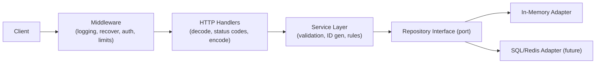

# Code Review: Todo List Service

A deep review of the Go TODO-list service. Findings are grouped by aspect and ordered roughly by severity within each section. Each item cites the relevant file and gives a concrete recommendation.

Severity legend: **[Critical]** can cause data loss/incorrect behavior/security exposure, **[High]** important correctness/design issue, **[Medium]** quality/maintainability, **[Low]** polish.

Status legend (added on re-review): **[Resolved]** fixed in current code, **[Partial]** partly addressed, **[Open]** still outstanding.

> **Re-review note (2026-06-15):** The codebase changed since the original review. Controllers were moved out of `package main` into a dedicated `controller/` package, and structured logging (`log/slog`) was added. Each item below is annotated with its current status; some original code citations referenced `cmd/category_controller.go`, which is now `controller/category_controller.go`.

---

## 1. Correctness Bugs (fix these first)

### 1.1 [Critical] [Resolved] Handlers continue executing after `http.Error`

In every handler, `http.Error(...)` was called on error but there was no `return`. Execution fell through to the next statement, so the server could write a second response, dereference a zero value, or marshal/serve garbage after already sending an error.

**Status: Resolved.** Every handler in `controller/todo_controller.go` and `controller/category_controller.go` now `return`s after `http.Error(...)`. For reference, the original (buggy) shape was:

```go
func (c *CategoryController) Create(w http.ResponseWriter, r *http.Request) {
	fmt.Println("request came here")
	var category model.Category
	err := json.NewDecoder(r.Body).Decode(&category)
	if err != nil {
		http.Error(w, err.Error(), http.StatusInternalServerError)
	}
	err = c.store.Create(category)
	if err != nil {
		fmt.Println("somethings is having issue")
		http.Error(w, err.Error(), http.StatusInternalServerError)
	}
}
```

### 1.2 [Critical] [Resolved] `GetAll` returns 5 phantom empty structs

`make([]model.Category, 5)` created a slice of length 5 (five zero-valued structs), then `append` added the real data after them, so callers got 5 empty objects + the actual records.

**Status: Resolved.** Both `GetAll` methods now use `make([]model.Category, 0)` / `make([]model.TODO, 0)`. (Could still pre-size with `len(c.store)` as a micro-optimization, but the correctness bug is gone.)

### 1.3 [High] [Open] Returning an error for an empty store

`GetAll` returns `model.ErrStoreEmpty` when there are no records. An empty collection is a valid result (HTTP 200 with `[]`), not an error. Returning an error here forces a 500 for the normal "no data yet" case.

**Status: Open.** Both `in_memory_category.go` and `in_memory_todo.go` still `return nil, model.ErrStoreEmpty` on an empty store.

Fix: return an empty slice and `nil` error when the store is empty.

### 1.4 [High] [Open] Reads take a write lock

The struct uses `sync.RWMutex`, but `GetByID` and `GetAll` call `Lock()` (exclusive) instead of `RLock()`. This serializes all reads unnecessarily and defeats the purpose of `RWMutex`.

**Status: Open.** Still present:

```52:59:memorystore/in_memory_category.go
func (c *CategoryMap) GetByID(cid string) (model.Category, error) {
	c.mu.Lock()
	defer c.mu.Unlock()
	if _, ok := c.store[cid]; ok {
		return c.store[cid], nil
	}
	return model.Category{}, model.ErrObjectNotFound
}
```

Fix: use `c.mu.RLock()` / `defer c.mu.RUnlock()` in read-only methods (`GetByID`, `GetAll`, both stores).

### 1.5 [High] [Resolved] Misleading error messages

`GetById` in the todo store used to return `"Store is empty"` when a single ID was missing, and `Delete`/`Update` used `"ID not found in the map "` (trailing space, leaking internal detail). Messages were inconsistent across the two stores.

**Status: Resolved.** `model/model.go` now defines sentinel errors (`ErrObjectAlreadyExists`, `ErrObjectNotFound`, `ErrStoreEmpty`) and both stores return them consistently — exactly the recommended fix. Handlers can now `errors.Is` against these to map to proper HTTP status codes (see 4.1, still open).

---

## 2. System Design & Architecture

### 2.1 [High] [Open] Missing service/use-case layer

**Status: Open.** Controllers call the repository directly. The README advertises hexagonal architecture, but there is no application/service layer to hold business rules (ID generation, validation, setting `CreationDate`, enforcing that a TODO's `CategoryID` exists). Business logic currently has nowhere to live and would leak into HTTP handlers.

Recommendation: introduce a `service` package: `Controller -> Service -> Repository`. Controllers handle HTTP only (decode/encode, status codes); services own rules; repositories own persistence.

### 2.2 [High] [Open] Client supplies primary keys (`TID`/`CID`)

**Status: Open.** IDs come from the request body. Two problems: clients can overwrite each other's records by reusing an ID, and `Create` rejects rather than generating an ID. This is both a correctness and a security/ownership concern.

Recommendation: generate IDs server-side (e.g. `google/uuid`) inside the service layer, ignore any client-supplied ID, and set `CreationDate` server-side too.

### 2.3 [Medium] [Open] No referential integrity between TODO and Category

**Status: Open.** `TODO.CategoryID` is free text; nothing validates the category exists. The domain says "TODO belongs to Category" but it is unenforced.

Recommendation: validate `CategoryID` against the category repository on create/update.

### 2.4 [Medium] [Resolved] Controllers live in `package main`

`TODOController`/`CategoryController` used to be in `cmd` under `package main`, so they couldn't be imported or unit-tested from elsewhere.

**Status: Resolved.** Controllers now live in their own `controller` package (`controller/todo_controller.go`, `controller/category_controller.go`), and `cmd/main.go` is wiring only. (A separate `service` layer is still missing — see 2.1.)

### 2.5 [Medium] [Open] No `context.Context` propagation

**Status: Open.** Repository interfaces don't take `context.Context`. (Controllers do use `context.Background()` for logging, but the request context is never threaded through to the store.) A real datastore adapter (SQL, etc.) needs context for cancellation/timeouts/tracing. Adding it later is a breaking change to every method.

Recommendation: change signatures now to `Create(ctx context.Context, ...)`, etc., and pass `r.Context()` from handlers.

### 2.6 [Low] [Open] `Update` is a true upsert vs strict update — decide intent

**Status: Open.** `Update` returns `ErrObjectNotFound` if absent (strict update), and the route is now `PUT`, but the semantics are still undocumented. That's reasonable, but combined with client-supplied IDs and no `PUT` semantics it's ambiguous. Clarify whether endpoints are create-only/update-only or upsert.

---

## 3. Concurrency & Scalability

### 3.1 [High] [Open] In-memory store cannot scale horizontally

**Status: Open.** All state lives in process-local maps. Running more than one replica (behind a load balancer) means each instance has different data; restarts lose everything. This caps you at a single instance and zero durability.

Recommendation: implement a persistent adapter (Postgres/SQLite/Redis) behind the existing repository interfaces. The ports are already there — this is the intended extension point.

### 3.2 [Medium] [Open] Lock contention with a single global mutex

**Status: Open.** Each store has one `RWMutex` guarding the whole map. Fixing 1.4 (read locks, still open) is the first win. Under very high write load a single mutex becomes a bottleneck, but for this scale it's fine — the persistent backend (3.1) is the real concurrency story.

### 3.3 [Low] [Open] No request-level concurrency limits

**Status: Open.** There is no max in-flight request limit or backpressure. With a real datastore you'd want connection pooling and a bounded worker model. Note for later.

---

## 4. HTTP API Design

### 4.1 [High] [Partial] Everything returns 500

Most errors map to `http.StatusInternalServerError`, including "not found" and (in the TODO controller) bad JSON. This makes the API unusable for clients and hides real server faults.

**Status: Partial.** `CategoryController` now returns `400 Bad Request` on JSON decode errors, but `TODOController` decode errors are still `500`, and not-found errors from the store (`Delete`/`Update`/`GetById`) still map to `500` in both controllers. The sentinel errors from 1.5 now make proper mapping straightforward.

Recommendation:

- Bad/invalid JSON or validation failure -> `400 Bad Request`.
- Not found -> `404 Not Found`.
- Duplicate on create -> `409 Conflict`.
- Genuine unexpected errors -> `500` (and log internally, don't echo `err.Error()` to the client; see 5.1).

### 4.2 [Medium] [Partial] Non-RESTful routing and verbs

`POST /api/todo/delete/{id}`, `GET /api/todo/getbyid/{id}` use verbs in the path, and several use the wrong methods.

**Status: Partial.** `update` was changed to `PUT` (in both `cmd/routes.go` and `cmd/category_routes.go`), but the routes still use verbs in the path (`/create`, `/update`, `/delete/{id}`, `/getbyid/{id}`, `/getall`) rather than RESTful resource paths.

Recommendation (Go 1.22 ServeMux supports this):

- `POST /api/todos` (create)
- `GET /api/todos` (list)
- `GET /api/todos/{id}`
- `PUT /api/todos/{id}` (update)
- `DELETE /api/todos/{id}`

### 4.3 [Medium] [Partial] `Create` returns no body or `Location`

**Status: Partial.** Handlers now write `201 Created`, but still send no response body or `Location` header. A create should return the created resource (especially once IDs are server-generated) and ideally a `Location` header.

### 4.4 [Low] [Open] No request body size limit / strict decoding

**Status: Open.** `json.NewDecoder(r.Body).Decode` still accepts unknown fields and unbounded bodies.

Recommendation: wrap with `http.MaxBytesReader` and call `dec.DisallowUnknownFields()`.

---

## 5. Security

### 5.1 [High] [Open] Internal error details leaked to clients

`http.Error(w, err.Error(), ...)` sends raw internal error strings to the caller. This can leak storage internals and aids attackers.

**Status: Open.** Errors are now also logged server-side via `slog` (good), but the handlers still pass `err.Error()` into `http.Error`, so the raw error is still echoed to the client.

Recommendation: log the detailed error server-side; return a generic message and an appropriate status code to the client.

### 5.2 [High] [Open] No authentication / authorization

**Status: Open.** All endpoints are open. Anyone can read, modify, or delete any TODO/category. There is no concept of a user owning their data.

Recommendation: add auth (API key/JWT/session) and scope data per user. Even for a demo, document that it is unauthenticated.

### 5.3 [Medium] [Open] No server timeouts (slowloris exposure)

```22:25:cmd/main.go
	server := &http.Server{
		Addr:    ":8080",
		Handler: mux,
	}
```

No `ReadTimeout`, `ReadHeaderTimeout`, `WriteTimeout`, or `IdleTimeout`. A slow client can hold connections open indefinitely.

**Status: Open.** Recommendation: set sensible timeouts on `http.Server`.

### 5.4 [Medium] [Open] No input validation

**Status: Open.** No checks that `Activity`/`Name` are non-empty, length-bounded, etc. Combined with no body size limit (4.4), this is a DoS/garbage-data vector.

### 5.5 [Low] [Open] No rate limiting / CORS policy / security headers

**Status: Open.** No throttling and no explicit CORS handling. Add as needed when exposing publicly.

---

## 6. Deployment & Operations

### 6.1 [High] [Resolved] `ListenAndServe` error is ignored

The original code called `server.ListenAndServe()` with no error check, so the process could exit silently.

**Status: Resolved.** `cmd/main.go` now checks the error, logs it via `slog`, and exits non-zero:

```27:31:cmd/main.go
	if err := server.ListenAndServe(); err != nil {
		logger.LogAttrs(context.Background(), slog.LevelError, "http server stopped",
			slog.String("error", err.Error()))
		os.Exit(1)
	}
```

(Once graceful shutdown is added per 6.2, treat `http.ErrServerClosed` as a clean exit.)

### 6.2 [High] [Open] No graceful shutdown

**Status: Open.** There's no signal handling. On SIGTERM (common in Kubernetes/containers) in-flight requests are dropped.

Recommendation: listen for `os.Interrupt`/`SIGTERM` and call `server.Shutdown(ctx)` with a timeout.

### 6.3 [Medium] [Open] Dockerfile does not copy `go.sum` and reduces build caching

```4:5:Dockerfile
COPY go.mod ./
RUN go mod download
```

**Status: Open.** Only `go.mod` is copied (there is still no `go.sum`, as there are no dependencies yet). There are currently no dependencies, but the moment one is added, builds break or become non-reproducible without `go.sum`.

Recommendation: `COPY go.mod go.sum ./` once a `go.sum` exists; the distroless/nonroot base and `CGO_ENABLED=0` choices are good. Consider adding a build flag `-ldflags="-s -w"` for smaller binaries.

### 6.4 [Medium] [Open] Hardcoded port, no configuration

**Status: Open.** `:8080` is hardcoded. No env-based config.

Recommendation: read `PORT` (and other settings) from environment, with a sensible default.

### 6.5 [Medium] [Open] No health/readiness endpoint

**Status: Open.** There is no `/healthz` or `/readyz`. Orchestrators need these for liveness/readiness probes.

### 6.6 [Low] [Partial] No `HEALTHCHECK` in Dockerfile and no structured logging

**Status: Partial.** Structured logging via `log/slog` is now in place (see 7.1). A container `HEALTHCHECK` is still missing.

---

## 7. Observability & Logging

### 7.1 [High] [Resolved] `fmt.Println` debugging statements

The original controllers had `fmt.Println("request came here")` / `fmt.Println("somethings is having issue")` scattered throughout.

**Status: Resolved.** Both controllers now use a `*slog.Logger` with `LogAttrs` (levels + structured key/value attributes). One harmless leftover: a commented-out `// fmt.Println(m.store, "......")` at `memorystore/in_memory_todo.go:31` could be deleted.

### 7.2 [Medium] [Partial] No request logging / middleware

**Status: Partial.** Handlers now log per-operation via `slog`, but there is still no middleware: no access logs, request IDs, or panic-recovery wrapper. An unhandled panic in a handler takes down the request with a stack trace and no recovery.

Recommendation: add middleware for logging, request IDs, and `recover()`.

### 7.3 [Low] [Open] No metrics/tracing

**Status: Open.** No Prometheus metrics or tracing hooks. Optional, but worth a stub for a service intended to grow.

---

## 8. Naming, Conventions & Code Quality

### 8.1 [High] [Open] JSON tag typo `cayegoryid`

```16:23:model/model.go
type TODO struct {
	TID          string    `json:"tid"`
	Activity     string    `json:"activity"`
	Description  string    `json:"description"`
	CreationDate time.Time `json:"creationdate"`
	IsDone       bool      `json:"isdone"`
	CategoryID   string    `json:"cayegoryid"`
}
```

**Status: Open.** The JSON field is still misspelled; API clients must send `cayegoryid`. Fix to `json:"category_id"` (and pick a consistent casing convention for all tags).

### 8.2 [Medium] [Open] Inconsistent method naming: `GetById` vs `GetByID`

**Status: Open.** The TODO repository uses `GetById`; the Category repository uses `GetByID`. Go convention is `ID` (initialism uppercased): `GetByID`. Standardize across interfaces and implementations.

### 8.3 [Medium] [Open] Inconsistent JSON tag style

**Status: Open.** Tags are lowercase, no separators: `creationdate`, `isdone`. Prefer snake_case (`creation_date`, `is_done`) or camelCase consistently.

### 8.4 [Medium] [Open] Inconsistent receiver/parameter naming

**Status: Open.** `CategoryMap.Create(Category model.Category)` still uses an exported-looking, type-shadowing parameter name `Category`; elsewhere it's lowercase `category`. Use short, consistent, lowercase receiver and parameter names.

### 8.5 [Low] [Partial] Type/file naming

- **Open:** `TODOController` vs `CategoryController` — acronym casing differs from the type style elsewhere; consider `TodoController` for consistency with `TodoMap`.
- **Resolved:** The README no longer references `memorystore/in_memory.go`; it now correctly lists `in_memory_todo.go` and `in_memory_category.go`.

### 8.6 [Low] [Open] Stray files and comments

**Status: Open.** The scratch-notes file now lives at `docs/note.txt`, and the misspellings remain: "indepdendent" and "persistance" (×2) in `model/model.go`, and "Reposyiry" in `docs/note.txt`. These should be cleaned up or removed from the repo.

---

## 9. Testing

### 9.1 [High] [Open] No tests at all

**Status: Open.** There are still no `_test.go` files anywhere in the repo. The store has subtle bugs (1.2, 1.3) that unit tests would have caught immediately.

Recommendation:

- Table-driven unit tests for both stores (create/duplicate, update/missing, delete/missing, get-all empty vs populated).
- Handler tests using `net/http/httptest` to assert status codes and bodies.
- A `go vet` + `staticcheck` + `golangci-lint` step in CI.

---

## 10. Suggested Target Architecture




---

## 11. Priority Checklist

Done since the original review:

- [x] Add `return` after every `http.Error` (1.1).
- [x] Fix `GetAll` slice allocation (1.2).
- [x] Standardize not-found errors via sentinels (1.5).
- [x] Move controllers out of `package main` into a `controller` package (2.4).
- [x] Check the `ListenAndServe` error (6.1).
- [x] Replace `fmt.Println` with structured `slog` logging (7.1).

Still outstanding (highest priority first):

1. Fix empty-store handling — return `[]` not an error (1.3).
2. Use `RLock` for read methods (1.4).
3. Map errors to correct HTTP status codes; stop leaking `err.Error()` (4.1, 5.1).
4. Generate IDs and `CreationDate` server-side; add input validation (2.2, 5.4).
5. Add server timeouts and graceful shutdown (5.3, 6.2).
6. Add recovery/logging middleware (7.2).
7. Fix JSON tag typo `cayegoryid` and `GetById`/`GetByID` naming (8.1, 8.2).
8. Add unit and handler tests (9.1).
9. Introduce a service layer (2.1).
10. Plan a persistent storage adapter for durability/horizontal scaling (3.1).
