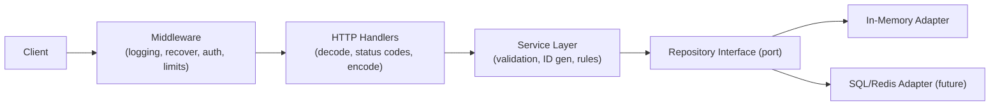

# Code Review: Todo List Service

A deep review of the Go TODO-list service. Findings are grouped by aspect and ordered roughly by severity within each section. Each item cites the relevant file and gives a concrete recommendation.

Severity legend: **[Critical]** can cause data loss/incorrect behavior/security exposure, **[High]** important correctness/design issue, **[Medium]** quality/maintainability, **[Low]** polish.

Status legend (added on re-review): **[Resolved]** fixed in current code, **[Partial]** partly addressed, **[Open]** still outstanding.

> **Re-review note (2026-06-15):** The codebase changed since the original review. Notable changes:
> - Controllers moved out of `package main` into a dedicated `controller/` package.
> - Structured logging (`log/slog`) added and injected into controllers.
> - Routes refactored to RESTful resource paths under `/api/v1/*` (closes 4.2).
> - `Update` now takes the id from the path: `Update(id string, obj)` — but the body id is not reconciled with the path id, which introduces a **new** integrity bug (see 1.6).
> - A naming refactor renamed `TODO` → `Todo`, `TODOController` → `TodoController`, `ToDoRepository` → `TodoRepository`, and standardized `GetByID` → `GetById` across both repositories. JSON tags moved to snake_case (`creation_date`, `is_done`). Some historical code citations below still use the old `TODO`/`cayegoryid` spellings.
>
> Each item below is annotated with its current status (`[Resolved]` = closed). Some original code citations referenced `cmd/category_controller.go`, which is now `controller/category_controller.go`. A deeper, attacker-focused pass was added in section 5 and a new correctness item (1.6).

---

## 1. Correctness Bugs (fix these first)

### 1.1 [Critical] [Resolved] Handlers continue executing after `http.Error`

In every handler, `http.Error(...)` was called on error but there was no `return`. Execution fell through to the next statement, so the server could write a second response, dereference a zero value, or marshal/serve garbage after already sending an error.

**Status: Resolved.** Every handler in `controller/todo_controller.go` and `controller/category_controller.go` now `return`s after `http.Error(...)`. For reference, the original (buggy) shape was:

```go
func (c *CategoryController) Create(w http.ResponseWriter, r *http.Request) {
	fmt.Println("request came here")
	var category model.Category
	err := json.NewDecoder(r.Body).Decode(&category)
	if err != nil {
		http.Error(w, err.Error(), http.StatusInternalServerError)
	}
	err = c.store.Create(category)
	if err != nil {
		fmt.Println("somethings is having issue")
		http.Error(w, err.Error(), http.StatusInternalServerError)
	}
}
```

### 1.2 [Critical] [Resolved] `GetAll` returns 5 phantom empty structs

`make([]model.Category, 5)` created a slice of length 5 (five zero-valued structs), then `append` added the real data after them, so callers got 5 empty objects + the actual records.

**Status: Resolved.** Both `GetAll` methods now use `make([]model.Category, 0)` / `make([]model.TODO, 0)`. (Could still pre-size with `len(c.store)` as a micro-optimization, but the correctness bug is gone.)

### 1.3 [High] [Open] Returning an error for an empty store

`GetAll` returns `model.ErrStoreEmpty` when there are no records. An empty collection is a valid result (HTTP 200 with `[]`), not an error. Returning an error here forces a 500 for the normal "no data yet" case.

**Status: Open.** Both `in_memory_category.go` and `in_memory_todo.go` still `return nil, model.ErrStoreEmpty` on an empty store, and the controllers map any `GetAll` error to `500` — so an empty list currently yields a 500.

Fix: return an empty slice and `nil` error when the store is empty:

```go
func (t *TodoMap) GetAll() ([]model.TODO, error) {
	t.mu.RLock()
	defer t.mu.RUnlock()
	todos := make([]model.TODO, 0, len(t.store)) // also pre-sizes (1.2)
	for _, v := range t.store {
		todos = append(todos, v)
	}
	return todos, nil // empty slice marshals as [], never an error
}
```

You can then drop `ErrStoreEmpty` entirely.

### 1.4 [High] [Open] Reads take a write lock

The struct uses `sync.RWMutex`, but `GetByID` and `GetAll` call `Lock()` (exclusive) instead of `RLock()`. This serializes all reads unnecessarily and defeats the purpose of `RWMutex`.

**Status: Open.** Still present:

```52:59:memorystore/in_memory_category.go
func (c *CategoryMap) GetByID(cid string) (model.Category, error) {
	c.mu.Lock()
	defer c.mu.Unlock()
	if _, ok := c.store[cid]; ok {
		return c.store[cid], nil
	}
	return model.Category{}, model.ErrObjectNotFound
}
```

Fix: use `c.mu.RLock()` / `defer c.mu.RUnlock()` in read-only methods (`GetByID`, `GetAll`, both stores):

```go
func (c *CategoryMap) GetByID(cid string) (model.Category, error) {
	c.mu.RLock()
	defer c.mu.RUnlock()
	if v, ok := c.store[cid]; ok {
		return v, nil
	}
	return model.Category{}, model.ErrObjectNotFound
}
```

### 1.5 [High] [Resolved] Misleading error messages

`GetById` in the todo store used to return `"Store is empty"` when a single ID was missing, and `Delete`/`Update` used `"ID not found in the map "` (trailing space, leaking internal detail). Messages were inconsistent across the two stores.

**Status: Resolved.** `model/model.go` now defines sentinel errors (`ErrObjectAlreadyExists`, `ErrObjectNotFound`, `ErrStoreEmpty`) and both stores return them consistently — exactly the recommended fix. Handlers can now `errors.Is` against these to map to proper HTTP status codes (see 4.1, still open).

### 1.6 [Critical] [Open] `Update` does not reconcile the path id with the body id (record-overwrite / mass assignment)

This is a **new** bug introduced when `Update` was changed to take the id from the URL path. The handler reads the id from the path, but the store writes the *body* object verbatim under that key — without checking that `body.TID` (or `body.CID`) matches the path id, and without forcing them to agree:

```45:55:memorystore/in_memory_todo.go
func (t *TodoMap) Update(tid string, todo model.TODO) error {
	t.mu.Lock()
	defer t.mu.Unlock()
	if _, ok := t.store[tid]; ok {
		t.store[tid] = todo // todo.TID comes from the body and may differ from tid
		return nil
	} else {
		return model.ErrObjectNotFound
	}
}
```

Concretely, `PUT /api/v1/todos/A` with body `{"tid":"B", ...}` stores a record under key `A` whose internal `TID` field is `B`. The map key and the entity id now disagree, which:

- breaks the invariant "the object stored at key X has id X" and corrupts any later `GetById`/serialization logic that trusts `TID`;
- is a classic **mass-assignment** foothold — the client controls every persisted field (including `CreationDate`, `IsDone`, `CategoryID`) with no server-side authority;
- combined with no auth (5.2), lets a caller rewrite arbitrary records.

The success log compounds the confusion: it logs `todolist.TID` (the body value), not the path id that was actually used as the key.

**Fix:** treat the path id as authoritative and ignore/validate the body id. For example:

```go
func (t *TODOController) Update(w http.ResponseWriter, r *http.Request) {
	id := r.PathValue("id")
	var in model.TODO
	if err := json.NewDecoder(r.Body).Decode(&in); err != nil {
		writeError(w, http.StatusBadRequest, "invalid request body")
		return
	}
	in.TID = id // path is the source of truth; never trust the body id
	if err := t.store.Update(id, in); err != nil {
		// map err -> 404/500 (see 4.1)
		return
	}
	w.WriteHeader(http.StatusNoContent)
	t.logger.LogAttrs(r.Context(), slog.LevelInfo, "todo updated", slog.String("id", id))
}
```

(Alternatively, reject with `400` when `body.TID != "" && body.TID != id`.) The same applies to `CategoryMap.Update` / `CategoryController.Update`.

---

## 2. System Design & Architecture

### 2.1 [High] [Open] Missing service/use-case layer

**Status: Open.** Controllers call the repository directly. The README advertises hexagonal architecture, but there is no application/service layer to hold business rules (ID generation, validation, setting `CreationDate`, enforcing that a TODO's `CategoryID` exists). Business logic currently has nowhere to live and would leak into HTTP handlers.

Recommendation: introduce a `service` package: `Controller -> Service -> Repository`. Controllers handle HTTP only (decode/encode, status codes); services own rules; repositories own persistence.

### 2.2 [High] [Open] Client supplies primary keys (`TID`/`CID`)

**Status: Open.** `Create` still takes the id (and every other field) from the request body. Two problems: clients can overwrite/squat on records by choosing an ID, and `Create` rejects with `ErrObjectAlreadyExists` rather than minting an ID. `Update` now at least takes the id from the path, but the body id is still trusted (see 1.6), and `CreationDate`/`IsDone` are entirely client-controlled (mass assignment).

Recommendation: generate IDs server-side inside the service layer, ignore any client-supplied ID, and set `CreationDate` server-side:

```go
func (s *TodoService) Create(ctx context.Context, in model.TODO) (model.TODO, error) {
	in.TID = uuid.NewString()       // server-authoritative id
	in.CreationDate = time.Now().UTC()
	in.IsDone = false               // don't let the client preset state
	if err := validate(in); err != nil { // see 5.4
		return model.TODO{}, err
	}
	return in, s.repo.Create(ctx, in)
}
```

Accept only `activity`, `description`, and `category_id` from the client; derive everything else.

### 2.3 [Medium] [Open] No referential integrity between TODO and Category

**Status: Open.** `TODO.CategoryID` is free text; nothing validates the category exists. The domain says "TODO belongs to Category" but it is unenforced.

Recommendation: validate `CategoryID` against the category repository on create/update.

### 2.4 [Medium] [Resolved] Controllers live in `package main`

`TODOController`/`CategoryController` used to be in `cmd` under `package main`, so they couldn't be imported or unit-tested from elsewhere.

**Status: Resolved.** Controllers now live in their own `controller` package (`controller/todo_controller.go`, `controller/category_controller.go`), and `cmd/main.go` is wiring only. (A separate `service` layer is still missing — see 2.1.)

### 2.5 [Medium] [Open] No `context.Context` propagation

**Status: Open.** Repository interfaces don't take `context.Context`. (Controllers do use `context.Background()` for logging, but the request context is never threaded through to the store.) A real datastore adapter (SQL, etc.) needs context for cancellation/timeouts/tracing. Adding it later is a breaking change to every method.

Recommendation: change signatures now to `Create(ctx context.Context, ...)`, etc., and pass `r.Context()` from handlers.

### 2.6 [Low] [Open] `Update` is a true upsert vs strict update — decide intent

**Status: Open.** `Update` is now `PUT /api/v1/{resource}/{id}` and returns `ErrObjectNotFound` when the id is absent (i.e. strict update, not create-on-PUT). That's a reasonable choice, but it isn't documented, and strict `PUT` semantics are unusual (idempotent `PUT` often implies upsert). Decide and document: either keep strict update (and return `404`, see 4.1) or make `PUT` a true upsert. Either way, fix the body-id reconciliation in 1.6 first.

---

## 3. Concurrency & Scalability

### 3.1 [High] [Open] In-memory store cannot scale horizontally

**Status: Open.** All state lives in process-local maps. Running more than one replica (behind a load balancer) means each instance has different data; restarts lose everything. This caps you at a single instance and zero durability.

Recommendation: implement a persistent adapter (Postgres/SQLite/Redis) behind the existing repository interfaces. The ports are already there — this is the intended extension point.

### 3.2 [Medium] [Open] Lock contention with a single global mutex

**Status: Open.** Each store has one `RWMutex` guarding the whole map. Fixing 1.4 (read locks, still open) is the first win. Under very high write load a single mutex becomes a bottleneck, but for this scale it's fine — the persistent backend (3.1) is the real concurrency story.

### 3.3 [Low] [Open] No request-level concurrency limits

**Status: Open.** There is no max in-flight request limit or backpressure. With a real datastore you'd want connection pooling and a bounded worker model. Note for later.

---

## 4. HTTP API Design

### 4.1 [High] [Partial] Everything returns 500

Most errors map to `http.StatusInternalServerError`, including "not found" and (in the TODO controller) bad JSON. This makes the API unusable for clients and hides real server faults.

**Status: Partial.** `CategoryController` now returns `400 Bad Request` on JSON decode errors, but `TODOController` decode errors are still `500`, and not-found errors from the store (`Delete`/`Update`/`GetById`) still map to `500` in both controllers. The sentinel errors from 1.5 now make proper mapping straightforward.

Recommendation:

- Bad/invalid JSON or validation failure -> `400 Bad Request`.
- Not found -> `404 Not Found`.
- Duplicate on create -> `409 Conflict`.
- Genuine unexpected errors -> `500` (and log internally, don't echo `err.Error()` to the client; see 5.1).

Map the sentinel errors from 1.5 with `errors.Is` and a small JSON helper, e.g.:

```go
func writeError(w http.ResponseWriter, status int, msg string) {
	w.Header().Set("Content-Type", "application/json")
	w.WriteHeader(status)
	_ = json.NewEncoder(w).Encode(map[string]string{"error": msg})
}

func statusFor(err error) int {
	switch {
	case errors.Is(err, model.ErrObjectNotFound):
		return http.StatusNotFound
	case errors.Is(err, model.ErrObjectAlreadyExists):
		return http.StatusConflict
	default:
		return http.StatusInternalServerError
	}
}
```

Then in a handler: `if err := t.store.Create(todo); err != nil { writeError(w, statusFor(err), "could not create todo"); return }`. Note the client message is generic; the detailed `err` only goes to the logs (5.1).

### 4.2 [Medium] [Resolved] Non-RESTful routing and verbs

The original routes used verbs in the path (`POST /api/todo/delete/{id}`, `GET /api/todo/getbyid/{id}`, etc.) and the wrong methods.

**Status: Resolved.** Both `cmd/routes.go` and `cmd/category_routes.go` now use RESTful resource paths under `/api/v1` with correct verbs:

- `POST /api/v1/todos` (create)
- `GET /api/v1/todos` (list)
- `GET /api/v1/todos/{id}`
- `PUT /api/v1/todos/{id}` (update)
- `DELETE /api/v1/todos/{id}`

…and the equivalent set under `/api/v1/categories`.

### 4.3 [Medium] [Partial] `Create` returns no body or `Location`

**Status: Partial.** Handlers now write `201 Created`, but still send no response body or `Location` header. A create should return the created resource (especially once IDs are server-generated) and ideally a `Location` header.

### 4.4 [Medium] [Open] No request body size limit / strict decoding

**Status: Open.** `json.NewDecoder(r.Body).Decode` still accepts unknown fields and unbounded bodies. Unbounded bodies are a real memory-exhaustion DoS vector (see 5.4), so this is closer to Medium than Low.

Recommendation: cap the body with `http.MaxBytesReader` and reject unknown fields:

```go
func decodeJSON[T any](w http.ResponseWriter, r *http.Request, dst *T) error {
	r.Body = http.MaxBytesReader(w, r.Body, 1<<20) // 1 MiB cap
	dec := json.NewDecoder(r.Body)
	dec.DisallowUnknownFields()
	return dec.Decode(dst)
}
```

`DisallowUnknownFields` also helps mitigate the mass-assignment concern in 1.6/2.2 by rejecting unexpected keys.

---

## 5. Security

### 5.1 [High] [Open] Internal error details leaked to clients

`http.Error(w, err.Error(), ...)` sends raw internal error strings to the caller. This can leak storage internals and aids attackers.

**Status: Open.** Errors are now also logged server-side via `slog` (good), but every handler still does `http.Error(w, err.Error(), ...)`, so the raw error is echoed to the client. For example, a malformed JSON body returns the exact `encoding/json` parser message, revealing internal field types and offsets.

Recommendation: log the detailed error server-side; return a generic message to the client (the `writeError`/`statusFor` helpers from 4.1 do exactly this):

```go
if err := t.store.Create(todo); err != nil {
	t.logger.LogAttrs(r.Context(), slog.LevelError, "create failed", slog.Any("error", err))
	writeError(w, statusFor(err), "could not create todo") // generic, no err.Error()
	return
}
```

### 5.2 [High] [Open] No authentication / authorization

**Status: Open.** All endpoints are open. Anyone can read, modify, or delete any TODO/category. There is no concept of a user owning their data.

Recommendation: add auth (API key/JWT/session) and scope data per user. Even for a demo, document that it is unauthenticated.

### 5.3 [Medium] [Open] No server timeouts (slowloris exposure)

```22:25:cmd/main.go
	server := &http.Server{
		Addr:    ":8080",
		Handler: mux,
	}
```

No `ReadTimeout`, `ReadHeaderTimeout`, `WriteTimeout`, or `IdleTimeout`. A slow client can hold connections open indefinitely (slowloris).

**Status: Open.** Recommendation: set sensible timeouts on `http.Server`:

```go
server := &http.Server{
	Addr:              ":8080",
	Handler:           mux,
	ReadHeaderTimeout: 5 * time.Second,
	ReadTimeout:       10 * time.Second,
	WriteTimeout:      15 * time.Second,
	IdleTimeout:       60 * time.Second,
}
```

### 5.4 [Medium] [Open] No input validation

**Status: Open.** No checks that `Activity`/`Name` are non-empty, length-bounded, etc. Combined with no body size limit (4.4), this is a DoS/garbage-data vector.

### 5.5 [Low] [Open] No rate limiting / CORS policy / security headers

**Status: Open.** No throttling and no explicit CORS handling.

### 5.6 [High] [Open] Mass assignment — client controls server-owned fields

**Status: Open (new, attacker-focused).** Because handlers decode the full struct straight from the request body and persist it, the client controls *every* field, including ones that should be server-authoritative:

- `CreationDate` — a caller can backdate/forward-date records, poisoning any time-based logic or audit trail.
- `IsDone` — can be preset on create.
- `TID`/`CID` — id squatting and, via 1.6, overwriting an existing record's identity.
- `CategoryID` — points anywhere, since nothing validates it (2.3).

This is the textbook mass-assignment pattern. Combined with **no authentication (5.2)** there's also no ownership model, so it doubles as an IDOR: any caller can read, modify, or delete any record by id.

**Fix:** don't bind the transport DTO directly to the domain object. Accept a narrow input DTO with only client-settable fields, and have the service set ids/timestamps/state server-side (see the `Create` example in 2.2). Add `dec.DisallowUnknownFields()` (4.4) so unexpected keys are rejected rather than silently ignored. Add as needed when exposing publicly.

---

## 6. Deployment & Operations

### 6.1 [High] [Resolved] `ListenAndServe` error is ignored

The original code called `server.ListenAndServe()` with no error check, so the process could exit silently.

**Status: Resolved.** `cmd/main.go` now checks the error, logs it via `slog`, and exits non-zero:

```27:31:cmd/main.go
	if err := server.ListenAndServe(); err != nil {
		logger.LogAttrs(context.Background(), slog.LevelError, "http server stopped",
			slog.String("error", err.Error()))
		os.Exit(1)
	}
```

(Once graceful shutdown is added per 6.2, treat `http.ErrServerClosed` as a clean exit.)

### 6.2 [High] [Open] No graceful shutdown

**Status: Open.** There's no signal handling — and note that once you add it, the current `if err := server.ListenAndServe(); err != nil { os.Exit(1) }` in `main.go` will treat a clean shutdown as a failure, because `ListenAndServe` returns `http.ErrServerClosed`. Handle both together:

```go
ctx, stop := signal.NotifyContext(context.Background(), os.Interrupt, syscall.SIGTERM)
defer stop()

go func() {
	if err := server.ListenAndServe(); err != nil && !errors.Is(err, http.ErrServerClosed) {
		logger.LogAttrs(ctx, slog.LevelError, "server error", slog.Any("error", err))
		os.Exit(1)
	}
}()

<-ctx.Done() // wait for SIGINT/SIGTERM
shutdownCtx, cancel := context.WithTimeout(context.Background(), 10*time.Second)
defer cancel()
_ = server.Shutdown(shutdownCtx)
``` On SIGTERM (common in Kubernetes/containers) in-flight requests are dropped.

Recommendation: listen for `os.Interrupt`/`SIGTERM` and call `server.Shutdown(ctx)` with a timeout.

### 6.3 [Medium] [Open] Dockerfile does not copy `go.sum` and reduces build caching

```4:5:Dockerfile
COPY go.mod ./
RUN go mod download
```

**Status: Open.** Only `go.mod` is copied (there is still no `go.sum`, as there are no dependencies yet). There are currently no dependencies, but the moment one is added, builds break or become non-reproducible without `go.sum`.

Recommendation: `COPY go.mod go.sum ./` once a `go.sum` exists; the distroless/nonroot base and `CGO_ENABLED=0` choices are good. Consider adding a build flag `-ldflags="-s -w"` for smaller binaries.

### 6.4 [Medium] [Open] Hardcoded port, no configuration

**Status: Open.** `:8080` is hardcoded. No env-based config.

Recommendation: read `PORT` (and other settings) from environment, with a sensible default.

### 6.5 [Medium] [Open] No health/readiness endpoint

**Status: Open.** There is no `/healthz` or `/readyz`. Orchestrators need these for liveness/readiness probes.

### 6.6 [Low] [Partial] No `HEALTHCHECK` in Dockerfile and no structured logging

**Status: Partial.** Structured logging via `log/slog` is now in place (see 7.1). A container `HEALTHCHECK` is still missing.

---

## 7. Observability & Logging

### 7.1 [High] [Resolved] `fmt.Println` debugging statements

The original controllers had `fmt.Println("request came here")` / `fmt.Println("somethings is having issue")` scattered throughout.

**Status: Resolved.** Both controllers now use a `*slog.Logger` with `LogAttrs` (levels + structured key/value attributes). One harmless leftover: a commented-out `// fmt.Println(m.store, "......")` at `memorystore/in_memory_todo.go:31` could be deleted.

### 7.2 [Medium] [Partial] No request logging / middleware

**Status: Partial.** Handlers now log per-operation via `slog`, but there is still no middleware: no access logs, request IDs, or panic-recovery wrapper. An unhandled panic in a handler takes down the request with a stack trace and no recovery.

Recommendation: add middleware for logging, request IDs, and `recover()`.

### 7.3 [Low] [Open] No metrics/tracing

**Status: Open.** No Prometheus metrics or tracing hooks.

### 7.4 [Low] [Open] Incorrect/misleading log attributes and detached context

**Status: Open (new).** A few logging-quality issues that hurt debuggability:

- `TODOController.GetById` logs the id under the wrong key — `slog.String("category_id", id)` in a TODO handler (`controller/todo_controller.go:128`); should be `"id"`.
- `Update` success logs `todolist.TID` (body value) instead of the path id actually used (ties into 1.6).
- Every handler passes `context.Background()` to `LogAttrs` instead of `r.Context()`, so logs can't be correlated to a request once request-scoped context/trace IDs exist (7.2). Prefer `r.Context()`. Optional, but worth a stub for a service intended to grow.

---

## 8. Naming, Conventions & Code Quality

### 8.1 [High] [Resolved] JSON tag typo `cayegoryid`

```16:23:model/model.go
type Todo struct {
	TID          string    `json:"tid"`
	Activity     string    `json:"activity"`
	Description  string    `json:"description"`
	CreationDate time.Time `json:"creation_date"`
	IsDone       bool      `json:"is_done"`
	CategoryID   string    `json:"category_id"`
}
```

**Status: Resolved.** The tag is now correctly `json:"category_id"` (the earlier `cayegoryid` → `cayegory_id` → `category_id` progression is complete).

### 8.2 [Medium] [Resolved] Inconsistent method naming: `GetById` vs `GetByID`

**Status: Resolved.** Both `TodoRepository` and `CategoryRepository` (and their implementations and callers) now use `GetById` consistently. Note: they standardized on `GetById` rather than the Go-idiomatic initialism `GetByID`, so a future polish pass could rename to `GetByID` — but the inconsistency this item flagged is gone.

### 8.3 [Medium] [Resolved] Inconsistent JSON tag style

**Status: Resolved.** Multi-word tags are now consistent snake_case: `creation_date`, `is_done` (`model/model.go:20-21`). Single-word tags remain lowercase, which is consistent with snake_case.

### 8.4 [Medium] [Open] Inconsistent receiver/parameter naming

**Status: Open.** `CategoryMap.Create` was fixed to a lowercase `category` parameter, but the exported-looking, type-shadowing parameter just moved to the TODO side: `TodoMap.Create(Todo model.Todo)` and `TodoMap.Update(tid string, Todo model.Todo)` (`in_memory_todo.go:23,45`), plus a capitalized local `var Todolist` in the controllers. Use short, consistent, lowercase parameter/variable names.

### 8.5 [Low] [Resolved] Type/file naming

- **Resolved:** `TODOController` was renamed to `TodoController`, consistent with `TodoMap` / `TodoRepository`.
- **Resolved:** The README no longer references `memorystore/in_memory.go`; it now correctly lists `in_memory_todo.go` and `in_memory_category.go`.

### 8.6 [Low] [Open] Stray files and comments

**Status: Open.** The scratch-notes file now lives at `docs/note.txt`, and the misspellings remain: "indepdendent" and "persistance" (×2) in `model/model.go`, and "Reposyiry" in `docs/note.txt`. These should be cleaned up or removed from the repo.

---

## 9. Testing

### 9.1 [High] [Open] No tests at all

**Status: Open.** There are still no `_test.go` files anywhere in the repo. The store has subtle bugs (1.2, 1.3) that unit tests would have caught immediately.

Recommendation:

- Table-driven unit tests for both stores (create/duplicate, update/missing, delete/missing, get-all empty vs populated).
- Handler tests using `net/http/httptest` to assert status codes and bodies.
- A `go vet` + `staticcheck` + `golangci-lint` step in CI.

---

## 10. Suggested Target Architecture




---

## 11. Priority Checklist

Closed since the original review:

- [x] Add `return` after every `http.Error` (1.1).
- [x] Fix `GetAll` slice allocation (1.2).
- [x] Standardize not-found errors via sentinels (1.5).
- [x] Move controllers out of `package main` into a `controller` package (2.4).
- [x] RESTful routing under `/api/v1/*` with correct verbs (4.2).
- [x] Check the `ListenAndServe` error (6.1).
- [x] Replace `fmt.Println` with structured `slog` logging (7.1).
- [x] Consistent `GetById` naming across repositories (8.2).
- [x] Consistent snake_case JSON tags (8.3).
- [x] Fix JSON tag typo to `category_id` (8.1).
- [x] Consistent type naming (`TodoController`) (8.5).

Still outstanding (highest priority first):

1. **Reconcile the path id with the body id in `Update`** — currently a record-overwrite / mass-assignment bug (1.6).
2. Stop trusting client-supplied state: server-side ids/`CreationDate`, narrow input DTOs (2.2, 5.6).
3. Map errors to correct HTTP status codes; stop leaking `err.Error()` (4.1, 5.1).
4. Fix empty-store handling — return `[]` not an error (1.3).
5. Use `RLock` for read methods (1.4).
6. Add input validation + body size limit / strict decoding (5.4, 4.4).
7. Add server timeouts and graceful shutdown (5.3, 6.2).
8. Add auth/ownership; add recovery + logging middleware (5.2, 7.2).
9. Fix parameter/variable naming and log-attribute bugs (8.4, 7.4).
10. Add unit and handler tests (9.1); introduce a service layer (2.1); plan a persistent adapter (3.1).
