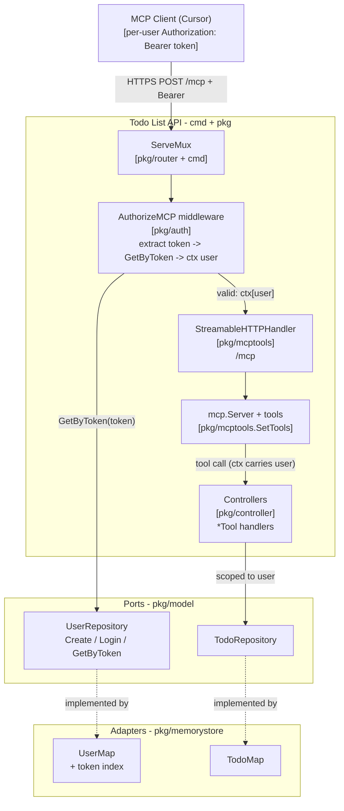
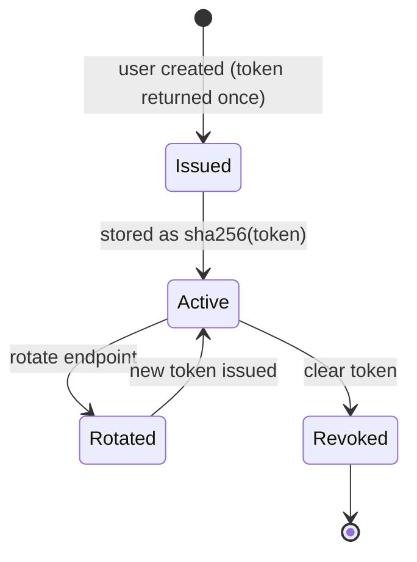
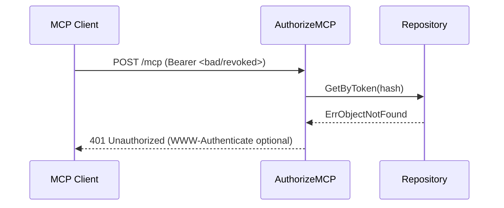

# Design: Per-User Static Token Auth for the MCP Server

Status: Proposed
Author: Rahul
Last updated: 2026-06-21
Related: pkg/mcptools, pkg/auth, pkg/controller, pkg/model, cmd/main.go

## 1. Overview

The todolist service exposes an MCP endpoint at `/mcp` (Streamable HTTP). Today
that endpoint is unauthenticated. This design adds **per-user static tokens**:
every user is issued a long-lived, opaque token; their MCP client (e.g. Cursor)
sends it on every request; the server validates the token, resolves it to a
user, and scopes all tool calls to that user.

### Goals

- A unique, static (non-expiring) token per user.
- MCP clients authenticate using the token via the `Authorization: Bearer` header.
- The server identifies the calling user and scopes tool operations to them.
- Tokens are revocable and rotatable.
- Reuse existing patterns (controllers, repository ports, `slog`, middleware).

### Non-goals

- Full OAuth 2.0 / RFC 9728 discovery flow (future work).
- Multi-tenant org/role hierarchy (only per-user identity + existing role claim).
- Replacing the existing JWT auth on the REST routes.

## 2. Terminology

| Term | Meaning |
| --- | --- |
| Static token | Opaque, random, long-lived per-user secret (not a JWT). |
| MCP host/client | The LLM app (Cursor) that connects to `/mcp`. |
| Tool call | An MCP `tools/call` request executed server-side. |

## 3. Architecture Design

The MCP endpoint is an `http.Handler` on the shared `ServeMux`. Auth is enforced
by a middleware wrapping the Streamable HTTP handler, identical in spirit to the
`AuthorizeRequest` middleware used on the REST routes — but it validates an
opaque token via a user-store lookup instead of verifying a JWT signature.



## 4. Data Model Changes

Add a `Token` field to `User` (stored **hashed** at rest):

```go
// pkg/model/model.go
User struct {
    UID          string `json:"uid"`
    Username     string `json:"username"`
    Password     string `json:"password"`
    EmailAddress string `json:"email_address"`
    Token        string `json:"token,omitempty"` // sha256(token) at rest; plaintext only in the create response
}
```

Extend the port:

```go
type UserRepository interface {
    Create(User) error
    Login(string, string) (bool, error)
    GetByToken(tokenHash string) (User, error) // new
}
```

The in-memory adapter keeps a secondary index `map[tokenHash]uid` for O(1) lookup.

## 5. Token Lifecycle

- **Issuance:** on user creation, generate 32 random bytes (`crypto/rand`) ->
  hex string (64 chars). Return the **plaintext once** in the create response;
  persist only `sha256(token)`.
- **Validation:** middleware hashes the presented token and calls `GetByToken`.
- **Rotation:** `POST /api/v1/users/token/rotate` (JWT-protected) regenerates the
  token and returns the new plaintext once.
- **Revocation:** clear the stored hash; subsequent lookups fail with 401.



## 6. Traffic Flow

### 6.1 Token issuance (signup)

```mermaid
sequenceDiagram
    participant U as User
    participant API as REST API (/api/v1/users/signup)
    participant Ctrl as UserController
    participant Store as UserMap

    U->>API: POST signup {username, password, email}
    API->>Ctrl: Create()
    Ctrl->>Ctrl: token = randomHex(32); hash = sha256(token)
    Ctrl->>Store: Create(user{..., Token: hash})
    Store-->>Ctrl: ok
    Ctrl-->>U: 201 {uid, token}
    Note over U: paste token into mcp.json headers
```

### 6.2 MCP client authenticated tool call

```mermaid
sequenceDiagram
    participant C as MCP Client (Cursor)
    participant MW as AuthorizeMCP
    participant H as StreamableHTTPHandler
    participant S as mcp.Server
    participant T as Tool handler
    participant R as Repository

    C->>MW: POST /mcp (Bearer <token>) initialize/tools.call
    MW->>MW: fields = parse(Authorization); hash = sha256(token)
    MW->>R: GetByToken(hash)
    alt token valid
        R-->>MW: user
        MW->>H: next (ctx["user"]=username)
        H->>S: dispatch
        S->>T: CreateUserTool(ctx, req, args)
        T->>T: caller = ctx["user"]
        T->>R: op scoped to caller
        R-->>T: result
        T-->>C: {status/result}
    else token invalid/missing
        MW-->>C: 401 Unauthorized
    end
```

### 6.3 Invalid / revoked token



## 7. Server Components

### 7.1 Middleware (pkg/auth)

```go
func (a *Authenticator) AuthorizeMCP(users model.UserRepository, next http.Handler) http.Handler {
    return http.HandlerFunc(func(w http.ResponseWriter, r *http.Request) {
        f := strings.Fields(r.Header.Get("Authorization"))
        if len(f) != 2 || strings.ToLower(f[0]) != "bearer" {
            http.Error(w, "missing bearer token", http.StatusUnauthorized); return
        }
        sum := sha256.Sum256([]byte(f[1]))
        user, err := users.GetByToken(hex.EncodeToString(sum[:]))
        if err != nil {
            http.Error(w, "invalid token", http.StatusUnauthorized); return
        }
        ctx := context.WithValue(r.Context(), ctxUserKey, user.Username)
        next.ServeHTTP(w, r.WithContext(ctx))
    })
}
```

### 7.2 Wiring (pkg/mcptools.SetTools + cmd/main.go)

```go
mcpHandler := mcp.NewStreamableHTTPHandler(
    func(*http.Request) *mcp.Server { return mcpserver },
    &mcp.StreamableHTTPOptions{DisableLocalhostProtection: true},
)
mux.Handle("/mcp", authenticator.AuthorizeMCP(userStore, mcpHandler))
```

### 7.3 Tool handlers read identity from ctx

```go
caller, _ := ctx.Value(ctxUserKey).(string) // scope every operation to caller
```

## 8. API Changes

| Method | Path | Auth | Change |
| --- | --- | --- | --- |
| POST | `/api/v1/users/signup` | None | Response now includes one-time `token` |
| POST | `/api/v1/users/token/rotate` | Bearer (JWT) | New: regenerate token |
| POST | `/mcp` | Bearer (static token) | Now requires a valid per-user token |

## 9. Client Configuration

Each user configures their own token in their MCP client:

```json
{
  "mcpServers": {
    "todolist": {
      "type": "http",
      "url": "https://todolist.ai:8080/mcp",
      "headers": { "Authorization": "Bearer <THIS-USER-TOKEN>" }
    }
  }
}
```

## 10. Security Considerations

- **Hash tokens at rest** (`sha256`); never log plaintext tokens.
- **HTTPS only** — tokens travel in a header; keep TLS on `/mcp`.
- **Scope by server-side identity** — derive owner from ctx, never from
  LLM/client-supplied fields (prevents IDOR/cross-user access).
- **Constant-time compare** on the hash lookup path where applicable.
- **Rate limit** `/mcp` and signup to limit brute force.
- **Also hash passwords** (currently plaintext) — same hardening principle.
- **Audit** every tool call with `slog` (user, tool, outcome).

## 11. Alternative Considered: Long-lived JWT

Reuse `auth.RequireBearerToken` + a verifier over the existing RSA `PublicKey`,
issuing a JWT with a far-future expiry. Stateless, but not truly static and
hard to revoke without a denylist. Rejected in favor of opaque keys because the
requirement is explicit per-user *static, revocable* tokens.

## 12. Implementation Plan

1. Add `Token` to `model.User` + `GetByToken` to the port.
2. Implement token index + `GetByToken` in `memorystore.UserMap`.
3. Generate/hash token in `UserController.Create`; return plaintext once.
4. Add `AuthorizeMCP` middleware in `pkg/auth`.
5. Wrap `/mcp` in `SetTools` / `main.go`.
6. Read `ctx` user in tool handlers; scope operations.
7. Add token rotation endpoint.
8. Tests: valid/invalid/revoked token, scoping, rotation.

## 13. Testing

- Unit: middleware (missing/malformed/invalid/valid), `GetByToken`.
- Integration: full MCP `initialize` + `tools/call` with a real token over HTTPS.
- Negative: revoked token -> 401; user A token cannot act as user B.

## 14. Future Work

- OAuth 2.0 + protected resource metadata (RFC 9728) for auto-discovery.
- Multiple named tokens per user (per device), with independent revocation.
- Persistent store (SQL adapter) for users/tokens.
